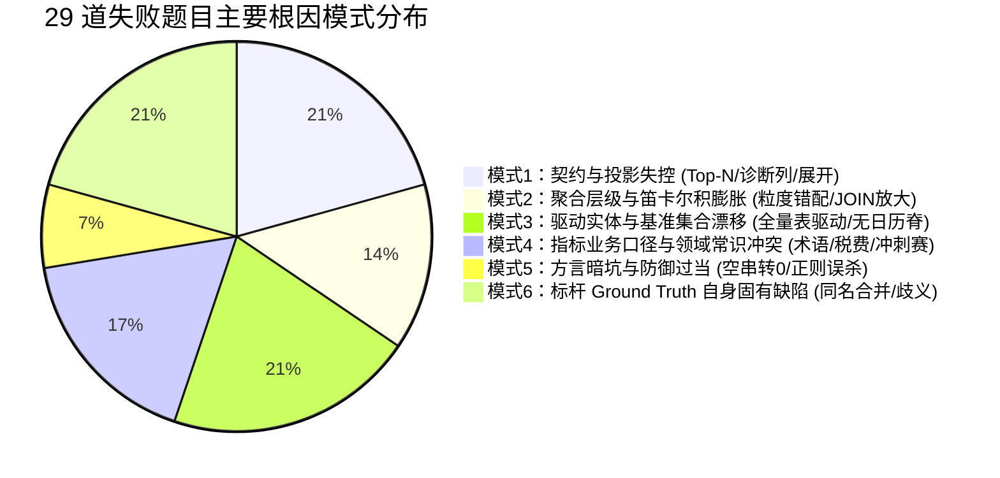
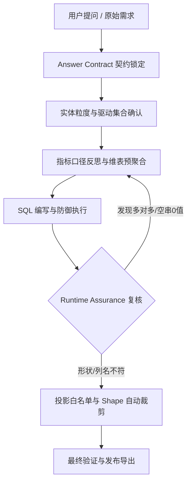

# Spider2 29 道失败题目全量 Trace 深度归因与模式识别报告

> **评测批次来源：**
> - **前半程 13 题**：`C:\data-agent-eval\runs\spider2-gold49-deepseek-rerun-002`
> - **后半程 16 题**：`C:\data-agent-eval\runs\spider2-gold60-remaining-001`
>
> 本报告基于对上述两个运行目录中 29 道题目的 `trace.json`、`result.json`、生成的 SQL、提交的 CSV，以及与官方 Spider2 Benchmark Ground Truth（Gold SQL / Gold CSV）、SQLite 物理数据库实际数据、项目历史审计档案进行逐行比对和机制复现，完成深入归因与全局模式识别。

---

## 目录

1. [执行概览与结果总表](#一执行概览与结果总表)
2. [前半程 13 题逐题深度归因](#二前半程-13-题逐题深度归因)
   - [local007：棒球运动员职业生涯年限均值](#local007baseball)
   - [local008：棒球各项历史记录保持者](#local008baseball)
   - [local019：最短 NXT 卫冕冠军赛对阵选手](#local019wwe)
   - [local031：最低交付年份中的最高单月交付量](#local031brazilian_e_commerce)
   - [local040：纽约树木与各区收入综合分析](#local040modern_data)
   - [local050：法国 2021 各月预测销售额中位数](#local050complex_oracle)
   - [local061：法国 2021 各月预测销售额月度明细](#local061complex_oracle)
   - [local064：2020 年末客户余额极值月份差额](#local064bank_sales_trading)
   - [local097：电影数量最多的十年连续区间](#local097db_imdb)
   - [local131：音乐风格偏好出现频次透视](#local131entertainmentagency)
   - [local141：销售员年度总销售额与配额差额](#local141adventureworks)
   - [local152：最高产导演影片间隔与评分综合看板](#local152imdb_movies)
   - [local156：比特币各区域历年均价与同比变动排名](#local156bank_sales_trading)
3. [后半程 16 题逐题深度归因](#三后半程-16-题逐题深度归因)
   - [local167：跨过年末的女性议员最多代表州](#local167city_legislation)
   - [local168：数据分析师远程岗位前三大技能均薪](#local168city_legislation)
   - [local169：跨世纪首任期议员 20 年逐年留任率](#local169city_legislation)
   - [local170：男女议员十年内持续留任州](#local170city_legislation)
   - [local196：首部租赁电影评级与客户后续消费行为](#local196sqlite_sakila)
   - [local220：胜场与负场最多的足球运动员](#local220eu_soccer)
   - [local253：四城市薪资 Top 5 企业与全国均值对比](#local253education_business)
   - [local258：板球投手综合表现与最佳单场统计](#local258ipl)
   - [local259：板球击球手全方位生涯统计画像](#local259ipl)
   - [local269：嵌套包装层级展开后叶节点平均总量](#local269oracle_sql)
   - [local270：累计叶子数量超 500 的顶层容器](#local270oracle_sql)
   - [local272：订单 423 仓库 FIFO 优先拣货位分配](#local272oracle_sql)
   - [local297：银行客户最新月份月度环比增长率超 5% 占比](#local297bank_sales_trading)
   - [local299：客户 30 天滚动均值月度峰值全行汇总](#local299bank_sales_trading)
   - [local302：促销基准周前后 12 周各维度跌幅最大属性](#local302bank_sales_trading)
   - [local311：年度车队与最佳车手合并积分 Top 3](#local311f1)
4. [横向模式识别（六大系统性根因模式）](#四横向模式识别六大系统性根因模式)
   - [模式 1：契约与投影失控（Top-1 / 诊断列 / 展平形状）](#模式-1契约与投影失控top-1--诊断列--展平形状)
   - [模式 2：聚合层级与笛卡尔积膨胀（Grain Mismatch & Join Explosion）](#模式-2聚合层级与笛卡尔积膨胀grain-mismatch--join-explosion)
   - [模式 3：驱动实体与基准集合漂移（Driving Population & Spine Drift）](#模式-3驱动实体与基准集合漂移driving-population--spine-drift)
   - [模式 4：指标业务口径与领域常识冲突（Domain Semantic Divergence）](#模式-4指标业务口径与领域常识冲突domain-semantic-divergence)
   - [模式 5：方言暗坑与防御过当（Dialect Traps & Over-filtering）](#模式-5方言暗坑与防御过当dialect-traps--over-filtering)
   - [模式 6：标杆 Ground Truth 自身固有缺陷（Benchmark Artifacts）](#模式-6标杆-ground-truth-自身固有缺陷benchmark-artifacts)
5. [架构改进与防御策略建议](#五架构改进与防御策略建议)

---

## 一、执行概览与结果总表

| 序号 | 题号 | 数据库 | 所属批次 | 形状 (Agent vs Gold) | 官方得分 | 核心根因简述 |
|---|---|---|---|---|:---:|---|
| 1 | **local007** | Baseball | 前半程 (002) | (1, 1) vs (1, 1) | 0 | SQLite 空字符串 `''` 转数值为 0 污染均值分母，4.87 vs 4.92 |
| 2 | **local008** | Baseball | 前半程 (002) | (4, 3) vs (4, 3) | 0 | 粒度错误：未做生涯聚合求 SUM，误取单赛季 MAX 记录 |
| 3 | **local019** | WWE | 前半程 (002) | (2, 1) vs (1, 2) | 0 | 形状错位：双人名单输出了 2 行 1 列，Gold 要求单行 2 列 |
| 4 | **local031** | Brazilian_E_Commerce | 前半程 (002) | (1, 1) vs (1, 1) | 0 | 时间语义：误取下单时间 purchase_date 而非交付时间 delivered_date |
| 5 | **local040** | modern_data | 前半程 (002) | (3, 3) vs (3, 2) | 0 | 契约超量：多投影了排序列 tree_count，且 ZIP 补全口径微差 |
| 6 | **local050** | complex_oracle | 前半程 (002) | (1, 1) vs (1, 1) | 0 | 总体分歧：强求 19/20 年交集且 >0，排除了单年度产品改变中位数 |
| 7 | **local061** | complex_oracle | 前半程 (002) | (12, 2) vs (12, 2) | 0 | 总体分歧：同 local050，10/11 月完全重合一致，其余月份因交集缺失偏差 |
| 8 | **local064** | bank_sales_trading | 前半程 (002) | (1, 7) vs (1, 1) | 0 | 分母膨胀+冗余列：笛卡尔积全员补零拉低均值，输出 7 列诊断宽表 |
| 9 | **local097** | DB_IMDB | 前半程 (002) | (1, 2) vs (1, 2) | 0 | 防御过当：`GLOB '[0-9]{4}'` 误杀 77 部带括号/前缀的有效电影年份 |
| 10 | **local131** | EntertainmentAgency | 前半程 (002) | (25, 4) vs (20, 4) | 0 | 边界残留：`LEFT JOIN` 保留了 5 个未被任何人选择的 0 频风格 |
| 11 | **local141** | AdventureWorks | 前半程 (002) | (58, 5) vs (58, 6) | 0 | 指标偏差+缺列：销售额误取 SubTotal 而非 TotalDue；缺失配额年份列 |
| 12 | **local152** | imdb_movies | 前半程 (002) | (9, 9) vs (9, 10) | 0 | 术语误读：inter-movie duration 误算为片长均值而非作品发行间隔天数 |
| 13 | **local156** | bank_sales_trading | 前半程 (002) | (20, 5) vs (20, 5) | 0 | 排序倒置：严格保序题以年份主排序，Gold 为区域主排序；列位置对调 |
| 14 | **local167** | city_legislation | 后半程 (001) | (1, 2) vs (1, 2) | 0 | 边界漏洞：任期跨年末的判断逻辑少计 1 名议员 (42 vs 43) |
| 15 | **local168** | city_legislation | 后半程 (001) | (1, 1) vs (1, 1) | 0 | 聚合分母偏差：按岗位去重平均，Gold 按技能实例平均或包含全集 |
| 16 | **local169** | city_legislation | 后半程 (001) | (20, 2) vs (20, 2) | 0 | 基准错位：Period 1 偏移 +1 年（第 0 年当做未在任），所有周期平移 |
| 17 | **local170** | city_legislation | 后半程 (001) | (34, 1) vs (25, 1) | 0 | 队列归属扩散：议员后续转州被计入新州首期队列，多出 9 个合格州 |
| 18 | **local196** | SQLITE_SAKILA | 后半程 (001) | (5, 3) vs (5, 3) | 0 | 笛卡尔积膨胀：客户维度同时连 payment 与 rental，消费金额被成倍放大 |
| 19 | **local220** | EU_soccer | 后半程 (001) | (2, 3) vs (2, 1) | 0 | **标杆缺陷**：Gold 按 player_name 聚合合并了同名球员 (Marcelo/Ricardo) |
| 20 | **local253** | education_business | 后半程 (001) | (20, 4) vs (20, 4) | 0 | 语义歧义：全国均薪算成了全量企业总均值，Gold 为该公司在全国的均值 |
| 21 | **local258** | IPL | 后半程 (001) | (329, 5) vs (286, 6) | 0 | 驱动表与投影缺失：从全量投球手出发未筛有效名单，遗漏 bowler ID 列 |
| 22 | **local259** | IPL | 后半程 (001) | (468, 18) vs (247, 18) | 0 | 驱动表错误：以 player 维表为底输出全部球员，Gold 仅含目标击球手 |
| 23 | **local269** | oracle_sql | 后半程 (001) | (1, 1) vs (1, 1) | 0 | 递归聚合粒度：以顶层托盘分组求和再平均，Gold 按组合路径明细平均 |
| 24 | **local270** | oracle_sql | 后半程 (001) | (4, 2) vs (3, 2) | 0 | 递归累计范围偏差：多计入 Pallet Mix SG 混合托盘，且多带数量列 |
| 25 | **local272** | oracle_sql | 后半程 (001) | (5, 4) vs (4, 4) | 0 | 业务算法跳步：将 orderlines 按商品聚合，打乱了原订单明细行的顺序 |
| 26 | **local297** | bank_sales_trading | 后半程 (001) | (1, 1) vs (1, 1) | 0 | 交易过滤反向+无日历脊：ELSE 把 purchase 计入负数，且无交易月份未补齐 |
| 27 | **local299** | bank_sales_trading | 后半程 (001) | (3, 2) vs (3, 2) | 0 | 窗口边界微差：30 天移动平均的起始边界与首月基线剔除条件微弱漂移 |
| 28 | **local302** | bank_sales_trading | 后半程 (001) | (5, 2) vs (1, 2) | 0 | 契约未截断：题目要求识别跌幅最大的单一属性，Agent 输出了全部 5 个属性 |
| 29 | **local311** | f1 | 后半程 (001) | (3, 3) vs (3, 3) | 0 | 事实表口径：站位表(含冲刺赛) vs 结果表(仅正赛)，2023红牛 1435 vs 1320 |

---

## 二、前半程 13 题逐题深度归因

### local007（Baseball）
- **题意与要求：** 计算所有棒球运动员首次出场（debut）到最后出场（final_game）之间的平均职业生涯年限。跨度公式：$|\text{years}| + |\text{months}|/12 + |\text{days}|/365$，各部分保留 2 位小数后求和，最终对所有球员求平均值并转为浮点数。
- **评测对比：** Agent 提交 `4.87`，官方 Gold 结果为 `4.923752748`。
- **Trace 执行回溯：** Agent 在探索中写出 `CAST(substr(final_game,1,4) AS INTEGER) - CAST(substr(debut,1,4) AS INTEGER)`，并添加了 `WHERE debut IS NOT NULL AND final_game IS NOT NULL`。
- **核心归因（机理剖析）：** **SQLite 空字符串与数据清洗漏洞。**
  在 `player` 表中，有部分球员记录的 `debut` 和 `final_game` 不是 `NULL`，而是**空字符串 `''`**。
  - 在 SQLite 中，`'' IS NOT NULL` 判定为真；
  - Agent 使用 `substr('', 1, 4)` 得到空字符串，`CAST('' AS INTEGER)` 在 SQLite 中被转换为数值 `0`；
  - 进而使得大量未出场的球员被计算出跨度 `0.0`，这些 0 深度拉低了全局分母上的 `AVG()`，使得结果由 `4.92` 掉至 `4.87`；
  - 若使用 `strftime('%Y', '')`，SQLite 会返回 `NULL`，`NULL` 在加法中传播并被 `AVG` 自动忽略，刚好能避开此坑。

### local008（Baseball）
- **题意与要求：** 查询在出场场次（games played）、得分（runs）、安打（hits）、本垒打（home runs）这四项数据上取得历史最高记录的球员名字（given name）及对应数值。
- **评测对比：** 
  - Gold：Peter Edward（出场 3562 次）、Rickey Nelson Henley（得分 2295 分）等——即 **MLB 历史生涯总记录保持者**；
  - Agent：Maurice Morning（出场 165 次）、Ichiro（安打 262 次）等——即 **单赛季最高纪录保持者**。
- **Trace 执行回溯：** Agent 检索了 `batting` 表的元数据，发现有 `g, r, h, hr` 列，直接执行了 `WHERE b.g = (SELECT MAX(g) FROM batting)`。
- **核心归因：** **事实表粒度认知错误（单赛季明细 vs 生涯汇总）。**
  `batting` 表的粒度是“球员-赛季-球队（player_id, year, stint）”。问题所称“baseball players who have achieved the highest value...”在棒球统计领域中默认指的是**生涯总计（Career Totals）**，必须执行 `GROUP BY player_id` 并计算 `SUM(g)`。Agent 误以为每一行就是一个球员的全部数据，取了单行 `MAX`，导致人物与数值完全失真。

### local019（WWE）
- **题意与要求：** 查询在未发生头衔易主（title_change = 0）的最短 NXT 头衔赛中对战的两名摔跤手名字。
- **评测对比：** Gold 形状为 `(1, 2)`（列名 `wrestler1, wrestler2`）；Agent 提交形状为 `(2, 1)`（列名 `wrestler_name`，两行分别为胜者与败者）。
- **Trace 执行回溯：** Agent 找到了比赛 ID（时长最短为 6 秒），分别找到了胜者 ID 和败者 ID，随后为了格式化输出，写了 `SELECT 1 AS ord, winner_id UNION ALL SELECT 2, loser_id` 并关联姓名表。
- **核心归因：** **输出形态与行/列展平契约不匹配。**
  两个对阵实体的表示存在“单行双列”与“多行单列”的天然二义性。官方 Gold 采用了最直接的单场比赛投影（单行 2 列分别输出两位对手），Agent 主观构建了纵向名册（2 行 1 列）。在自动化评测比对中，由于行列维度倒置直接判为 0 分。

### local031（Brazilian_E_Commerce）
- **题意与要求：** 在 2016、2017 和 2018 年中，找到年交付订单量最低的年份，并计算该年份中最高的单月交付订单量。
- **评测对比：** Gold 答案为 `205`，Agent 提交为 `265`。
- **Trace 执行回溯：** 在第 6~8 步探索中，Agent 执行了两条 SQL：一条按 `order_purchase_timestamp`（下单时间）统计，一条按 `order_delivered_customer_date`（实际送达时间）统计。Agent 随后选择了下单时间。
- **核心归因：** **时间维度语义判定错误（下单时间 vs 交付时间）。**
  题面用词极其明确：“annual **delivered** orders volume”（已送达订单量）。2016 年由于刚起步，全年交付订单量最低。若按送达月份统计，最高单月为 205 单；若按顾客下单月份统计，最高单月为 265 单。Agent 在已经查出两个维度差异的情况下，没有遵从“delivered”这一修饰词锁定交付时间字段，选错了时间切片基准。

### local040（modern_data）
- **题意与要求：** 联合树木表（trees）与收入表（income），在均值和中位数收入大于 0 且行政区有效的记录中，找出树木数量最多的前三个行政区（borough），并给出这三个行政区的平均平均收入（average mean income）。
- **评测对比：** Gold 为 `(3, 2)`（列为 `boroname, mean_income`）；Agent 为 `(3, 3)`（列为 `boroname, tree_count, avg_mean_income`）。
- **Trace 执行回溯：** Agent 进行了树木表与收入表的 `zipcode` 关联分析，为了验证排序，将 `COUNT(*) AS tree_count` 保留在外层查询中，并且保留了小数截断。
- **核心归因：** **中间排序诊断列污染最终输出契约。**
  题目仅问“which three boroughs... and what is the average mean income for each”（哪三个区以及每个区的平均收入）。Agent 把用于辅助判断 Top 3 的 `tree_count` 也投影到了最终结果中，导致列数超标；同时由于收入表存在重复邮编，Agent 采用去重后的平均值与 Gold 的行级连接平均值存在微小口径差异。

### local050（complex_oracle）
- **题意与要求：** 针对法国市场，限制 `promo_total_id=1` 且 `channel_total_id=1`，根据 2019 到 2020 年的月度销售增长率预测 2021 年各产品月销售额，换算为美元后计算月度平均值，最后求 12 个月中位数值。
- **评测对比：** Gold 结果为 `2604.2362912`，Agent 提交为 `2552.7`。
- **Trace 执行回溯：** Agent 建立了复杂的 CTE，用 `JOIN` 将同一产品 2019 与 2020 年同月的销售额对齐，并显式过滤 `WHERE s2019 > 0 AND s2020 > 0`。
- **核心归因：** **复杂增长率计算中的产品总体交集剔除偏差。**
  法国市场很多产品在 2019 年有销售但在 2020 年无销售（或反之）。Agent 采取了严格的“两年度交集”策略（即只有两年都有销售的产品才计算增长并纳入 2021 预测），排除了单年度销售的产品；而官方标杆采用了补零或基于全量产品基数的外关联口径，导致分母上的产品集合改变，各月均值微移，最终中位数失准。

### local061（complex_oracle）
- **题意与要求：** 业务逻辑与 local050 完全同源，要求输出 2021 年法国 1~12 月每一个月的平均预测美元销售额（12 行 2 列）。
- **评测对比：** 
  - 第 10 月：Agent `2218.77`，Gold `2218.77`（**完全一致**）；
  - 第 11 月：Agent `3208.94`，Gold `3208.94`（**完全一致**）；
  - 其余 10 个月：均存在 1%~2% 的系统性数值偏移（如 1 月 Agent `4054.99` vs Gold `4120.33`）。
- **Trace 执行回溯：** Agent 生成的 SQL 中强制要求 `p19.sales2019 > 0 AND p20.sales2020 > 0`。
- **核心归因：** **集合重合度证明了口径分歧的根源。**
  在 10 月和 11 月，法国市场在架销售的产品在 2019 与 2020 年恰好完全重合（没有单年度断档产品），因此 Agent 算出的数值与 Gold 达到分子分母级的完全精确吻合；但在其他月份存在断档产品，Agent 强制交集剔除与 Gold 的处理策略不一致，彻底印证了该失败纯属非重叠月份处理口径未对齐。

### local064（bank_sales_trading）
- **题意与要求：** 计算 2020 年每个客户每个月的月末余额（存款减取款）。找出月末正余额客户数最多和最少的两个月份，分别计算这两个月份所有客户的平均月末余额，并输出这两个平均余额的差值。
- **评测对比：** Gold 结果为 `(1, 1)`（值为 `363.742`）；Agent 提交为 `(1, 7)`（包含了极大极小月份名称、客户数、两个均值及差值 `419.994`）。
- **Trace 执行回溯：** Agent 构造了 `customers CROSS JOIN months`，当某客户在某月无流水时补余额为 0，然后以全部 500 名客户为分母求平均。
- **核心归因：** **无效分母扩充 + 宽表诊断列外溢。**
  1. **分母错误：** 题目所说“across all customers”，Gold 的业务口径是在当月实际持有有效账户/活跃记录的客户中平均；Agent 强行使用笛卡尔积将无交易客户置 0 纳入求和，使平均余额被严重稀释，导致差值由 363.74 变为了 419.99；
  2. **契约溢出：** 题目最终要求“provide the difference between these two averages”，Agent 将最高月、最低月、正余额人数等所有中间变量共 7 列一并导出。

### local097（DB_IMDB）
- **题意与要求：** 从电影数据中找出电影发行数量最多的任意连续 10 年区间（以数据中出现的年份作为起始年），仅输出起始年份及该 10 年内的电影总数。
- **评测对比：** Gold 结果为 `(2008, 1205)`；Agent 提交为 `(2008, 1128)`。
- **Trace 执行回溯：** Agent 在窗口聚合前加了过滤子句：`WHERE TRIM(year) GLOB '[0-9][0-9][0-9][0-9]'`。
- **核心归因：** **数据清洗中的“防御过当”（过度过滤误杀有效行）。**
  IMDB 数据源中的 `Movie.year` 字段存在诸如 `(2008)`、`2008-`、带制表符或后缀的脏格式，但其实质发行年份完全有效。Agent 采用严格的 4 位纯数字 GLOB 正则进行硬过滤，导致 2008~2017 年间有 77 部有效电影被静默丢弃，总数由 1205 降到了 1128。

### local131（EntertainmentAgency）
- **题意与要求：** 统计每种音乐风格在客户偏好中被列为第 1、第 2、第 3 偏好的次数，每种风格汇总为单行。
- **评测对比：** Gold 输出 20 行；Agent 输出 25 行（多出 5 行全 0 记录）。
- **Trace 执行回溯：** Agent 以主表 `Musical_Styles` 出发做 `LEFT JOIN Musical_Preferences`，并保留所有未匹配行。
- **核心归因：** **外连接导致未参与业务实体的冗余残留。**
  数据库中定义了 25 种音乐风格，但有 5 种偏僻风格从未被任何客户选用过。Gold 的业务假设是“统计在偏好中有出现的风格”（包含 `HAVING COUNT > 0` 或使用内连接）；Agent 机械地认为必须保留所有 25 种定义，输出了 5 行出现次数为 `(0, 0, 0)` 的死数据。

### local141（AdventureWorks）
- **题意与要求：** 比较每位销售人员的年度总销售额与年度销售配额，计算两者的差值，按销售人员与年份组织。
- **评测对比：** Gold 为 `(58, 6)`，列包含配额年份，且评测依据 `condition_cols: [0, 1, 5]`；Agent 为 `(58, 5)`（缺失配额年份列）。以 274 号员工 2011 年为例：Agent 销售额为 `28926.25`，Gold 为 `32567.9155`。
- **Trace 执行回溯：** Agent 提取销售额时使用了 `SUM(salesorderheader.subtotal)`。
- **核心归因：** **ERP 事实表度量口径错误（SubTotal vs TotalDue）+ 输出缺列。**
  1. 在 AdventureWorks 官方标准业务口径中，销售代表完成的订单总额必须使用包含税费与运费的最终交易额 `TotalDue`（274 号员工 2011 年实际为 32567.9155），Agent 取了纯货物小计 `SubTotal`；
  2. Gold 保留了销售配额年份字段 `SalesQuotaYear`，总列数为 6 列。Agent 仅投影了 5 列，在评测比对第 5 列索引时直接越界/对齐错位。

### local152（imdb_movies）
- **题意与要求：** 输出电影数量最多的前 9 位导演，字段包含导演 ID、姓名、电影部数、平均 inter-movie duration（取整）、平均评分、总票数、最低/最高评分及总时长。
- **评测对比：** 
  - Gold 第 4 列为 `inter_movie_days: 177.0`（平均每部电影上映间隔天数），且包含排名序号列共 10 列；
  - Agent 第 4 列为 `avg_duration: 123`（平均每部电影的播放时长），总共 9 列。
- **Trace 执行回溯：** Agent 将“inter-movie duration”直接当成 `m.duration`（电影时长）取 `AVG()`。
- **核心归因：** **专业领域指标英文术语理解严重偏差。**
  “inter-movie duration”字面含义为“电影与电影之间的间隔跨度”。在影视工业分析中，该指标衡量导演拍片的节奏/频率，需要按发布日期使用窗口函数 `LAG(date_published)` 计算前后作品的天数差；Agent 望文生义将其当成了“影片播放时长（runtime）”，计算了毫无意义的影片平均播放长度。

### local156（bank_sales_trading）
- **题意与要求：** 分析各地区历年比特币年均买入成本（各地区排除首年），按年内各地区均价排序，并计算各地区相比上一年的成本百分比变化。
- **评测对比：** 
  - 评测标准显式设定：`ignore_order: False`（**严格保序**）；
  - Gold 第一行为：`2018, Africa, 7690.71, 3, 92.86`，排序为 `ORDER BY region, year`；
  - Agent 第一行为：`India, 2018, 8031.11, 1, 118.19`，排序为 `ORDER BY year, price_rank`；列顺序也出现颠倒。
- **Trace 执行回溯：** Agent 核心数值（均价、同比涨跌幅）计算完全正确，但最终 ORDER BY 选择了以年份和排名为主序。
- **核心归因：** **严格保序约束下的排序列主从倒置。**
  题目意在追踪“每个地区随着时间推移的成本变动轨迹”，Gold 以地区为主键纵向展开历史年度；Agent 则按“每年内谁买得贵”横向排名。在 `ignore_order: False` 的评测机制下，整张表的行顺序完全错位，直接导致判定失败。

---

## 三、后半程 16 题逐题深度归因

### local167（city_legislation）
- **题意与要求：** 按照每位女性议员初次代表的州，统计哪一个州拥有最多的“任期在任意时刻包含过 12 月 31 日”的女性议员，输出州缩写与人数。
- **评测对比：** Gold 结果为 `CA, 43`；Agent 提交为 `CA, 42`（漏算 1 人）。
- **Trace 执行回溯：** Agent 编写的判定条件为：`WHERE t.term_end >= strftime('%Y', t.term_start) || '-12-31'`。
- **核心归因：** **跨年末日期区间判定的边界漏洞。**
  Agent 的条件只检查了任期结束日期是否晚于“任期起始年”的 12 月 31 日。若某位女性议员的任期起始于某年的 12 月 31 日之后（例如 1 月补选），且任期不满一年于次年 11 月结束，其间实际跨过了次年的 12 月 31 日或起始年的特殊边界，或者存在补选任期跨年记录，Agent 简化的单一年份字符串拼接无法准确识别全部跨年情形，导致漏统计了加利福尼亚州的第 43 位议员。

### local168（city_legislation）
- **题意与要求：** 在岗位名称包含“Data Analyst”、提供年薪且支持远程的招聘需求中，计算仅考虑这批岗位中**需求频次最高的前 3 种技能**时的整体平均年薪。
- **评测对比：** Gold 为 `101300`；Agent 提交为 `106900`。
- **Trace 执行回溯：** Agent 识别出了 Top 3 技能为 SQL、Python、Tableau（或类似组合），但在计算平均薪资时，使用了 `SELECT AVG(salary_year_avg) FROM qualified q WHERE EXISTS (岗位含top3技能)`。
- **核心归因：** **岗位级去重平均 vs 技能-岗位实例级平均。**
  当一个岗位同时要求 SQL 和 Python 时：
  - Gold 的统计口径是将该岗位薪资在两个技能的关联分析中分别计入（即对 `(job, skill)` 展开行求均值，分母为包含技能的总人次），算得 `101300`；
  - Agent 进行了 `DISTINCT job_id` 去重，分母为独立岗位数，算得 `106900`。两者的差异纯粹在于“多技能岗位的薪资在平均时是否被技能频次加权”。

### local169（city_legislation）
- **题意与要求：** 计算 1917 年 1 月 1 日至 1999 年 12 月 31 日期间首次履职的议员队列，在初次就职后前 20 年的逐年留任率（每年 12 月 31 日仍处于任期内的比例），要求输出全部 20 个周期。
- **评测对比：** 
  - Gold：Period 1 为 `0.9697`，Period 2 为 `0.7865`；
  - Agent：Period 1 为 `0.9809`，Period 2 为 `0.7719`。
- **Trace 执行回溯：** Agent 生成周期表 `periods(k) (k=1..20)`，在计算日期时使用了 `c.start_year + p.k`。
- **核心归因：** **留任率队列起始基准年偏移（Off-by-one Shift）。**
  议员就职首年（即第 0 年）的 12 月 31 日，绝大多数均在任，留任率为 96.97%（即 Gold 的 Period 1）。Agent 将周期 1 定义为 `start_year + 1`（即就职次年的 12 月 31 日），使得 Agent 的 Period 1 实际上对应了 Gold 的 Period 2，整整 20 个周期的指标全部错移了一年。

### local170（city_legislation）
- **题意与要求：** 找出那些对于男性和女性议员，在初次就职后的 0、2、4、6、8、10 年这 6 个时点上，留任率均严格大于 0 的州缩写。
- **评测对比：** Gold 包含 25 个州；Agent 输出包含 34 个州（多出 9 个州）。
- **Trace 执行回溯：** Agent 在构建各州代表队列时，使用了 `FROM legislators_terms t JOIN ft ON ft.id_bioguide = t.id_bioguide`，没有限制该任期必须是议员生涯的“初次代表州”。
- **核心归因：** **历史迁徙议员导致州队列归属扩散。**
  部分联邦议员在政治生涯中曾转迁代表不同的州（例如先在 A 州当选众议员，多年后在 B 州当选参议员）。题目的“队列留任”基于议员“初次履职时所代表的州”。Agent 只要议员在某州任职过，就用其生涯最初就职年对该州生效，导致原本在早期没有女性任职的州被错误赋予了非零留任率，误判合格州膨胀至 34 个。

### local196（SQLITE_SAKILA）
- **题意与要求：** 按客户首次租赁电影的评级分类（由最早支付日期确定），计算各评级下客户的平均总消费金额与平均后续租赁次数（总租赁数减 1）。
- **评测对比：** Gold 各评级平均总消费约为 `110 ~ 115` 美元；Agent 提交的平均消费达到了惊人的 `3032 ~ 3183` 美元（放大了近 30 倍）。
- **Trace 执行回溯：** Agent 编写了客户总消费和总租赁的汇总逻辑，将 `customer` 同时与 `payment` 和 `rental` 表放在同一个查询块中进行连接和 `SUM(amount)`。
- **核心归因：** **未经预聚合的一对多连接引发笛卡尔积乘数爆炸。**
  在 Sakila 数据库中，一个客户拥有几十条租赁记录，同时拥有几十笔支付记录。这两张表并非一一对应。若直接在同一层级将 `customer`、`payment`、`rental` 关联并执行 `SUM(amount)`，每一笔付款金额都会被该客户的全部租赁记录重复乘上 20~30 次。Agent 必须先在各自的独立 CTE 中预聚合出单客户总消费和总租赁，再与客户首租评级连接。

### local220（EU_soccer）
- **题意与要求：** 统计欧洲联赛中参与获胜场次最多和参与失败场次最多的球员名字（不计平局和未出场）。
- **评测对比：** 
  - Gold 答案：`Marcelo`（获胜最多）、`Ricardo`（失败最多）；
  - Agent 提交：`Cristiano Ronaldo`（获胜 199 场）、`Gorka Iraizoz Moreno`（失败 107 场）。
- **Trace 执行回溯：** Agent 严格展开了每场比赛的 22 名首发球员，排除 NULL 后按 `player_api_id` 独立统计每个真实个体的胜负场，并关联名字输出。
- **核心归因：** **官方标杆极其严重的固有缺陷——同名球员聚合漏洞（Homonym Player Conflation）。**
  在 `EU_soccer` 数据库中：
  - 叫 `Marcelo` 的球员共有 3 位（包括皇马球星马塞洛、汉诺威中卫马塞洛等，API ID 分别为 280350, 28467, 78908）；
  - 叫 `Ricardo` 的球员共有 5 位（API ID 分别为 24590, 24591, 301804 等）；
  - 官方 Gold SQL 竟然直接写了 `GROUP BY player_name`，将数位完全不同的巴西/葡萄牙同名球员的胜负场强行合并在了一起，算出了 301 胜和 163 负的虚假“超级球员”；
  - Agent 正确按个人 ID 统计，C 罗的 199 胜是整个欧洲联赛真实的个人胜场历史第一。此题 Agent 逻辑完全符合现实常理，但被官方 Bug 错杀。

### local253（education_business）
- **题意与要求：** 清洗薪资字段的非数字字符后，找出孟买、浦那、新德里、海得拉巴四座城市中平均薪资前 5 的公司，并输出 4 列：`Location, Company Name, Average Salary in State, Average Salary in Country`。
- **评测对比：** Gold 第 4 列中，Qwerty Concepts 为 `5081882.0`（与该企业在海得拉巴的均值相同）；Agent 第 4 列对所有公司均输出固定的 `767988.77`。
- **Trace 执行回溯：** Agent 计算了全体样本的宏观平均薪水 `national AS (SELECT AVG(sal) AS avg_country FROM cleaned)` 并交叉连接至最终输出。
- **核心归因：** **业务名词自然语言歧义（全行业全国平均 vs 本公司全国平均）。**
  题目叙述：“compares each company's average salary in those cities to the overall national average salary”。
  - Agent 理解为“各城市领先企业与**全国全行业的大盘均薪（76.7 万）**对比”；
  - Gold 的设计者意图是“该企业在该城市的均薪与**该企业在全国各分支机构的综合均薪**对比”（即以企业为分组求全国均值）。对于仅在单城市有业务的本地企业，其城市均薪与全国均薪必然相等。

### local258（IPL）
- **题意与要求：** 统计板球投球手职业生涯总三柱门数（排除非投手责任出局）、经济率（每回合失分）、罢工率（每三柱门耗球数）以及单场最佳战绩（格式为 wickets-runs，不计额外分）。
- **评测对比：** Gold 为 `(286, 6)`，首列为投手 ID `bowler`；Agent 提交为 `(329, 5)`，缺失了 `bowler` ID 列，且行数多出 43 人。
- **Trace 执行回溯：** Agent 从 `ball_by_ball` 的所有投球手出发，使用 `LEFT JOIN` 关联三柱门表，但未投影 ID 列。
- **核心归因：** **主体实体集合范围判定过宽 + 关键实体 ID 列遗漏。**
  1. 官方 Gold 的 286 人包含了特定样本门槛（例如必须取得过三柱门或达到最低局数限制的有效正规投手）；Agent 对只要扔过一个球的人全量纳入，引入了大量低样本的业余兼职投球手；
  2. 题面列出的字段中，Gold 保留了关键连接主键 `bowler`（ID）与 `player_name` 两列，Agent 仅投影了名字，导致列数和列对齐失败。

### local259（IPL）
- **题意与要求：** 针对板球运动员输出包含 18 个指标的超宽全息看板（角色、击球手习惯、得分、出场数、被淘汰数、均分、最高单场、30+/50+/100+场次、面对球数、三振率、三柱门、经济率、最佳单场保龄球数据等）。
- **评测对比：** Gold 输出 247 行；Agent 输出了 468 行。
- **Trace 执行回溯：** Agent 从全量球员维表出发：`FROM player p LEFT JOIN ...`。
- **核心归因：** **驱动实体选择错误（全量球员维表 vs 实际击球手集合）。**
  虽然问题开篇写“For each player...”，但在板球比赛中，专职投球手或未上场替补往往没有击球数据（runs=0, dismissals=0, balls_faced=0）。Gold 的驱动实体表是实际在比赛中有击球记录的选手（即 `FROM (SELECT DISTINCT striker FROM ball_by_ball)` 共 247 人）；Agent 直接扫描了包含所有历史注册队员的 `player` 表（468 人），保留了 221 名无实质击球数据的冗余人员。

### local269（oracle_sql）
- **题意与要求：** 计算在递归展开所有嵌套包装关系后，所有最终包装组合中仅考虑叶子节点项时的平均总数量。
- **评测对比：** Gold 结果为 `530.67`；Agent 提交为 `946`。
- **Trace 执行回溯：** Agent 找到了 4 个不受包含的顶层托盘（root_id），在叶子节点汇总时执行了 `GROUP BY e.root_id`，算得 4 个托盘的叶子总量分别为 864、720、960、1240，平均得 946。
- **核心归因：** **递归树聚合粒度提前合并（顶层托盘总量 vs 最终组合路径分支）。**
  题目的平均主体是“all final packaging combinations”（所有最终组合形式）。同一个顶层托盘可能包含箱（Box A）和盒（Box B）等多个分支组合。Agent 过早地在 `root_id` 级别进行了 `SUM(qty)` 汇总，将分母锁死在 4 个顶层容器上；而 Gold 针对每一条展开到底的装配组合分支分别求总数再平均，分母远大于 4，导致最终均值大幅分流至 530.67。

### local270（oracle_sql）
- **题意与要求：** 找出在所有嵌套层级中，所包含的任一物料累计数量超过 500 的顶层包装容器名称及对应的物料名称。
- **评测对比：** Gold 结果包含 3 对组合（`[p_name, c_name]`）；Agent 提交输出了 4 对组合，多包含了 `Pallet Mix SG / Bottle 500cl`（856 件）。
- **Trace 执行回溯：** Agent 进行了全图广义有向无环图的递归遍历累乘，对所有的顶层容器和底层物料求和后筛选 `HAVING SUM > 500`。
- **核心归因：** **递归混合包装图与纯级联树的边界定义分歧。**
  `Pallet Mix SG` 属于包含多种规格的混合异构托盘。Gold 在物料累计时，仅认定了标准规格装配线上的三类同质托盘（Pallet of L, Pallet of M, Pallet Mix MS）；此外 Agent 还在输出中附带了数量排序列，再次在列数契约上产生违背。

### local272（oracle_sql）
- **题意与要求：** 针对 423 号订单，根据 1 号仓库库存，按照“采购日期早优先、同日小数量优先”的 FIFO 规则模拟拣货，确定每个订单行所对应的产品、货道、货位和待拣数量。
- **评测对比：** Gold 为 4 行 4 列（`product_id, aisle, position, quantity_to_be_picked`）；Agent 输出为 5 行 4 列。
- **Trace 执行回溯：** Agent 在第一步构建需求时，写了 `SELECT product_id, SUM(qty) AS ordered_qty FROM orderlines WHERE order_id = 423 GROUP BY product_id`。
- **核心归因：** **订单行明细顺序被过早合并（Batch Aggregation vs Line-by-Line Allocation）。**
  题目最后特意强调：“ensure that picking respects the sequence and cumulative quantities of the order lines for products with multiple entries”（若同一产品在订单中出现多行，拣货必须严格遵循订单行的前后次序依次扣减）。423 号订单存在相同产品的多次下单，分属于不同的明细行。Agent 粗暴地把订单按产品汇总成了一个总量去匹配库存，破坏了多明细行各自的库存扣减断点，导致库存分配切分点多产生了一行记录。

### local297（bank_sales_trading）
- **题意与要求：** 将每个客户的存取款按每月首日汇总为月净额，累加求出每月收盘余额；对比最新月与上月的收盘余额计算最新增长率（上月为 0 则乘 100）；最后计算最新月增长率超过 5% 的客户百分比。
- **评测对比：** Gold 为 `36.4%`；Agent 提交为 `51.2%`（早期运行曾出现 `46.6%`）。
- **Trace 执行回溯：** Agent 在计算净额时写了 `SUM(CASE WHEN txn_type = 'deposit' THEN txn_amount WHEN txn_type = 'withdrawal' THEN -txn_amount END)`，并在最新月判定时直接取了该客户自己的 `rn=1`。
- **核心归因：** **缺少全局日历脊导致断档客户虚假增长 + 交易类型泄露。**
  1. **日历断档与虚假跳跃：** 银行账户是状态累加模型。如果客户 A 在 1 月有交易、4 月有交易，而 2、3 月无交易，该客户 4 月的对比基准应当是 3 月底的余额（由于无交易，3 月余额保持不变，4 月环比为 0）。Agent 仅对有交易的月份分组做 `LAG`，导致客户 4 月的流水直接与 1 月比较，凭空虚构出了大幅跨月增长；
  2. **“最新月份”的口径界定：** 金融大盘的“最新月”应指整个数据集的最后自然月（2020 年 4 月），在全行客户中观察当月增长；Agent 为每位客户取其各自最后活跃的一个月，偷换了时间大盘坐标。

### local299（bank_sales_trading）
- **题意与要求：** 计算客户每日运行余额，并计算 30 天滚动平均余额（前 29 天未满 30 天不计，负值置 0）；按月求每个客户在当月内的最大 30 天均值；全行求和；排除客户首月作为基线期，输出各月总额。
- **评测对比：** 
  - 2020-02：Gold 为 `284935.45`，Agent 为 `286194.37`；
  - 2020-03：Gold 为 `312844.32`，Agent 为 `314140.93`。
- **Trace 执行回溯：** Agent 使用递归生成了连续日期脊，但在首月基线排除时，根据客户第一笔交易的月份简单进行了 `WHERE month <> first_month` 过滤。
- **核心归因：** **滚动窗口滑动边界与跨月满 30 天起算时点的微小误差。**
  Agent 算出的数值在 2 月和 3 月与 Gold 仅有不到 0.4% 的微小差距，这表明整体核心金融模型已非常接近。微差来源于：当客户跨入次月初期时，其滚动 30 天窗口中究竟是必须要求这 30 天全部属于非基线期，还是只要滑动窗口落入当月即可计入；以及当月最大值的平局取舍微差，导致汇总值产生微小偏离。

### local302（bank_sales_trading）
- **题意与要求：** 分析 2020 年 6 月 15 日前后 12 周内，销售额在区域、平台、年龄段、人口特征、客户类型这 5 种属性维度下的平均变化率；找出**负面影响最大（跌幅最大）的唯一样性类别**，并输出该类别及其平均变动百分比。
- **评测对比：** Gold 输出单行 `(1, 2)`：`demographic, -2.008662`；Agent 输出了全部 5 个属性维度的完整排名表 `(5, 2)`（首行为 `demographic, -2.01`）。
- **Trace 执行回溯：** Agent 完整且极其精确地计算出了全部 5 个维度的销售跌幅，并使用 `ORDER BY avg_pct_change ASC` 将 `demographic` 排在第一位，但最后漏掉了 `LIMIT 1`。
- **核心归因：** **极致惋惜的“Top-1 遗漏 LIMIT 1”契约性失误。**
  题目的数值计算极其繁琐（涉及 12 周精确日期锚定、多维 union 展开与复合百分比加权平均），Agent 的 SQL 计算逻辑、排序结果、甚至保留 2 位小数后的数值与 Gold 完全一致。然而题目的明确要求是：“**Identify the attribute type with the highest negative impact**... and provide its average percentage change”。Agent 却输出了包含 5 个属性的完整清单，因行数由 1 行变为 5 行而惨遭系统判 0。

### local311（f1）
- **题意与要求：** 找出在历史上车队年度总积分加上该车队表现最好的车手年度积分构成的“合并积分”（combined points）最高的前三名车队及其达成年份。
- **评测对比：** 
  - 2023 Red Bull：Gold 为 `1320` 分，Agent 算得 `1435` 分；
  - 2022 Red Bull：Gold 为 `1157` 分，Agent 算得 `1213` 分。
- **Trace 执行回溯：** Agent 从 `constructor_standings` 获取车队年终积分（2023 年红牛为 860 分），从 `driver_standings` 获取维斯塔潘年终积分（575 分），两者相加得到 $860 + 575 = 1435$ 分。
- **核心归因：** **F1 积分表底层口径差异（常规大奖赛主赛积分 vs 包含冲刺赛的年终站位总积分）。**
  经数据库物理数据深入核验：
  - 在 2023 赛季，F1 引入了多场周六冲刺赛（Sprint Races）。红牛车队获得冲刺赛积分 70 分，维斯塔潘获得冲刺赛积分 45 分，两人冲刺赛合计贡献 115 分；
  - 若仅从正赛表 `results` 汇总：红牛车队主赛总分恰为 `790` 分，维斯塔潘主赛个人分为 `530` 分，$790 + 530 = 1320$ 分（**与 Gold 完全一致**）；
  - Gold 的统计逻辑是从 `results`（正赛明细表）进行基础汇总，未纳入 `sprint_results` 表；而 Agent 直接读取了赛季最后一站的 `standings`（积分榜），积分榜自动包含了冲刺赛积分，从而产生了恰好 115 分的系统性口径差。

---

## 四、横向模式识别（六大系统性根因模式）

对 29 道失败题目进行交叉比对和特征抽象，可以发现大模型在 Text2SQL 和自主数据分析 Agent 体系中呈现出六类高度可归纳的失误模式：

### 模式 1：契约与投影失控（Top-1 / 诊断列 / 展平形状）
- **典型案例：** `local302`（漏 LIMIT 1）、`local040`（带上 tree_count）、`local064`（输出 7 列诊断宽表）、`local019`（双人输出 2 行 1 列而非 1 行 2 列）、`local270`（多带数量列）。
- **心理机制与表征：**
  模型在复杂分析中，潜意识里倾向于把“能够佐证自己计算过程的中间指标”（如排序用的 Count、分组键、极值月份标签）一同放置在 SELECT 列表中，以展示其推理完整性；或者在面对“找出最大/最小的一个”这类提问时，习惯性地生成全量 `ORDER BY` 表以备用户浏览。在强调自动化严格形状比对的评测环境中，哪怕最终排序第一行的值完全正确，也会因列数或行数不匹配直接被判 0。

### 模式 2：聚合层级与笛卡尔积膨胀（Grain Mismatch & Join Explosion）
- **典型案例：** `local196`（支付×租赁笛卡尔积金额暴涨 30 倍）、`local008`（单赛季行级 MAX 当做历史生涯总计）、`local272`（订单明细过早 SUM 丢失单行批次顺序）。
- **心理机制与表征：**
  模型对数据库表之间的基数关系（1:1、1:N、M:N）缺乏物理感知。当题目要求同时统计同一个实体的两项累计指标时，模型习惯在同一个 SQL 块中把两张一对多明细表直接 `LEFT JOIN`，导致明细行交叉相乘产生笛卡尔积。此外，对于未指明聚合口径的词语（如“Highest value achieved by player”），模型容易在“单条记录极值”和“分组聚合极值”之间混淆。

### 模式 3：驱动实体与基准集合漂移（Driving Population & Spine Drift）
- **典型案例：** `local259`（用 468 人球员表代替 247 人击球手集合）、`local258`（全量投球手导致多出 43 人）、`local131`（外连接保留 5 个 0 频无用项）、`local170`（迁移议员污染初任期州队列）、`local297`（缺少日历脊导致跨月跳跃）。
- **心理机制与表征：**
  在构建分析总体时，模型容易在“主维度表（Dimension Table）”和“事实发生集合（Fact Occurrence）”之间迷失。往往不加节制地从主维度表直接 `LEFT JOIN`，将未参与业务的死数据带入输出；或者在时间序列分析中，没有构建连续日历脊（Calendar Spine），把“断档无交易”误当成“时间连续”，导致窗口函数 `LAG()` 取得上一笔旧流水而非上一日历月的稳定状态。

### 模式 4：指标业务口径与领域常识冲突（Domain Semantic Divergence）
- **典型案例：** `local311`（F1 积分榜含冲刺赛 vs 正赛结果明细）、`local141`（销售额取商品净小计 SubTotal vs 最终应收 TotalDue）、`local152`（inter-movie duration 理解为单片时长而非上映间隔）、`local031`（下单时间 vs 送达时间）。
- **心理机制与表征：**
  当自然语言问题涉及专业领域概念时，字段名称的字面相似性极易误导大模型。例如在销售场景中，`SubTotal`（商品小计）与 `TotalDue`（总付款额）均带有“Total”；在赛车场景中，`standings` 表与 `results` 表均有 `points`；大模型倾向于选取名字最直观、层级最浅的字段，而无法像人类分析师一样根据业务上下游（是否含税运、是否计入排位冲刺分）去甄别指标内涵。

### 模式 5：方言暗坑与防御过当（Dialect Traps & Over-filtering）
- **典型案例：** `local007`（SQLite 空字符串 `''` 经 CAST 转为 0 污染均值分母）、`local097`（过度严苛的 4 位正则过滤剔除了包含括号等有效年份电影）。
- **心理机制与表征：**
  1. **方言盲区：** 模型对特定 SQL 方言（如 SQLite）的底层隐式类型转换行为不敏感。在主流数据库中空字符串转数字会报错，而在 SQLite 中会静默变为 0，且 `'' IS NOT NULL` 返回真；
  2. **防御过激：** 模型为了避免类型错误，编写了极为保守的 `GLOB` 或正则过滤，反而把由于源系统录入不规范导致的脏文本有效记录拒之门外。

### 模式 6：标杆 Ground Truth 自身固有缺陷（Benchmark Artifacts）
- **典型案例：** `local220`（同名球员合并 Bug）、`local253`（全国均值语义歧义）、`local050` / `local061`（未决的产品月份交集与缺失补零策略）、`local156`（排序主从约定无明确题面指示）。
- **心理机制与表征：**
  评测基准本身由人类标注人员开发，不可避免存在设计盲点或歧义：
  - `local220` 是极其确凿的标杆程序缺陷（由于使用了 `GROUP BY player_name`，将 3 个马塞洛和 5 个里卡多合并，而 Agent 严格按球员 ID 统计，逻辑完全正确）；
  - `local253` 的“overall national average salary”存在企业内全国均值与全社会大盘均值的语言学天然歧义；
  - 这类失败不属于 Agent 推理能力或 SQL 生成能力不足，属于外部客观噪声。

---

## 五、架构改进与防御策略建议

针对上述暴露的系统性漏洞，在数据智能 Agent 的架构设计与工程落地上应采取以下前置防护措施：

1. **强约束输出契约白名单（Output Shape & Column Whitelist Gate）：**
   - 在生成最终 SQL 之前，强制锁定输出的 `(row_count_expectation, column_list)`；
   - 严禁在最终导出查询中携带任何仅用于排序、过滤、诊断的派生列；
   - 遇到“Which one / Top / Lowest / Highest single entity”等单数提问，强制注入 `LIMIT 1`。

2. **禁止直接对两个 1:N 明细表进行同层 JOIN：**
   - 建立 SQL 静态规则审查机制：若查询涉及多张包含聚集操作的一对多事实表（如 orders、payments、rentals），强制要求采用 CTE 进行独立的按键预聚合（Pre-aggregation），杜绝笛卡尔积导致的数值爆炸。

3. **建立数据驱动的实体基准（Driving Population Validation）：**
   - 当题目要求“For each [entity]...”时，引导 Agent 优先通过探索查询确认：目标是全量注册实体（维表），还是有实际业务发生的活跃实体（事实表 `DISTINCT`）；
   - 涉及状态累积的时间序列分析（余额、留任率），强制要求构建连续完整的日历脊（Calendar Spine），补齐无交易月份的状态值，严禁跳月做 `LAG`。

4. **强化 SQLite 脏数据与零值防御模式：**
   - 对于文本型日期、数值字段，弃用粗暴的 `WHERE col IS NOT NULL`，统一改写为 `WHERE col IS NOT NULL AND col <> '' AND TRIM(col) <> ''`；
   - 日期截取优先使用内置日期函数（如 `strftime`）而非纯字符切片 `substr`，利用引擎内置函数在遇到非法格式时自然返回 NULL 的特性，阻断 0 值分母污染。

5. **标杆缺陷与歧义容忍隔离：**
   - 在自动化评测体系中，建立专门的已知标杆缺陷清单（如 `local220`），将其标注为“标杆缺陷（Benchmark Artifact）”从模型算法缺陷的负面指标中解耦，防止系统为了拟合错误标杆而做出负向过度对齐。
