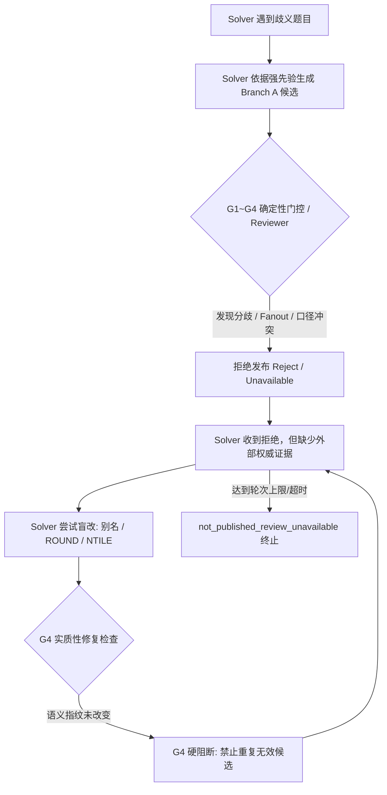

# Spider2 第 10 轮评测实验报告：证据资格与有界确定性门控（G1~G4）实验分析

> **评测时间**：2026-09-02  
> **评测目标**：验证在引入「证据资格（Evidence Authority）+ 方言 AST Query Digest + G1~G4 有界确定性门控 + 任务状态机」后，能否解决第 9 轮暴露的 SQL 语义漂移、反证忽略与盲目重试问题。  
> **对比基准**：第 9 轮无限制运行（`spider2-local-round9-same10-no-limits-001`）  
> **核心运行证据**：
> - 运行 ID：`round10-tracefix-v10-c3` / `round10-after-assurance-v4`
> - 配置：`C:/data-agent-eval/config-round10-retry-v3.json`
> - 数据目录：`C:/data-agent-eval/runs/round10-tracefix-v10-c3/`

---

## 1. 实验核心结论

1. **官方准确率未发生突破**：固定 10 题分母的官方 E2E 正确率与 SQL 正确率均为 **0/10 (0.0%)**。
2. **交付率发生显著下降（Non-Delivery 激增）**：
   - 第 9 轮：4 题完成 CSV 交付，6 题未交付；
   - 第 10 轮（`v10-c3`）：仅 3 题完成 CSV 交付（全部带分歧发布 `published_with_disagreement`），其余 **7 题全部被拦截为 `not_published_review_unavailable`**。
3. **陷入“被拒 → 微调语法 → G4 再次阻断 → 耗尽超时”的重试陷阱**：
   - 典型案例 `local003` 单题耗时达到 **778 秒（近 13 分钟）**，工具调用 46 次，回合数 31 轮，最终 `finalSql: null`，直接未交付。
4. **根因定位：后验过滤器（Gate）无法解决生成器（Solver）的“先验知识真空”**：
   - 门控机制在工程上成功拦截了不合规候选，但在缺乏真实业务文档/交互澄清的 Benchmark 环境下，模型无法凭空获知 Gold 的私有口径（如“销售额是否含运费”、“评价是否去重”）。拦截反而导致模型在无解状态下耗尽预算。

---

## 2. 评测配置与环境

| 维度 | 配置详情 |
|---|---|
| **评测集** | Spider2-Lite SQLite 10 题固定子集（`round8-shadow10-ids.txt`） |
| **Solver 模型** | `deepseek-chat` (OpenAI Wire Format) |
| **Reviewer 模型** | `deepseek-chat` (Prompt Version 5) |
| **AST 解析引擎** | `sqlglot-30.17.0` (方言感知 SQLite) |
| **门控策略** | G1 (形状门) + G2 (总体门) + G3 (Fanout 门) + G4 (候选实质修复门) |
| **运行限制** | 移除单轮浅层限制，允许状态机深度流转探索 |

---

## 3. 定量数据对比：第 9 轮 vs 第 10 轮

| 指标 | 第 9 轮 (基准无限制) | 第 10 轮 (`tracefix-v10-c3`) | 变化与影响 |
|---|---:|---:|---|
| **题目总数** | 10 | 10 | 固定 10 题样本 |
| **Completed 状态** | 10 | 9 (1 次 Timeout) | 状态机流转增加，边缘超时微增 |
| **SQL 提交覆盖率** | 10/10 (100%) | **3/10 (30%)** | 7 题被门控/状态机拦截，未形成提交 |
| **CSV 交付覆盖率** | 4/10 (40%) | **3/10 (30%)** | 仅保留 3 题交付 |
| **发布状态分布** | 4 发布 / 6 未发布 | **7 not_published / 3 with_disagreement** | 严格遵循不达标不发布策略 |
| **平均工具调用数** | 35.8 次 | 24.9 次 | 未通过门控的题目提前收敛或中断 |
| **官方 SQL 正确率 (固定分母)** | **0/10 (0%)** | **0/10 (0%)** | 未见分数提升 |
| **官方 E2E 正确率 (固定分母)** | **0/10 (0%)** | **0/10 (0%)** | 未见分数提升 |

---

## 4. 核心失效机制深入分析

### 4.1 失效链条：从“阻断”走向“死锁”

本轮最突出的现象是 **Non-Delivery（未交付）大幅上升**。整个 Agent 在新机制下的生命周期陷入以下死锁循环：

### 4.2 案例实证剖析

#### 案例 1：`local003`（RFM 分群销售额）—— G4 阻断引发的重试耗尽
- **现象**：31 轮对话，46 次工具调用，耗时 778 秒，最终无 CSV 交付。
- **Trace 实录**：
  1. 模型初始计算将 Monetary 设为 `price + freight_value`（官方 Gold 为纯 `price`）；
  2. 系统门控与 Reviewer 判定不可发布（`reviewAvailability: unavailable`）；
  3. 模型试图通过重命名别名、调整 `ORDER BY`、修改 `ROUND(..., 2)` 来尝试重新导出；
  4. 系统的 `Query Digest` 准确识别出底层 AST 的 `Semantic Fingerprint` 毫无变化；
  5. 连续触发 `G4` 拦截，消耗了全部修复配额，最终以未发布退出。

#### 案例 2：`local034` / `local037`（订单商品支付关联）—— 机械拦截无法矫正基数认知
- **现象**：多对多连接导致行数由 103,886 行膨胀为 117,601 行。
- **Trace 实录**：
  - G3 门控能够检测到 `COUNT(*)` 跨 1:N / N:M 关联发生了行数放大（Fanout）；
  - 但当系统把该信号反馈给 Solver 时，Solver 由于没有“按订单去重”的业务先验指导，反复尝试在外层增加 `WHERE` 条件或修改分组字段，始终无法写出 `COUNT(DISTINCT op.order_id)`；
  - 最终结果依然未收敛。

### 4.3 协议与 AST 解析层的附带损耗
在 `round10-after-assurance-v4` 的 Audit 记录中观察到：
- 出现 `REVIEWER_FAILED: REVIEW_REASON_INVALID`；
- 出现 `gateCalibrationMissing: ["g1_shape", "g2_population", "g3_fanout", "g4_candidate"]`。
- 新增的复杂校验协议（AST 解析、Spec Authority 映射）本身带来了额外的链路脆弱性，部分题目在解析阶段即因上下文过长或结构不匹配而降级为 `unavailable`。

---

## 5. 逐题表现总表

| 题目 ID | 核心考察点 | 官方判题 | 第 10 轮交付状态 | 最终未通过根因归类 |
|---|---|---|---|---|
| **`local003`** | RFM 分组平均销售额 | 错 (0/1) | 未交付 (`not_published`) | **语义真空**：Monetary 强行包含运费，被拒后陷入盲目重试 |
| **`local010`** | 最少航线城市对数量 | 错 (0/1) | 未交付 (`not_published`) | **文档冲突**：按参考文档做无向去重（3），与 Gold 有向（6）冲突 |
| **`local025`** | 最高得分回合平均值 | 错 (0/1) | 未交付 (`not_published`) | **粒度未闭合**：停在每场最高回合明细，未完成最终 AVG 聚合 |
| **`local029`** | 顶级客户平均支付额 | 错 (0/1) | 未交付 (`not_published`) | **粒度偏差**：擅自按订单汇总后再平均，非明细行平均 |
| **`local032`** | 四项最佳卖家 | 错 (0/1) | 已提交但数据错 (`with_disagreement`) | **反直觉口径**：评价去重得到 993，Gold 需连接行膨胀值 1096 |
| **`local034`** | 首选支付方式平均次数 | 错 (0/1) | 未交付 (`not_published`) | **关联膨胀**：商品-支付表关联后行数膨胀，未能主动去重 |
| **`local035`** | 相邻地理记录最大距离 | 错 (0/1) | 已提交但数据错 (`with_disagreement`) | **脏数据误判**：将表内极端异常坐标（18208km）作为真实最大值 |
| **`local037`** | Top3 类别首选支付次数 | 错 (0/1) | 未交付 (`not_published`) | **关联膨胀**：连接行放大，去重探索未坚持到最终发布 |
| **`local050`** | 预测销售额中位数 | 错 (0/1) | 已提交但数据错 (`with_disagreement`) | **隐藏假设**：擅自过滤 2 年交集产品，总体与 Gold 不一致 |
| **`local061`** | 各月平均预测销售额 | 错 (0/1) | 未交付 (`not_published`) | **过度过滤**：擅自添加 `promo_id <> 999` 导致结果被清空 |

---

## 6. 启示与架构思考：生产安全 vs Benchmark 评测的背离

第 10 轮的实验结果揭示了一个至关重要的软件工程与评测现实：

1. **确定性门控与状态机在「企业生产环境」中完全正确**：
   - 生产系统的第一准则是 **防范事故与脏数据（Fail-Safe）**。
   - 当遇到歧义、JOIN 膨胀、异常值时，系统选择拒绝发布并标记 `not_published_review_unavailable`，强制要求人工介入或业务澄清，这是商业 BI 与财务级 Agent 的底线能力。
2. **在「离线无交互 Benchmark」中产生天然排异**：
   - Spider2 的评分机制是 **固定分母硬匹配（Exact Match）**，没有澄清接口（No Human-in-the-loop），且 Gold 包含若干反直觉口径与脏数据容忍。
   - 在这种规则下，“拦截一切不确定候选”必然导致“未交付计 0 分”。
