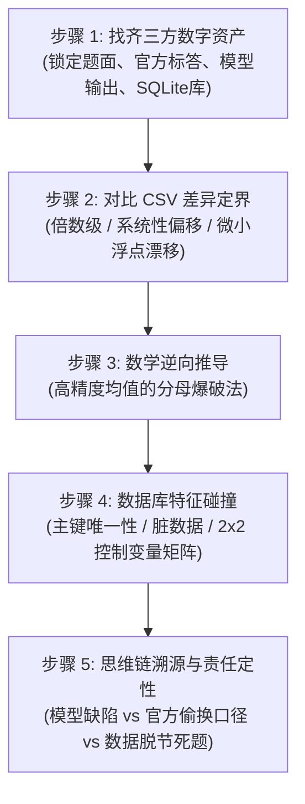

# Text-to-SQL 错题快速归因与标答逆向排查指南 (SOP)

> **目标受众**：评测工程师、数据分析师、算法工程师及任何刚接触 Text-to-SQL 评测的团队成员。  
> **核心目的**：在 Spider2 / BIRD 等 Benchmark 评测中，当模型出现评测失败（0分）或结果不符时，提供一套标准化、可复制的五步排查方法论，在 5~10 分钟内完成：**精准推导官方标答口径、定位真实代码分歧、并判定是模型失误还是官方数据/SQL Bug**。

---

## 一、核心排查心法

```
【常见误区】：看一眼题目 -> 读一遍模型写的复杂 SQL -> 凭空猜测出题人到底怎么想的 -> 陷入主观争论。
【正确心法】：一切以底层数据库的真实行数为锚！
              官方输出的数值是死的，必然由底层数据物理聚合得出。
              通过数学逆向反推官方漏掉/多算了哪几行，再去数据库里对准主键和字段做特征碰撞，最后对照思维链定性。
```

---

## 二、标准五步操作法（The 5-Step SOP）



---

### 步骤 1：找齐三方资产（耗时：1~2 分钟）

排查开始前，不要看 SQL，先快速将以下三方文件准备到位：

| 资产类型 | 所在目录/绝对路径规范 | 关键提取信息 |
| :--- | :--- | :--- |
| **① 官方金标**<br>(Ground Truth) | `Spider2/spider2-lite/evaluation_suite/gold/exec_result/<id>.csv`<br>`Spider2/spider2-lite/evaluation_suite/gold/sql/<id>.sql`<br>`Spider2/spider2-lite/evaluation_suite/gold/spider2lite_eval.jsonl`<br>`Spider2/spider2-lite/spider2-lite.jsonl` | 1. 官方标答 CSV 的确切值（唯一事实）<br>2. 官方是否有标答 SQL？（若无，提示为离线数据导出）<br>3. 评测规则：`tolerance` 容差（默认 0.01）、`ignore_order` 是否为 true |
| **② 模型提交**<br>(Agent Output) | `runs/<run_id>/submissions/sql/<id>.sql`<br>`runs/<run_id>/submissions/csv/<id>.csv`<br>`runs/<run_id>/transcripts/<id>/*.jsonl` | 1. 模型提交的最终 SQL 与 CSV 结果<br>2. 模型完整执行思维链（CoT）与探查历史 |
| **③ 底层物理库**<br>(Ground Reality) | `Spider2/spider2-lite/resource/databases/spider2-localdb/<db>.sqlite` | 本地 SQLite 物理数据库文件 |

---

### 步骤 2：对比 CSV，进行“差异定界”（耗时：1 分钟）

对比模型的 CSV 和官方 Gold CSV，快速归入以下三种差异模式：

```
                    ┌─── 倍数级差异 (2x, 3x, 10x) ──────────> 90% 是 JOIN 产生 1 对多扇出膨胀
                    │
两份 CSV 对比 ──────┼─── 系统性整体偏移 (差几点或固定比例) ──> 分母集合定义不同 (如漏算 NULL、分组基数错位)
                    │
                    └─── 微小浮点漂移 (差 0.003% 或几毛钱) ───> 实体主键未去重，或极少数测试行未清洗
```

* **排序检查**：如果行数与数值完全一致，只是顺序不同，立即查看 `spider2lite_eval.jsonl` 中的 `"ignore_order"`。若为 `true`，则顺序无关。
* **列数检查**：若模型输出 3 列而官方 2 列，评测函数 `compare_pandas_table` 通常支持列包含匹配；只要数值能完全对上就不会因此判错。

---

### 步骤 3：数学逆向推导——“分母爆破法”（最核心武器）

**当官方标答是一个多位小数的平均值/比率时，这是秒级破案的杀手锏。**

#### 原理：
任何平均值必然满足：
$$\text{Average} = \frac{\text{分子总和 (Sum)}}{\text{分母记录数 (Count)}}$$
由于分子总和在绝大多数业务场景下是整数（或以分为单位的金额），只要在一个合理的大致行数区间内循环，看哪个整数 $N$ 能让 $\text{Average} \times N$ 最接近整数，即可**精确还原官方计算时的物理记录数**！

#### 开箱即用 Python 脚本：
```python
# 示例：已知官方标答为 target_avg，全表大约在 100,000 ~ 115,000 行
target_avg = 94026.03572038967

for n in range(100000, 115000):
    val = target_avg * n
    # 如果乘积与最接近的整数相差极小
    if abs(val - round(val)) < 1e-5:
        print(f"【命中官方分母】参与计算的记录数: n = {n}, 分子总和 = {round(val)}")
        break
```

> **实战威力（以 local040 为例）**：
> 1. 运行脚本，瞬间输出：官方分母必为 **$n = 105,318$**；
> 2. 查询当前 SQLite 库里该区域的总行数：正好是 **$106,374$** 行；
> 3. 计算缺口：$106,374 - 105,318 = \mathbf{1,056}$ 行！
> 4. **瞬间锁定突破口**：官方标答在计算时，不多不少，**正好排除了 1,056 条记录**！排查范围立刻从 69 万行急剧收窄到这 1,056 行。

---

### 步骤 4：数据库特征碰撞（在 SQLite 里验证假设）

拿到精准差值（例如 `1,056` 行）后，直接在 SQLite 上对数据表进行特征碰撞，不要凭空猜想。

#### 1. 实体主键唯一性校验（排查重复）
```sql
-- 检查事实表主键是否存在重复
SELECT COUNT(*) - COUNT(DISTINCT primary_key) FROM table_name;
```
* **实测案例**：在 `local040` 中，执行 `SELECT COUNT(*) - COUNT(DISTINCT tree_id) FROM trees WHERE boroname = 'Staten Island'`，输出结果**不多不少正好是 1,056**！
* 真相大白：官方是按真实的树木实体（`DISTINCT tree_id`）加权计算的，而模型偷懒用了 `COUNT(*)` 包含了重复行。

#### 2. 脏数据与分类标签校验
若主键无重复，则检查特定状态列是否恰好有 1,056 条：
```sql
SELECT status_col, COUNT(*) 
FROM table_name 
GROUP BY status_col 
HAVING COUNT(*) = 1056;
```

#### 3. 编写 2x2 控制变量验证矩阵
在 Python 中对模型写法与官方写法的分歧点进行排列组合运行：
* **实验组 1**：模型原始提交 SQL
* **实验组 2**：仅改动分歧 A（如去掉 NULL 过滤）
* **实验组 3**：仅改动分歧 B（如加入主键去重）
* **实验组 4**：同时改动 A + B（即官方逻辑）

**只有当某一组实验能在本地 SQLite 跑出与 Gold CSV 小数点后 15 位完全一致的结果时，才算真正完成了归因闭环。**

---

### 步骤 5：思维链溯源与责任定性（输出复盘结论）

确认技术分歧后，查阅模型 `transcript.jsonl`，查看模型当时的 CoT（思维链），完成责任分类归因：

```
                             ┌─── 模型规则违规 / 推理缺陷 ─────> 题面/数据正常，模型违反了 rules.md (如盲信主键未 DISTINCT)
                             │
责任分类 (三选一) ─────────────┼─── 官方口径偷换 / 不严谨 ───────> 题面问支付次数(payments)，SQL 偷懒写订单数(orders)
                             │
                             └─── 评测集制作事故 / 死题 ────────> 库里无标答 SQL，数据导入与离线 CSV 脱节，数学上不可解
```

---

## 三、经典真题实战档案速查

### 案例 1：`local040`（NYC 树木与收入）——模型盲信事实表主键
* **现象**：三区平均收入差了几块钱（94029 vs 94026，相对误差仅 0.003%），被判 0 分。
* **逆向路径**：
  1. 分母爆破发现官方分母为 105,318，比库里的 106,374 恰好少了 1,056 行；
  2. SQLite 碰撞主键：`COUNT(*) - COUNT(DISTINCT tree_id)` 正好等于 1,056；
  3. 模型思维链审计：模型在 Turn 23 检查了空值与邮编，但潜意识认为 `trees` 表每一行就是一棵唯一的树，从未检查 `tree_id` 唯一性，违反了 `rules.md` 规则 2.1。
* **定性**：**模型推理/规则缺陷**。

### 案例 2：`local034` & `local037`（巴西电商 Olist）——官方偷换度量实体
* **现象**：`local034` 均值差 3 块钱；`local037` 树木前三大类数量差几十笔（7565 vs 7540）。
* **逆向路径**：
  1. 题面明确要求：`total number of payments`（支付次数）；
  2. 查数据库：一个订单多次刷卡在支付表里有多个流水号（`payment_sequential`）；
  3. 官方标答 SQL 曝光：官方为了省事直接写成了 `COUNT(DISTINCT oi.order_id)`（订单数）；
  4. 模型在思维链中明确考虑了这一点，严谨地统计了支付流水（`pay_key`），反而被官方偷懒写法淘汰。
* **定性**：**官方口径偷换**。

### 案例 3：`local029`（巴西电商 Olist）——官方低级扇出 Bug
* **现象**：模型算出的订单数与官方标答相差数倍。
* **逆向路径**：
  1. 题面要求：计算特定金额条件的订单数；
  2. 官方标答 SQL 曝光：官方把 `orders` 与 `order_payments` 做 `JOIN`，但没有按 `order_id` 预聚合，直接对外层做 `COUNT(o.order_id)`；
  3. 数据库验证：用 3 张代金券支付的订单被扇出成 3 行，导致 1 笔订单被计算成 3 笔。
* **定性**：**官方 SQL 自身存在低级 Bug**。

### 案例 4：`local028`（巴西电商 Olist）——时间口径任性偏离常理
* **现象**：各月份订单量分布完全错位。
* **逆向路径**：
  1. 电商公认常识：月度销售趋势必然基于下单时间（`order_purchase_timestamp`）；
  2. 官方标答 SQL 曝光：官方任性使用了妥投签收时间（`order_delivered_customer_date`），由于跨月运输，整年数据错位。
* **定性**：**官方时间口径偏离常识**。

---

## 四、团队排查自查清单（Checklist）

在对外汇报错题前，自查是否满足以下 4 点：
- [ ] 官方 Gold CSV 的确切值是多少？官方目录是否有对应的 Gold SQL？
- [ ] 是否用 Python “分母爆破脚本”算出了官方参与聚合的实际行数缺口？
- [ ] 是否在 SQLite 里通过控制变量脚本，100% 精确复现出 Gold CSV 的数值？
- [ ] 模型是违反了 `rules.md`，还是被官方出题人的偷懒/Bug 背刺？
