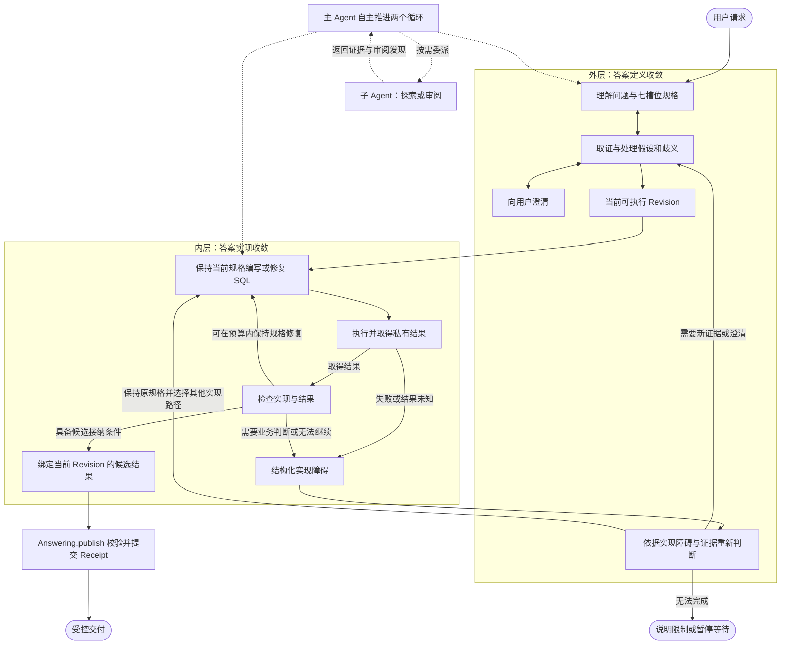

# Answering 模块内外双层业务循环架构设计方案

> **版本**：v1.1  
> **初稿日期**：2026-09-16  
> **状态**：架构设计，尚不表示实现或验收完成  
> **设计目标**：将 Answering 的求解过程组织为外层“答案定义收敛”和内层“答案实现收敛”，由主 Agent 自主推进整个过程，按需调用子 Agent 探索和审阅。保留 Pi 的唯一执行状态权威与 Answering 的唯一查询业务状态权威。

---

## 1. 架构结论与适用范围

**采用业务内外双层循环作为 Answering 的整体求解架构，而不是仅在扁平循环中追加检测工具或提示词。**

这两层对应两种不同的业务变化：

- **外层改变答案定义**：通过理解、证据和澄清，收敛“应该回答什么”。
- **内层改变答案实现**：在当前答案定义下，通过实现、执行、检查和修复，收敛“怎样得到这个答案”。

核心原则是：

> 实现失败不等于业务定义错误；业务定义发生变化，则必须重新审视实现。

双层循环的价值在于局部化试错、隔离修改权限，并允许实现反馈推动业务判断。它不是一次性的 Planner → Executor 流水线，也不要求所有请求走过固定步骤。

### 1.1 两个正交维度

| 维度 | 划分内容 | 作用 |
|---|---|---|
| 业务循环 | 外层答案定义、内层答案实现 | 明确修改对象、证据要求、收敛条件和跨层反馈 |
| 执行协作 | 主 Agent、按需调用的子 Agent | 提供探索与审阅协作，由主 Agent 自主调度 |

**禁止把这两个维度机械映射为“主 Agent = 外层，子 Agent = 内层”。**

主 Agent 统筹并推进两个业务循环；子 Agent 只负责受委派的探索和审阅，可服务于任一层，不拥有某一层循环。子 Agent 的调用时机、数量和是否并行，不由业务循环图固定规定。

### 1.2 与现有架构的关系

本方案以 `backend_architecture_decoupling_analysis_and_plan.md` 的状态权威、五用例 Interface、发布一致性和 Pi 执行约束为基础，细化 Answering 内部的业务求解结构；`backend_architecture_target_design.md` 仍为辅助入口。

- Data Agent 仍是唯一产品 Agent。
- Pi AgentHarness 仍是唯一 Agent 执行内核。
- Answering 仍是唯一查询业务状态权威。
- ResultStore 保存不可变结果；Presentation 只消费受控投影和授权结果。
- 两层循环不引入第二套 Runner、QA checkpoint、独立业务状态副本或兼容双写。

---

## 2. 为什么需要双层业务循环

扁平求解过程容易混淆两种问题：

1. **答案定义尚不清楚**：统计什么实体、采用什么总体和分母、如何理解时间与排名要求。
2. **答案定义已明确，但实现存在障碍**：字段映射、SQL 方言、连接与聚合写法、结果形状或执行故障。

如果这两种问题没有明确分流，模型可能为了让查询执行成功而删减过滤、修改统计主体或简化指标，也可能在业务歧义尚未解决时反复修 SQL。

双层架构的作用不是声称能消除所有错误，而是使两种变化有不同的正当理由：

- 修改实现，需要说明它如何保持当前答案定义。
- 修改答案定义，需要新的合格证据或用户澄清，而不是一条技术错误。

当前 `candidate-checks.ts` 主要提供完整性、输出形状和身份检查。JOIN 等更深入的检查是可以扩展的内部能力，但**某个探针是否实现，不是双层架构是否成立的前提**。先建立求解职责与跨层契约，再评估具体检查能力。

---

## 3. 整体架构与自主调度

### 3.1 职责总览

```text
用户请求
   │
   ▼
主 Agent：自主推进整个求解过程，决定下一步与是否委派
   │
   ├─ Answering 外层业务循环
   │    理解问题 ↔ 收集证据 ↔ 澄清歧义 ↔ 确定答案规格
   │                         │
   │                         │ 当前可执行 Revision
   │                         ▼
   ├─ Answering 内层业务循环
   │    编写 SQL ↔ 执行与检查 ↔ 保持规格的技术修复
   │                         │
   │          ┌──────────────┴──────────────┐
   │          ▼                             ▼
   │      候选结果                     结构化实现障碍
   │          │                             │
   │          ▼                             └─→ 返回外层判断
   │    Answering.publish
   │          │
   │          ▼
   │    PublicationReceipt → 受控交付
   │
   └─ 按需委派子 Agent：探索 / 审阅
        可辅助任一业务循环；返回证据、发现与覆盖限制
        不修改权威规格，不接管内层，不授予发布许可

Pi：负责上述 Agent 活动的执行、调度原语、取消和恢复
Answering：负责业务契约、权限、收敛条件与唯一查询业务状态
```

### 3.2 业务反馈图

下图表达允许的业务关系，不是要求每个请求逐节点执行的固定工作流，也不表示两个独立的 Agent。



### 3.3 主子 Agent 协作

主 Agent 根据未决问题与风险，自主决定是否委派。例如：

- 外层可委派探索数据源与文档，也可委派审阅规格解释是否遗漏题面要求。
- 内层可委派探索字段性质与连接基数，也可委派审阅 SQL 是否符合当前规格。
- 简单请求可以不调用子 Agent；复杂请求也不要求每轮都调用。

子 Agent 接收完成委派所需的有界上下文与受限工具，返回探索证据或审阅发现。它不承担整段 SQL 生成—修复—发布循环，不直接修订权威 Spec，也不直接执行最终候选生成与发布。探索使用只读、不可发布的探索路径。

子 Agent 的意见是输入，不是权威决定：观测仍是观测，审阅仍有覆盖范围。主 Agent 负责综合这些信息，Answering 负责按证据资格和业务规则接纳变化。子 Agent 的执行状态由 Pi 管理，不另建一套任务生命周期。

---

## 4. 外层：答案定义收敛

### 4.1 修改对象

外层围绕唯一规范 AnswerSpec 的七槽位工作：

- `entity`：统计实体与业务键；
- `metric`：指标、分子分母及聚合顺序；
- `filters`：资格总体与条件作用域；
- `groupBy`：分组粒度；
- `time`：时间基准、窗口与边界；
- `ranking`：排序、数量与并列政策；
- `output`：交付形态与必要输出约束。

外层关心实现是否可行，但不把 SQL 局部写法作为业务口径。探索可以发生在规格尚未就绪时，不应要求先解决全部假设才能取证。

### 4.2 收敛条件

外层收敛意味着当前请求已经具备足以实施的答案定义：必要槽位明确或明确不适用，关键假设与选择按政策完成处置，证据适用范围和需要披露的内容可追溯。

这不表示语义正确性已经被证明，也不要求把所有不确定性强行标成“已证实”。未知不能伪装为不适用，允许的 provisional 处置也不能伪装为权威支持。

ReadyRevision 是**当前实现目标的版本凭据**，不是整个任务永远不可改变的终态。发生合格的新证据或用户澄清时，可以通过外层建立新 Revision；旧实现不能因此自动绑定到新 Revision。

### 4.3 接收内层反馈

外层收到实现障碍后，可以：

1. 保持原规格，补充物理映射或选择其他实现路径；
2. 获取新证据，或请求用户澄清；
3. 在证据支持下提出业务修订，并建立新 Revision；
4. 说明当前数据或能力限制，暂停或结束求解。

**升级到外层，不等于必须修改 Spec。** 字段缺失、空结果、探针不可用或预算耗尽，都不能单独授权改变用户要的答案。

### 4.4 证据原则

业务证据按既有 Evidence Authority 与适用范围处理：用户澄清、已审核定义或语义模型、任务文档、题面措辞、正式 Schema、观测数据、模型推断。

优先级不能替代证据资格检查。尤其是观测数据只能说明数据现象，不能单独确定用户的业务意图；子 Agent 的审阅结论也不能自动升级为权威定义。

---

## 5. 内层：答案实现收敛

### 5.1 修改对象与职责

内层在当前可执行 Revision 下处理查询实现：物理映射、SQL 编写、执行、检查，以及保持语义的技术修复。它由主 Agent 推进，必要时调用探索或审阅子 Agent 辅助。

“内层不能修改 Spec”约束的是**该业务活动允许产生的变化**，不是规定另一个 Agent 必须接管执行。同一个主 Agent 若发现需要改变答案定义，应显式返回外层，按业务修订契约处理，而不是在技术修复中悄悄改口径。

### 5.2 收敛与升级

内层有两类主要输出：

- **候选结果**：绑定当前 Revision、查询身份和不可变 ResultRef，满足接纳条件，并携带检查发现和覆盖限制。
- **实现障碍**：描述当前不能完成的原因、已取得的证据、检查范围与需要外层判断的问题。

内层可以在发现业务歧义时立即升级，不必先耗尽重试次数。纯技术问题则可在有界预算内继续修复，不能以修改分母、移除过滤、降低指标要求等方式“修复”。

### 5.3 有界推进，而不是固定脚本

架构要求存在明确预算，但不将“固定 2～3 次”作为所有任务的结构常量。具体次数和成本上限由版本化政策及任务资源约束决定。

- 预算覆盖修复次数、探针数量、耗时和扫描成本。
- 外层修订或子 Agent 委派不得隐式重置同一任务的累计预算。
- 预算耗尽代表当前路径未完成，不证明业务规格错误。
- 不可确定是否已执行的调用进入既有未知结果处理，不自动重跑。
- 执行预算与恢复使用 Pi 的机制，不新增 Answering Runner 或 QA checkpoint。

### 5.4 检查是内部能力，不是循环本身

内层可使用 CandidateCheck、受控探针与按需审阅，检查规则与处置动作分开：

- 确定违反完整性或已确认约束的问题，按政策阻断接纳或发布；
- 风险发现可推动继续探索、修复或外层澄清；
- `unknown/not_applicable` 等结果保留覆盖信息，不伪装为 `clear`；
- 审阅或探针失败，不自动成为修改业务定义的依据。

具体检查应单独设计和评估，不在本架构中固定通用自动修复表。例如，JOIN 键重复不能单独证明度量错误，空集可能是正确答案，`DISTINCT` 或 `LIMIT 1` 也不是通用修复。应以“是否保持当前规格”为依据，而不是以“是否让检查变绿”为依据。

### 5.5 执行与发布身份

一次修复可能产生新的查询尝试，但不能覆盖已有候选或把旧结果改绑为新实现。每个被接纳的最终结果来自一次执行并封存，Preview 与发布内容读取同一 Result Candidate，发布不得重新执行 SQL。

内层产出 Candidate，而不是凭“检查通过”自行签发 Receipt。主 Agent 发起发布请求，`Answering.publish()` 根据当前 Revision、结果身份与发布政策生成幂等 PublicationReceipt。

---

## 6. 跨层契约与状态权威

### 6.1 最小业务契约

本节定义需要表达的信息，不新增一组外部命令或可写协议。

| 契约 | 必要信息 | 不包含的权力 |
|---|---|---|
| 当前实现目标 | Task、当前可执行 Revision、七槽位规格、相关证据与披露要求 | 修改 Spec、绕过 Ready 资格或发布检查 |
| 实现结果 | Candidate 身份、对应 Revision、检查发现与覆盖限制 | 自动签发 Receipt、覆盖已有结果 |
| 实现障碍 | 对应 Revision、问题与证据、已有尝试摘要、需外层判断的事项 | 自动修订 Spec、宣告业务定义错误 |
| 探索或审阅委派 | 明确问题、必要上下文、范围与资源约束 | 拥有某一业务循环或直接修改权威状态 |
| 协作反馈 | 证据来源、观察或发现、覆盖范围与未决项 | 自报业务验证成功或授予发布许可 |

实现障碍应区分技术失败、映射不足、需要业务判断、预算耗尽及执行结果未知，避免把所有失败都压成“规格冲突”。没有发生 SQL 执行的障碍，也不必伪造一条 `failedSql`。

### 6.2 权限与收敛由 Answering 约束

Answering 定义并强制执行的是：

- 什么证据允许处置假设或修订规格；
- 什么条件允许基于当前 Revision 执行最终查询；
- 哪些修改属于保持规格的实现尝试，哪些需要外层业务修订；
- 候选与当前 Revision 的关联、接纳及发布条件。

不能只依赖提示词或模型返回的 `suggestedAction` 建立这些约束，也不应把它们变成固定的 Agent 调度表。主 Agent 选择下一步行动，但其业务写入仍须通过 Answering 校验；子 Agent 的权限由可信执行上下文限制。

### 6.3 保持现有五用例 Interface

对外仍为：

```text
begin / revise / execute / publish / inspect
```

内外循环是这些用例背后的业务组织方式，不要求增加 `startOuterLoop`、`runInnerAgent`、`forceRepair` 等外部操作。跨层契约沿现有业务记录和返回值表达，不建立另一份 Outer/Inner Task 权威状态。

- **Answering**：唯一管理 Spec、Evidence、Hypothesis、Choice、Candidate 与 Receipt 等查询业务状态。
- **Pi**：唯一管理主子 Agent 的 Operation、Tool invocation、调度、取消和恢复。
- **ResultStore**：保存封存的私有结果。
- **Presentation**：读取投影与 Receipt 授权的结果。

业务循环可以在同一个主 Agent 执行过程中多次往返；这种往返不是第二套执行运行时。

---

## 7. 演进实施路径

实施以业务架构为先，不以增加某个探针或强制引入内层子 Agent 为第一步。

### 阶段一：建立双层业务契约

- 明确外层与内层的修改对象、收敛条件和跨层反馈。
- 将技术失败与业务修订理由分开表达。
- 保持五用例 Interface 与唯一业务状态权威。
- 先覆盖“同一主 Agent、不调用子 Agent”也能完成两个循环的路径。

### 阶段二：接入按需探索与审阅协作

- 主 Agent 自主选择委派时机，不固定必经子 Agent 步骤。
- 子 Agent 只获得完成探索或审阅所需的权限和上下文。
- 两层都可以使用协作反馈，但反馈不能直接修改 Spec 或授权发布。
- 执行与恢复由 Pi 承担，不增加子 Agent 业务状态副本。

### 阶段三：逐项增强内层检查与反馈质量

- 在明确适用范围后增加结构检查、探针与审阅能力。
- 保留检查覆盖和不可判定信息，避免“所有探针必须 clear”的通用门控。
- 从旁路记录和针对性评测开始，再按证据决定是否赋予阻断能力。
- 新检查或探针不改变两层业务分工，也不要求修改 Host 或重建执行运行时。

### 阶段四：验证架构收益

比较扁平求解与双层业务求解在相同任务条件下的表现，重点观察：

- 技术错误是否更少诱发无依据的业务修订；
- 真正的业务歧义是否得到及时澄清，而不是被技术修复掩盖；
- 交付正确率、未交付率、延迟与成本是否改善；
- 主 Agent 是否能自主选择直接完成或按需协作，而非机械走流程。

不以 Agent 数量、调用次数、循环层数或新增检查数量作为架构成功指标。

---

## 8. 架构验收原则

1. 主 Agent 可以独立推进外层和内层，子 Agent 不是任一循环的必需执行者。
2. 主 Agent 可在两层任意合适时点委派探索或审阅；子 Agent 不能直接修订权威规格、生成最终候选或发布。
3. 技术修复保留当前 Spec；需要改变答案定义时，显式进入外层并提供修订依据。
4. 实现障碍不会自动修改 Spec；外层可以保持规格、继续取证、澄清或说明无法完成。
5. 当前 Revision 变化后，旧候选不能被改绑为新 Revision 的结果。
6. 探索产物不能发布；观测和审阅意见不能自行升级为业务语义证明。
7. 修复与跨层往返有整体预算，不因修订或委派无限重置；未知执行结果不自动重跑。
8. Candidate 接纳与 Receipt 发布继续由 Answering 政策约束，Preview 与交付读取同一封存结果。
9. Pi 和 Answering 各自保持唯一状态权威，没有额外 Runner、QA checkpoint 或业务状态双写。
10. 简单请求不被迫经历多轮探索、审阅或修复；架构规定契约，不机械编排步骤。

---

## 9. v1.1 修订摘要

- 将设计中心从“SQL 探针与自愈流水线”调整为 Answering 的整体双层业务求解架构。
- 明确业务循环与主子 Agent 协作是正交维度，撤销“主 Agent 外层、子 Agent 内层”的固定映射。
- 明确主 Agent 自主统筹两个循环，子 Agent 仅按需承担探索和审阅。
- 将“冻结”限定为当前实现目标的版本绑定，不把 ReadyRevision 描述为不可再演进的业务终态。
- 将升级定义为返回外层判断，不等同于强制修订；将内层成功输出调整为 Candidate，而非直接签发 Receipt。
- 移除固定探针、固定重试次数和通用自动修复动作对架构的机械约束，保留有界推进与语义保持原则。
- 同步修订流程图、跨层契约、状态权威、实施路径和验收原则；本次仅更新设计文档，不表示代码已完成相应演进。
