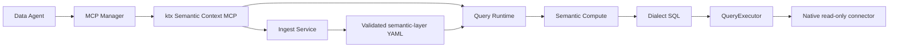
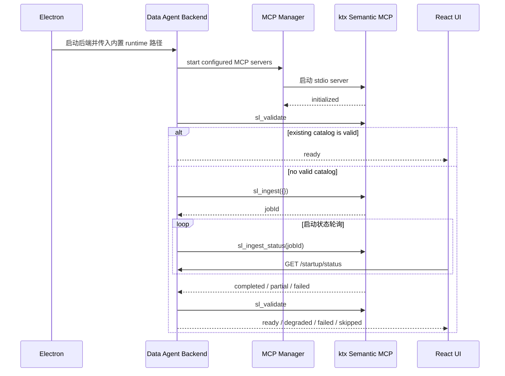

# Data Agent ktx 语义上下文组件移植方案 V2

## 1. 文档状态

- 状态：实施中（2026-08-11 已批准统一连接注册表与统一 LLM 配置修订）
- 版本：V2
- 日期：2026-08-10
- 产品仓库：`D:\data_agent`
- **ktx** 源码：`D:\data_agent\ktx`
- 参考抽取模块：`C:\Users\Negan\Desktop\context_engine\ktx_semantic_calculator_mcp`
- 上游基线：`45aa95d2cc121267bbbc8c184402a19573956dd4`

本文件取代 `docs/semantic_ingest_startup_design.md` 中与生产源码位置、查询运行时、组件交付方式冲突的内容。旧文档保留为讨论记录，不再作为实施依据。

## 2. 最终结论

将 **ktx** 的声明式语义查询和 context-source ingest 组合成一个内置的本地 MCP 组件，随 Data Agent 安装包交付：



生产约束如下：

1. 一个 **ktx** MCP 实例同时提供 Ingest 和 Query。
2. Data Agent 统一连接注册表是宿主模式下数据库连接的唯一事实源；`ktx.yaml` 只保存项目、来源策略和外部连接引用。
3. Query 直接复用原始 **ktx** Project Loader、Semantic Compute、Dialect、QueryExecutor 和 native connector。
4. Ingest 直接复用原始 **ktx** connector、adapter 和 ingest orchestration，不经 Data Agent Database MCP 中转。
5. Data Agent 启动时先校验并复用已有有效 catalog；首次无有效 catalog 时显式触发 Ingest，用户重试时显式后台刷新，前台展示状态。
6. 用户安装 Data Agent 后不需要 Node、Python、npm、pnpm 或开发机源码路径。
7. 旧 Python Gateway 和新的 **ktx** Query Runtime 不长期共存；迁移验收后只保留原始 **ktx** 生产链。
8. Data Agent 现有默认 LLM profile 是宿主模式下 LLM 的唯一事实源；Semantic MCP 与 Agent 共用该 profile，不维护第二套模型配置。

## 3. 设计原则

### 3.1 完整性优先

“完成”不是能生成一条 SQL，而是以下链路全部成立：

```text
configured source
-> ingest
-> diff / reconciliation
-> validated semantic YAML
-> declarative query
-> semantic planning
-> dialect transcription
-> read-only execution
-> bounded result
-> packaged product smoke
```

### 3.2 简洁性优先

只保留必要边界：

- 一个 MCP 进程；
- 一个 `ktx.yaml`；
- 一个生产 Query Runtime；
- 一个 Ingest job；
- 一个 Data Agent 启动状态服务；
- 一个前端状态接口；
- 一个发布运行时目录。

不增加分布式队列、Ingest daemon、事件总线、WebSocket、远程控制面、第二套数据库网关或兼容 fallback。

### 3.3 原始能力优先

原始 **ktx** 已有实现优先于本地重写。Data Agent 只增加生命周期、产品状态和打包接入，不重新实现 Planner、Dialect、QueryExecutor、connector 或 context-source adapter。

### 3.4 两条硬性禁止

以下禁令高于进度、演示、发布期限和“先跑起来”的局部目标，任何阶段均不得规避：

1. **禁止“差不多了就交付”。** 只要方案、计划或 Definition of Done 中仍有与本次交付范围相关的必需链路、退出门禁或真实环境验证未通过，就不得使用“完成”“已交付”“完整闭环”“可以发布”等结论。局部 smoke、fixture、fallback、单表查询和进程成功只能按其实际证据范围记录，不得向上推断为系统完成。
2. **禁止“糊弄完成”。** 不得用任务状态 `completed`、接口可调用、文件已生成、测试替身通过、`row_count` 可查询、手工修补后的结果或错误路径上的局部成功，替代原始 **ktx** 行为、真实产物质量和端到端验收。发现主流程错位、能力降级、测试覆盖错误或验收标准不足时，必须立即撤销此前的完成结论，明确标记未完成，记录根因并按原始流程重新验证。

执行要求：

- 每项“完成”声明必须同时给出对应需求、生产调用链、真实产物和验证证据；四者缺一即为未完成。
- 不允许通过把未完成项改名为 `partial`、`degraded`、`fallback`、`smoke` 或移出当前阶段来维持完成结论；这些术语只能描述真实状态，不能改变验收门禁。
- 开发日志必须区分“代码已写”“局部测试通过”“真实链路通过”和“产品完成”，并保留失败、降级与撤销结论的记录。
- 一旦用户要求的是“完整移植”，验收基准就是原始 **ktx** 的完整生产行为，而不是功能相似、接口兼容或最低可运行版本。

## 4. 源码与交付边界

### 4.1 唯一生产源码

生产实现归属 `D:\data_agent\ktx`：

```text
D:\data_agent\ktx\packages\cli\src
  -> semantic context application
  -> semantic-only MCP adapter
  -> stdio entrypoint
```

在 `@kaelio/ktx` 的源码层增加受支持的内部应用入口，直接导入现有源码模块。不得在生产代码中动态加载 npm 包的私有 `dist` 路径。

### 4.2 参考抽取模块

`context_engine\ktx_semantic_calculator_mcp` 只作为以下内容的迁移来源：

- 已形成的 MCP schema 和测试样例；
- Ingest diff、proposal、reconciliation、rollback 设计；
- 上游 Python semantic-layer conformance；
- 旧路径差距清单。

它不进入 Data Agent 运行时依赖，也不随产品交付。需要的行为迁入 **ktx** 后，删除或归档重叠生产代码，避免双实现。

### 4.3 产品交付

Data Agent 安装包内置：

```text
resources/
  ktx-semantic-context/
    node/
    app/
    node_modules/
    python-runtime/
    licenses/
```

开发模式可使用系统 Node 22；正式安装包必须携带固定 Node 22 runtime 和 **ktx** managed Python runtime。首启不从网络下载运行时。

不采用 Node SEA 或单文件打包。**ktx** 包含动态模块、运行时资源和 native dependency，目录式 sidecar 更直接、可诊断、可验证。

### 4.4 可写项目目录

运行时二进制和用户项目必须分离：

```text
安装目录/resources/ktx-semantic-context/   # 只读运行时
Electron userData/semantic-context/        # 可写 ktx 项目
  ktx.yaml
  semantic-layer/
  raw-sources/
  .ktx/
```

Electron 将明确的项目目录传给 Data Agent 后端，再由 MCP 配置传给 **ktx**。不得在安装目录写 catalog、raw source 或 job state。升级安装包不得覆盖用户项目。

Data Agent 根据统一连接注册表维护受管的 connection ref 和 ingest connection ID；不复制连接参数或凭据。不存在启用语义摄入的连接且没有独立 **ktx** 来源时，启动状态为 `skipped` 并提示需要配置。

## 5. 组件内部结构

```text
ktx Semantic Context MCP
├── SemanticContextApplication
│   ├── QueryRuntime
│   ├── IngestService
│   ├── CatalogPublisher
│   └── ProjectRuntime
├── MCP tools
│   ├── sl_ingest
│   ├── sl_ingest_status
│   ├── sl_discover
│   ├── sl_read_source
│   ├── sl_validate
│   └── sl_query
└── stdio entrypoint
```

`SemanticContextApplication` 是唯一应用入口。MCP handler 不直接访问文件、adapter、connector 或数据库 SDK。

## 6. Query Runtime

### 6.1 生产链

```text
sl_query
-> loadKtxProject(ktx.yaml)
-> load validated semantic-layer/<connectionId>/*.yaml
-> compileLocalSlQuery
-> managed Python semantic compute
-> driver dialect
-> createKtxCliIngestQueryExecutor
-> createKtxCliScanConnector
-> connector.executeReadOnly
-> bounded result
```

虽然现有函数名包含 `Cli`，这里是进程内函数组合，不执行 `ktx sl query` 命令，也不经过命令行参数解析。

### 6.2 声明式查询契约

`sl_query` 完整支持原始 **ktx** 查询输入：

- `connectionId`；
- `measures`，包括已批准引用和原始 **ktx** 支持的命名表达式；
- `dimensions` 和 `granularity`；
- `filters`；
- `segments`；
- `orderBy`；
- `limit`；
- `includeEmpty`；
- `maxRows`。

返回：

- `connectionId`；
- `dialect`；
- `sql`；
- `headers`；
- `rows`；
- `totalRows`；
- `plan`。

Agent 工具层只开放已批准 semantic refs 和受限 filter DTO。低层 Runtime 保持原始 **ktx** 契约，治理发生在应用入口，不修改 Planner 能力。

### 6.3 执行安全

- 连接必须存在于 `ktx.yaml`；
- driver 必须支持 `readOnlySql`；
- SQL 由 Semantic Compute 生成；
- connector 必须执行只读校验；
- `maxRows` 必须向执行器传递；
- connector 必须在成功和失败后 cleanup；
- 不允许 Query Runtime fallback 到 Database MCP；
- 不提供任意 SQL MCP 工具。

## 7. Ingest Service

### 7.1 统一入口

`sl_ingest` 读取 `ktx.yaml`，不接受任意路径、driver、credential 或 adapter override：

```json
{
  "connectionId": "optional"
}
```

- 空输入：处理全部可 Ingest 的已配置连接；
- 指定 `connectionId`：只处理该连接，用于诊断和重试；
- 同一项目只允许一个 active job；
- 重复调用返回当前 job，不创建第二个任务。

### 7.2 全来源能力

Ingest 由 **ktx** 原始 production entrypoints 和 semantic production registry 驱动，而不是把所有来源强行塞进同一条 WorkUnit 流水线：

- live database metadata 和 relationship evidence；
- dbt；
- MetricFlow；
- LookML / Looker；
- Metabase；
- historic SQL evidence；
- 已有 semantic YAML；
- **ktx** 当前 production registry 后续新增并通过 conformance 的来源。

只把满足 grain、measure、join 和验证规则的产物发布到 executable semantic layer。historic SQL 只产生 usage evidence，不能自动批准 measure。

数据库连接与 context-source 必须保持原始 **ktx** 的职责分流：

- 数据库连接执行 enriched scan：结构采集、描述与 embedding enrichment、正式/推断/复合关系发现、数据库侧验证和 `_schema` manifest 发布；
- dbt、MetricFlow、LookML / Looker、Metabase、historic SQL 等 context-source 执行 SourceAdapter / WorkUnit / reconciliation 流水线；
- 两条分支由同一个 `sl_ingest` job 聚合状态和 finalization，但不得用 `runLocalIngest(adapter=live-database)` 替代数据库 enriched scan。

Notion、Wiki、Memory 等不产生或补强 executable semantic catalog 的 broader context 能力不进入本组件。它们属于完整 **ktx** context layer 的独立产品范围，不能为了“全来源”而塞进语义查询组件。

### 7.3 执行流水线

```text
database connection
-> structural scan
-> enrichment
-> relationship discovery / profiling / validation
-> _schema manifest
-> validation / finalization

context source
-> detect / acquire / stage / diff
-> WorkUnit
-> deterministic projection or constrained LLM proposal
-> reconciliation
-> validation / finalization
-> raw/provenance archive
```

LLM 只能提交结构化 proposal，不能直接写正式目录。

对 context-source ingest 写出的独立 source，如果 proposal 没有提供 measure，可以确定性补充 `row_count = count(*)`，保证该 source 最低限度可执行且不推测业务口径。`row_count` 不代表数据库 enrichment、关系图或业务指标已经完整，也不得单独使结构型 catalog 进入 `ready`。

### 7.4 产物归属

每个自动产物记录：

- `ownerConnectionId`；
- adapter/source kind；
- raw paths；
- content fingerprint；
- generation timestamp；
- semantic source name。

规则：

1. 来源只能更新或删除自己拥有的产物。
2. 无归属记录的人工 YAML 永不自动删除。
3. 两个来源声明同一目标时失败关闭。
4. 文件内部实体删除必须进入 semantic diff，不能只比较原始文件是否存在。
5. unchanged 重跑不改写 YAML、归属状态或 Git history。

### 7.5 Last-Known-Good

Ingest 的 acquire、chunk 和 projection 在 staging 中完成。只有 finalization 使用项目级 catalog mutex：

```text
staging proposal
-> acquire catalog mutex
-> write with rollback journal
-> validate complete affected catalog
-> commit ownership/provenance
-> release mutex
```

查询在长时间 Ingest 阶段继续使用最近一次有效目录，只在 finalization 的短窗口等待。验证失败恢复原文件和归属状态，不污染 active catalog。

## 8. MCP 工具与权限

| 工具 | Data Agent 宿主 | LLM Agent | 说明 |
| --- | ---: | ---: | --- |
| `sl_ingest` | 允许 | 默认隐藏 | 启动或重试 Ingest |
| `sl_ingest_status` | 允许 | 默认隐藏 | 读取当前/最近 job 状态 |
| `sl_validate` | 允许 | 默认隐藏 | 启动门禁和诊断 |
| `sl_discover` | 允许 | 允许 | 发现 semantic entities |
| `sl_read_source` | 允许 | 允许 | 读取已发布 semantic source |
| `sl_query` | 允许 | 允许 | 声明式查询 |

使用 Data Agent 现有 MCP bridge allowlist，不建设通用权限平台。

### 8.1 Ingest job 状态

```text
idle -> queued -> running -> completed
                         -> partial
                         -> failed
```

状态只保存在 MCP 进程内存中。进程重启后由宿主校验并复用有效 catalog；仅在缺少有效 catalog 或用户显式重试时重新执行幂等 Ingest，不增加 job 数据库。

`sl_ingest_status` 返回 job ID、阶段、连接进度、结果摘要和安全错误码，不返回凭据、SQL、绝对 raw path 或 LLM transcript。

## 9. Data Agent 启动集成

### 9.1 启动时序



`/health` 只表示后端进程可用，不等待 Ingest。业务状态使用独立 `/startup/status`。

### 9.2 产品状态

```text
checking -> ready
         -> ingesting -> ready
                      -> degraded
                      -> failed
         -> skipped
ready -> refreshing -> ready / degraded
```

- `ready`：本轮成功且所需 catalog 有效；
- `refreshing`：用户显式刷新正在后台执行，查询继续使用 last-known-good；
- `degraded`：本轮部分失败，但存在 last-known-good；
- `failed`：没有可安全查询的 catalog；
- `skipped`：没有配置语义组件，保留非语义能力。

首次启动的 `checking` 和 `ingesting` 阶段阻止语义分析。`refreshing` 和 `degraded` 允许进入并继续使用 last-known-good，同时明确展示后台同步或不可用连接。

### 9.3 API 与 UI

最小后端 API：

```text
GET  /startup/status
POST /startup/semantic-ingest/retry
```

React 只轮询状态 API，显示当前连接、阶段、完成数、失败摘要和重试入口。详细 adapter 步骤和文件路径进入日志，不进入 UI。

## 10. 配置与凭据

### 10.1 单一事实源与投影

Data Agent 宿主模式使用两个已有事实源：

- `connections.json`：数据库连接注册表，Database MCP 与 Semantic MCP 共用；
- 默认 LLM profile：Agent 与 Semantic Ingest 共用模型、endpoint 和 secret。

`ktx.yaml` 仍是唯一 **ktx** 项目和来源策略配置，但受管数据库与 LLM 只保存环境引用：

```yaml
setup:
  database_connection_ids:
    - warehouse

connections:
  warehouse:
    ref: env:DATA_AGENT_CONNECTION_WAREHOUSE

llm:
  provider:
    backend: openai-compatible
    openai:
      api_key: env:DATA_AGENT_KTX_LLM_API_KEY
      base_url: env:DATA_AGENT_KTX_LLM_BASE_URL
  models:
    default: env:DATA_AGENT_KTX_LLM_MODEL

ingest:
  adapters:
    - live-database
```

每个 `DATA_AGENT_CONNECTION_*` 值是一个完整 JSON connection object，由 Project Loader 解析后再经过现有 driver schema 校验。独立使用 **ktx** 时仍允许内联 connection 与 LLM 配置；Data Agent 管理的运行路径不使用内联凭据。

保存连接、切换默认连接、切换默认 LLM 或启动后端时，Data Agent 以结构化 YAML 更新受管引用并重启/协调 Semantic MCP。未受管的 dbt、Metabase 等 **ktx** 来源配置保持不变。

### 10.2 凭据

- 数据库凭据和 LLM API Key 只由 Data Agent 既有配置层保存；`ktx.yaml` 不落 secret；
- Data Agent 启动 MCP 时通过环境变量传递连接 JSON 和 LLM profile；
- 日志、MCP result、progress、状态 API和 fingerprint 不包含 secret；
- Database MCP 与 Semantic MCP 共享配置事实源，但不共享运行时连接对象，也不互相调用。

## 11. Database MCP 的边界

```text
普通 SQL/数据库工具 -> Data Agent Database MCP
声明式语义查询      -> ktx sl_query -> native connector
语义来源摄入        -> ktx sl_ingest -> native connector/adapters
```

两条能力从统一连接注册表读取同一逻辑连接，但不互相转发、不共享运行时连接对象。Semantic MCP 通过进程环境接收临时投影，避免在 `ktx.yaml` 中复制明文凭据。

## 12. 故障处理

| 故障 | 行为 |
| --- | --- |
| MCP 启动失败 | 使用现有 MCP reconnect；产品状态 `failed` |
| `ktx.yaml` 无效 | 返回字段级配置错误，不开始 Ingest |
| 连接引用环境变量缺失/无效 | Project Loader 返回引用字段错误，不启动该项目 |
| 默认 LLM 缺失或不支持 | Ingest 明确失败并提示配置默认 LLM，不静默切换模型 |
| 单连接不可达 | 按 `failureMode` 继续或结束，其他连接不被回滚 |
| proposal 冲突 | 失败关闭，保留 active catalog |
| semantic validation 失败 | 回滚 affected artifacts 和 ownership |
| MCP 进程重启 | 丢弃内存 job；宿主先校验并复用有效 catalog，仅在无有效 catalog 或用户显式重试时 Ingest |
| Query 发生在 finalization | 等待 catalog mutex，不读取半写状态 |
| catalog 不存在 | `sl_query` 返回 `semantic_catalog_not_ready` |
| driver 不支持只读 SQL | 明确拒绝执行，不 fallback |

## 13. 非目标

V2 不增加：

- 定时 Ingest 调度；
- 独立 Ingest 进程；
- 远程 MCP/HTTP 服务；
- 分布式任务队列；
- job 持久化数据库；
- WebSocket；
- 多租户控制面；
- 任意 SQL 工具；
- Database MCP bridge；
- 第二套 semantic planner；
- 旧新查询链 fallback；
- 未经实际需求证明的插件框架。

## 14. 迁移策略

迁移采用替换而不是叠加：

1. 在原始 **ktx** 源码中建立受支持的 Semantic Context application API。
2. 用该 API 建立 semantic-only MCP 和完整测试。
3. 在 Data Agent 开发配置接入，但不启用旧新 fallback。
4. 将旧单数据库配置迁移到统一连接注册表，并为 `ktx.yaml` 生成受管引用。
5. 将默认 LLM profile 投影到 Semantic MCP 环境，完成 OpenAI-compatible 与 Anthropic 映射。
6. 完成 Ingest、Query、MySQL、启动状态和安装包验收。
7. 一次性将生产配置切到新组件。
8. 删除旧 `SemanticGateway -> python -m semantic_runtime -> local warehouse` 查询路径。
9. 删除 `connections.yaml` 生产配置和私有 `dist` 动态加载 adapter。
10. inventory 确认无 caller 后，归档重叠抽取模块。

## 15. 完成定义

以下条件全部满足，V2 才算完成：

1. Data Agent 安装包内可启动一个内置 **ktx** Semantic MCP，无开发机依赖。
2. `sl_ingest({})` 能发现并处理 `ktx.yaml` 中全部 production registry 来源。
3. 多来源 ownership、删除隔离、冲突、unchanged 和 rollback 有 focused tests。
4. Ingest 失败不会破坏 last-known-good。
5. `sl_query` 完整经过原始 **ktx** Semantic Compute、Dialect、QueryExecutor 和 native connector。
6. MySQL 查询不调用 Database MCP，并通过真实 read-only E2E。
7. Agent 只能看到允许的 semantic query tools。
8. Data Agent 在首次无有效 catalog 时显式触发 Ingest，已有 catalog 启动时校验复用；前端展示进度、后台刷新、失败和重试。
9. 开发、PyInstaller backend、Electron unpacked 和安装包环境均通过 smoke。
10. 用户机器不需要 Node、Python、npm 或 pnpm。
11. 旧 Python Gateway、旧 local warehouse execution 和私有 `dist` adapter 无生产 caller 并已删除。
12. 两个仓库的测试、开发日志、WORKLOG、许可证和发布说明同步完成。
13. Database MCP 与 Semantic MCP 使用同一连接注册表，Agent 与 Semantic Ingest 使用同一默认 LLM profile，且生成的 `ktx.yaml` 不含 secret。
