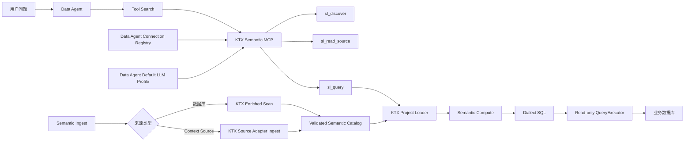
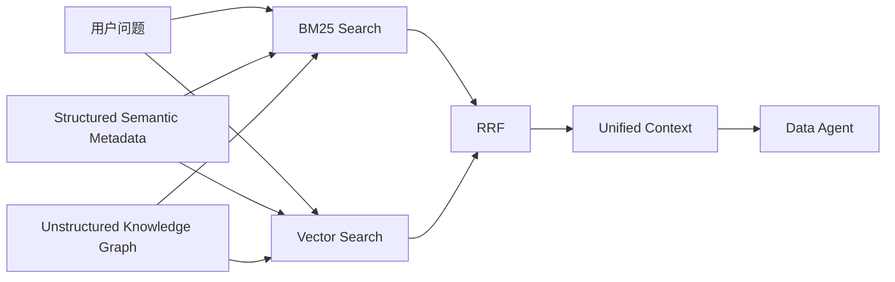

# Data Agent 语义层引擎改造方案

## 1. 方案状态

- 产品项目：`D:\data_agent`
- KTX 工作区：`D:\data_agent\ktx`
- 改造目标：为 Data Agent 装配结构化数据语义层
- 当前策略：暂不建设向量检索
- 后续规划：非结构化语义知识图谱统一采用 **BM25 + 向量检索 + RRF**
- 核心原则：
  - 不重复实现 KTX 已有能力
  - 不增加新的常驻服务
  - 不引入第二套连接、模型和状态配置
  - 不维护两条生产查询链
  - 以真实业务闭环为完成标准

---

## 2. 最终结论

在现有集成基础上继续采用：

> **KTX 原生能力 + 内置 Semantic MCP + Data Agent 薄宿主适配层**

不抽取、翻译或重新实现 KTX 语义层。

本阶段关闭 KTX embedding，但保留：

- 数据库结构采集
- 表和字段语义描述
- 正式外键读取
- 确定性关系发现
- LLM 关系提议
- 数据库侧关系验证
- `_schema` manifest 生成
- 声明式指标查询
- 只读 SQL 编译与执行
- FTS5/BM25 式关键词检索

后续建设非结构化语义知识图谱时，再统一增加：

```text
BM25 召回
+
向量召回
+
RRF 融合排序
```

不在 KTX 内提前建设一套临时向量检索系统。

---

## 3. 设计原则

### 3.1 KTX 负责语义计算，Data Agent 负责产品集成

KTX 负责：

- 数据库扫描
- 元数据 enrichment
- 关系发现与验证
- 语义层 YAML
- 声明式查询编译
- SQL 生成

Data Agent 负责：

- 数据库连接管理
- LLM 配置管理
- Semantic MCP 生命周期
- 启动状态与刷新状态
- Agent 工具暴露
- 最终 SQL 执行边界与结果限制

双方通过现有 MCP 边界通信，不建立 Python 与 TypeScript 之间的内部模块耦合。

### 3.2 单一事实源

| 配置 | 唯一事实源 |
|---|---|
| 数据库连接 | Data Agent Connection Registry |
| 默认数据库 | Data Agent 默认连接 |
| LLM 模型与密钥 | Data Agent 默认 LLM Profile |
| 语义项目策略 | `ktx.yaml` |
| 语义层产物 | KTX `semantic-layer` |
| Ingest 状态 | Semantic MCP |
| 查询执行链 | KTX Query Runtime |

禁止：

- 在 KTX 中保存第二套数据库凭据
- 在 KTX 中维护第二套 LLM 配置界面
- Data Agent 与 KTX 分别维护一套语义 catalog
- Semantic Query 失败后回退到 Agent 自由编写 SQL
- Database MCP 与 KTX Query Runtime 并行执行同一语义查询

### 3.3 embedding 是可选增强能力，不是 enrichment 前置条件

本项目将 embedding 定义为：

> 关系候选发现与检索排序的可选信号，而不是结构采集、LLM 描述、关系验证和语义查询的硬依赖。

关闭 embedding 后仍应执行：

- LLM 表描述
- LLM 字段描述
- 正式 PK/FK 提取
- 名称相似关系候选
- 表名与字段名规则匹配
- 字段类型兼容判断
- LLM 关系提议
- 唯一性与覆盖率分析
- 数据库侧关系验证
- 关系图解析
- `_schema` manifest 写入

唯一明确放弃的能力是：

- `embedding_similarity` 关系候选信号
- KTX 内部向量检索
- 本地 embedding daemon
- `sentence-transformers`
- PyTorch 打包
- embedding API 调用

### 3.4 不提前设计未来检索引擎

本阶段不增加：

- 独立向量数据库
- 新的 Retrieval Service
- 新的 embedding worker
- 新的知识图谱存储
- 新的 RRF 排序模块
- 结构化与非结构化统一索引

只保留未来演进边界：

```text
Agent
  ├── Semantic MCP
  │     ├── sl_discover
  │     ├── sl_read_source
  │     └── sl_query
  │
  └── Future Context Retrieval
        ├── BM25
        ├── Vector Search
        └── RRF
```

等非结构化知识图谱模型、切块策略和权限模型明确后，再设计统一检索层。

---

## 4. 目标架构



运行时保持：

- 一个 Semantic MCP 进程
- 一个 `ktx.yaml`
- 一个数据库连接注册表
- 一个默认 LLM Profile
- 一条声明式查询执行链
- 一个 active ingest job

---

## 5. 本次改造范围

### 5.1 必须改造

1. 数据库 Ingest 恢复到 KTX 原始 enriched scan
2. KTX LLM enrichment 支持关闭 embedding
3. `ktx.yaml` 显式关闭 embedding
4. catalog readiness 增加完整性判断
5. 保持现有 MCP 接口和 Data Agent 启动集成
6. 完成真实数据库端到端验证
7. 验证打包产物不包含本地 embedding 运行时

### 5.2 保持不变

- `sl_discover`
- `sl_read_source`
- `sl_query`
- Semantic MCP 进程模型
- Data Agent MCP Manager
- Data Agent Connection Registry
- Data Agent 默认 LLM Profile
- Query Runtime
- Semantic Compute
- Dialect SQL
- QueryExecutor
- native read-only connector
- 前端现有语义层启动状态接口
- Last-Known-Good catalog 复用机制

### 5.3 本次不做

- 非结构化材料知识图谱
- 向量模型选型
- embedding 生成
- 向量数据库选型
- RRF 参数设计
- 统一检索 API
- KTX 全量 fork 清理
- 全部上游改动重构
- 新增独立语义层服务

---

## 6. 核心改造设计

### 6.1 数据库与 Context Source 正确分流

#### 当前问题

当前链路：

```text
SemanticContextApplication
-> runLocalIngest
-> live-database adapter
-> WorkUnit bundle
```

这条链能够生成逐表 YAML，但绕过了 KTX 原始数据库 enriched scan，因此没有完整执行：

- 正式 FK 处理
- relationship profiling
- 数据库侧关系验证
- relationship graph resolution
- `_schema` manifest 生成
- 深度 enrichment

#### 改造后

```text
SemanticContextApplication
-> KTX Public Ingest Plan
-> connection type routing
   ├── database-ingest
   │     -> runKtxScan
   │     -> mode: enriched
   │     -> detectRelationships: true
   │
   └── source-ingest
         -> existing SourceAdapter
         -> runLocalIngest
```

#### 实现原则

不在 `SemanticContextApplication` 中重新实现数据库驱动识别和 Ingest 流程。

直接复用 KTX 已有：

- `buildPublicIngestPlan`
- `executePublicIngestTarget`
- `runKtxScan`
- `runLocalIngest`

`SemanticContextApplication` 只负责：

1. 选择目标连接
2. 调用公共 Ingest 入口
3. 将 KTX 结果映射到现有 Semantic MCP 状态
4. 触发 catalog validation

不新增：

- `DatabaseSemanticIngestService`
- 第二套 adapter registry
- `public-ingest.ts` 的复制实现
- Data Agent Python 层数据库扫描
- Database MCP 元数据中转

### 6.2 无 embedding 的 LLM enrichment

#### 目标模式

```yaml
ingest:
  embeddings:
    backend: none

scan:
  enrichment:
    mode: llm

  relationships:
    enabled: true
    llmProposals: true
    validationRequiredForManifest: true
```

该模式的语义是：

```text
真实 LLM 描述
+ 确定性关系发现
+ LLM 关系提议
+ 数据库侧关系验证
- embedding
```

#### KTX 最小改动

当前 KTX 在 `scan.enrichment.mode: llm` 时把 embedding provider 作为硬前置条件。

应将其修改为：

```text
LLM provider：必需
Embedding provider：可选
```

目标逻辑：

```ts
if (mode === "llm") {
  const llmRuntime = resolveLlmRuntime();

  if (!llmRuntime) {
    return missingLlm;
  }

  const embeddingProvider = optionalEmbeddingProvider();

  return {
    status: "ready",
    providers: {
      llmRuntime,
      ...(embeddingProvider
        ? { embedding: createEmbeddingPort(embeddingProvider) }
        : {}),
    },
  };
}
```

禁止采用：

- `mode: deterministic`
- 假 LLM Runtime
- 占位描述
- 空字符串描述
- 手工补 description
- embedding 失败后跳过整个 enrichment

#### 预检规则调整

数据库 Public Ingest readiness 从：

```text
LLM 配置存在
AND scan.enrichment.mode = llm
AND embedding 配置存在
```

调整为：

```text
LLM 配置存在
AND scan.enrichment.mode = llm
```

当 `embedding.backend: none` 时：

- 不应 preflight failure
- 不应启动 managed embedding daemon
- 不应下载本地模型
- 不应调用 embedding API
- 不应将 `embeddings: skipped` 判为失败

### 6.3 `ktx.yaml` 配置

由 Data Agent 配置同步逻辑生成或维护：

```yaml
connections:
  default-mysql:
    ref: env:DATA_AGENT_CONNECTION_DEFAULT_MYSQL

setup:
  database_connection_ids:
    - default-mysql

ingest:
  adapters:
    - live-database
  embeddings:
    backend: none

scan:
  enrichment:
    mode: llm

  relationships:
    enabled: true
    llmProposals: true
    validationRequiredForManifest: true

llm:
  provider:
    backend: openai-compatible
    openai:
      api_key: env:DATA_AGENT_KTX_LLM_API_KEY
      base_url: env:DATA_AGENT_KTX_LLM_BASE_URL

  models:
    default: env:DATA_AGENT_KTX_LLM_MODEL

  promptCaching:
    enabled: false
```

#### 配置约束

Data Agent 只负责同步宿主拥有的字段：

- `connections`
- `setup.database_connection_ids`
- `ingest.embeddings.backend`
- `scan.enrichment.mode`
- `scan.relationships`
- `llm.provider`
- `llm.models.default`

其他 KTX 用户配置应保持不变，禁止每次启动重写整个文件。

本阶段固定：

```yaml
ingest:
  embeddings:
    backend: none
```

不配置：

- model
- dimensions
- OpenAI embedding credentials
- sentence-transformers
- base URL
- 本地模型路径

### 6.4 Catalog Readiness

#### 当前不足

当前 `catalogReady` 主要判断：

- 是否存在 semantic source
- source 是否通过 Semantic Compute validation

这会把以下情况误判为 ready：

- 只有逐表 YAML
- 没有 `_schema` manifest
- enrichment 未执行
- relationship stage 失败
- 旧 structural-only catalog

#### 改造原则

不新增数据库表或状态服务。

直接复用 KTX 已有：

- `scan-report.json`
- `semantic-layer` source records
- Semantic Compute validation
- enrichment state
- manifest artifact 信息

#### 数据库 Catalog Ready 条件

数据库连接必须同时满足：

1. 至少存在一个 semantic source
2. Semantic Compute validation 成功
3. 存在最新成功的 `scan-report.json`
4. `mode` 为 `enriched`
5. `dryRun` 为 `false`
6. `manifestShardsWritten > 0`
7. `enrichmentState.failedStages` 为空
8. 表描述状态不是 `failed`
9. 字段描述状态不是 `failed`
10. 关系发现阶段不是 `failed`
11. 未出现不可恢复的 enrichment 错误

允许：

```text
enrichment.embeddings = skipped
```

`embeddings: skipped` 不影响 ready。

#### Context Source Ready 条件

非数据库来源保持现有规则：

1. source records 非空
2. Semantic Compute validation 成功
3. Ingest report 没有 failed WorkUnit

#### 无关系数据库的处理

不能使用 `accepted relationships > 0` 作为通用 readiness 条件，因为合法数据库可能不存在可验证关系。

关系数量只作为质量指标，不作为所有数据库的统一硬门禁。但对于包含已知正式 FK 的 E2E 测试数据库，必须验证对应关系出现在 manifest 中。

### 6.5 Ingest 状态映射

保留现有 MCP 状态结构：

```text
queued
running
completed
partial
failed
```

保留现有字段：

- `jobId`
- `currentConnectionId`
- `completedConnections`
- `totalConnections`
- `summary`
- `results`
- `catalogReady`
- `errorCode`

不新增新的状态协议。

#### 状态映射规则

| KTX 结果 | Semantic MCP 状态 |
|---|---|
| 所有目标成功且 catalog ready | `completed` |
| 部分目标失败但已有有效 catalog | `partial` |
| 刷新失败但 Last-Known-Good 可用 | `partial` / 宿主展示 degraded |
| 所有目标失败且无有效 catalog | `failed` |
| 执行成功但 catalog 不完整 | `failed` |
| embedding skipped | 不影响状态 |

以下情况不能标记为 `completed + catalogReady`：

- 只有 `row_count` 可查询
- 只有表级 YAML
- `joins: []` 但数据库存在正式 FK
- 缺少 `_schema`
- LLM enrichment 被跳过
- 使用 deterministic 占位描述
- 手工补 measure 后查询成功

### 6.6 Last-Known-Good

继续使用现有 Last-Known-Good 策略，不再创建新的版本仓库。

首次启动：

```text
没有有效 catalog
-> 启动 Ingest
-> Ingest 完成并验证
-> ready
```

已有有效 catalog：

```text
启动
-> 直接复用
-> 不重复 Ingest
-> ready
```

显式刷新：

```text
已有 catalog
-> refreshing
-> 旧 catalog 继续服务
-> 新 catalog 验证成功后切换
```

刷新失败：

```text
保留旧 catalog
-> degraded
-> 返回刷新错误
-> 查询继续使用 Last-Known-Good
```

首次 Ingest 失败：

```text
无可用 catalog
-> failed
-> 不暴露伪 ready
```

### 6.7 Query Runtime

查询链保持不变：

```text
Agent
-> sl_discover
-> sl_read_source
-> sl_query
-> Project Loader
-> Semantic Compute
-> Dialect SQL
-> QueryExecutor
-> native read-only connector
-> bounded result
```

Semantic Query 失败时：

- 返回结构化错误
- 提示补充语义定义或刷新 catalog
- 不自动调用 `database_query`
- 不让 Agent 自由生成 SQL
- 不走旧 Python Gateway
- 不切换到另一套语义计算器

---

## 7. 代码改造清单

### 7.1 KTX

#### `packages/cli/src/context/scan/local-scan.ts`

- LLM enrichment 不再硬依赖 embedding
- embedding provider 为空时仍构建 LLM enrichment providers
- `embeddings: skipped` 作为正常状态
- 保留 LLM provider 缺失错误

#### `packages/cli/src/public-ingest.ts`

- `enrichmentReadinessGaps` 不再将 embedding 作为数据库 Ingest 前置条件
- 继续要求真实 LLM 配置
- 继续要求 `scan.enrichment.mode: llm`
- 保持数据库连接进入 `database-ingest`

#### `packages/cli/src/semantic-context/application.ts`

- 不再将数据库连接统一送入 `runLocalIngest`
- 使用 KTX Public Ingest Plan 分流
- 数据库连接调用原始 enriched scan
- Context Source 保持 SourceAdapter Ingest
- 将 KTX structured result 映射为当前状态协议
- 完成后调用增强版 catalog validation

#### Catalog validation

优先在 KTX 现有 scan 模块中暴露一个只读的最新扫描报告读取函数。

不创建新的状态存储，只读取现有：

```text
raw-sources/<connection>/<sync>/scan-report.json
```

### 7.2 Data Agent

#### `src/config_manager.py`

- 同步 `ingest.embeddings.backend: none`
- 同步 `scan.enrichment.mode: llm`
- 同步关系发现开关
- 保持 Data Agent 默认 LLM Profile 投影
- 只更新宿主拥有字段
- 保留用户其他 KTX 配置

#### `src/semantic_startup.py`

原则上不改变架构，仅在需要时调整：

- 对新 catalog readiness 结果的处理
- embedding skipped 不显示为失败
- incomplete catalog 不显示为 ready
- 保持 retry、refreshing 和 Last-Known-Good

#### MCP Manager

不改，继续加载：

```text
Bundled ktx semantic context MCP
```

---

## 8. 最小化改动约束

本次不借机处理全部 KTX fork 技术债，只修改完成当前目标所必需的代码。

| 类型 | 允许 |
|---|---:|
| database ingest 路由修复 | 是 |
| embedding 可选化 | 是 |
| readiness 完整性 | 是 |
| Data Agent 配置投影 | 是 |
| 必要测试 | 是 |
| 重写 KTX Ingest | 否 |
| 重写语义计算器 | 否 |
| 新增微服务 | 否 |
| 新增状态数据库 | 否 |
| 新增向量数据库 | 否 |
| 重构全部上游改动 | 否 |
| 修改 MCP 工具协议 | 原则上否 |
| 新增 Agent 工具 | 否 |

---

## 9. 测试与验收

### 9.1 单元测试

#### 无 embedding enrichment

验证：

- `mode: llm`
- embedding provider 为 `null`
- resolution 状态为 ready
- providers 包含真实 LLM runtime
- providers 不包含 embedding
- enrichment 不被整体跳过

#### Public Ingest preflight

验证以下配置：

```yaml
llm: configured
scan.enrichment.mode: llm
ingest.embeddings.backend: none
```

应生成：

```text
operation: database-ingest
preflightFailure: undefined
```

#### 路由

验证：

- MySQL/PostgreSQL/SQLite 等数据库进入 `database-ingest`
- Metabase/dbt/LookML 等进入 `source-ingest`
- 数据库不调用 `runLocalIngest(live-database)`
- Context Source 不调用 `runKtxScan`

#### 配置同步

验证：

- embedding 始终为 `none`
- scan enrichment 为 `llm`
- LLM 凭据仍通过环境变量引用
- 用户无关配置不被删除

#### Readiness

覆盖：

- source 为空
- semantic validation 失败
- structural-only catalog
- manifest 缺失
- enrichment stage 失败
- embedding skipped
- 完整 enriched catalog

### 9.2 KTX 集成测试

准备包含以下结构的数据库：

- 普通主键
- 正式外键
- 复合关系
- 无外键但可通过字段和数据验证发现的关系
- 无关系独立表
- 一对多关系
- 可能形成 fan/chasm trap 的结构

验证产物：

- `scan-report.json`
- `_schema` manifest
- table descriptions
- column descriptions
- relationship diagnostics
- relationship profile
- semantic-layer YAML
- accepted/review/rejected 统计
- embeddings 状态为 skipped

对于数据库中声明的正式 FK：

- 不允许在最终 manifest 中全部丢失
- join 方向必须正确
- 反向关系符合 KTX 规则
- 引用表和字段必须真实存在
- 数据库侧验证结果必须可追踪

### 9.3 Data Agent 端到端测试

完整链路：

```text
Data Agent startup
-> bundled Semantic MCP
-> database enriched scan
-> catalog validation
-> Agent tool_search
-> sl_discover
-> sl_read_source
-> sl_query
-> Semantic Compute
-> SQL
-> native read-only connector
-> database result
```

必须测试：

1. 单表指标查询
2. 维度聚合
3. 两表 join 查询
4. 多表 join 查询
5. 时间维度查询
6. 无效指标错误
7. 不存在 source 错误
8. SQL 只读限制
9. 结果行数上限
10. 已有 catalog 重启复用
11. 显式刷新
12. 刷新失败时 Last-Known-Good
13. 首次 Ingest 失败
14. MCP 断连重连

端到端日志必须证明：

```text
使用 semantic_* 工具
未使用 database_* 工具
未使用直接 SQL fallback
未使用旧 Python Gateway
```

### 9.4 真实业务库验收

使用当前 25 表数据库重新执行。

不能沿用旧的 `row_count` 成功结果作为验收。

必须至少满足：

- 25 表全部完成结构采集
- `_schema` manifest 存在
- 数据库中已知的正式 FK 被投影到语义关系
- 不再出现“数据库有正式 FK，但全部 source 为 `joins: []`”
- table descriptions 由真实 LLM 生成
- column descriptions 由真实 LLM 生成
- embeddings 明确为 skipped
- 跨 source 查询成功
- `catalogReady = true`
- 重启后直接复用
- 未启动 embedding daemon

### 9.5 打包验收

安装包不要求用户安装：

- Node.js
- Python
- npm
- pnpm
- KTX 源码
- sentence-transformers
- PyTorch
- embedding 模型

检查安装产物：

- Semantic MCP launcher 存在
- KTX Semantic Context 代码存在
- `ktx-sl` 计算运行时存在
- native connector 依赖存在
- 不包含本地 embedding 模型
- 不包含非必要 Torch 运行时
- 不引用 `D:\data_agent\ktx`
- 不引用开发机绝对路径
- 干净环境能够完成 Ingest-to-Query

---

## 10. 完成标准

以下条件必须全部满足，才能声明改造完成。

### 10.1 需求完成

- Data Agent 装配 KTX 语义层
- embedding 关闭
- LLM enrichment 保留
- 关系发现与验证保留
- 声明式查询可用

### 10.2 生产调用链完成

- 数据库走 enriched scan
- Context Source 走 SourceAdapter
- 查询走 KTX Query Runtime
- 不存在 Database MCP fallback
- 不存在旧 Python Gateway fallback

### 10.3 真实产物完成

- `_schema` manifest 存在
- 表字段描述有效
- 已知 FK 被正确投影
- scan report 完整
- semantic validation 通过
- embedding 状态为 skipped

### 10.4 真实验证完成

- 25 表真实 Ingest 通过
- 跨表查询通过
- 重启复用通过
- 刷新与 Last-Known-Good 通过
- 安装包干净环境通过
- 日志证明没有使用 fallback

任何一项缺失，都只能标记为：

```text
未完成
```

不能使用以下结果替代：

- 单元测试通过
- fixture 通过
- `row_count` 通过
- job 状态 completed
- 手工补 YAML
- 手工补 measure
- structural-only catalog
- 开发机源码运行成功

---

## 11. 实施顺序

### 阶段一：修复无 embedding enrichment

1. 调整 KTX LLM enrichment provider resolution
2. 调整 Public Ingest embedding preflight
3. 增加无 embedding 单元测试
4. 确认不启动 embedding daemon

退出条件：

```text
真实 LLM enrichment 可以在 embedding.backend = none 时运行
```

### 阶段二：修复数据库 Ingest 路由

1. Semantic Context 接入 Public Ingest Plan
2. 数据库调用 enriched scan
3. Context Source 保持原链
4. 保持现有 MCP 状态协议

退出条件：

```text
数据库不再进入 live-database WorkUnit 主链
```

### 阶段三：完善 Catalog Readiness

1. 复用 scan report
2. 增加 enriched/manifest/stage 验证
3. embedding skipped 不影响 ready
4. structural-only catalog 不再 ready

退出条件：

```text
catalogReady 能区分完整语义 catalog 与逐表结构 fallback
```

### 阶段四：真实数据库验证

1. 清理旧的 structural-only 测试 catalog
2. 重新执行 25 表 enriched scan
3. 检查 FK、manifest 和 relationship artifacts
4. 执行跨表声明式查询
5. 验证重启复用和刷新

退出条件：

```text
真实数据库 Ingest-to-Query 闭环通过
```

### 阶段五：打包验证

1. 构建 sidecar
2. 构建 unpacked 应用
3. 构建 installer
4. 干净环境安装
5. 验证不含 embedding 重依赖
6. 完成安装态 Ingest-to-Query

退出条件：

```text
用户无需安装额外运行时即可使用完整语义层
```

---

## 12. 后续统一检索演进

本阶段完成后，结构化语义层保持独立稳定。

未来非结构化材料语义知识图谱建设时，再新增统一检索阶段：



后续设计原则：

- 统一 embedding 模型
- 统一向量索引
- 统一权限过滤
- 统一文档与实体标识
- 统一 RRF 排序
- 统一生命周期管理
- KTX 不单独维护第二套向量库
- 当前 KTX `embedding_json` 不作为未来生产向量索引
- KTX semantic query 与知识检索保持职责分离

最终职责：

```text
统一检索层：回答“应该使用哪些知识和语义实体”
KTX 语义层：回答“如何把语义查询编译为正确 SQL”
Data Agent：负责推理、调用工具和生成分析结论
```

---

## 13. 最终交付形态

```text
Data Agent
├── Connection Registry
├── Default LLM Profile
├── Agent Runtime
├── MCP Manager
└── Bundled KTX Semantic Context
    ├── Semantic Ingest
    │   ├── Database Enriched Scan
    │   └── Context Source Ingest
    ├── Semantic Catalog
    ├── FTS5 Discovery
    ├── Semantic Compute
    ├── Dialect SQL
    └── Read-only QueryExecutor
```

本阶段不包含独立 embedding、向量数据库或 RRF 服务。

最终方案可以概括为：

> 保留现有 Semantic MCP 架构，恢复 KTX 原始数据库 enriched scan，将 embedding 从硬依赖改为可选能力，以真实 LLM、确定性规则、正式约束和数据库侧验证完成结构化语义层；未来再由统一检索层承接 BM25、向量检索和 RRF，避免重复建设与过早复杂化。
