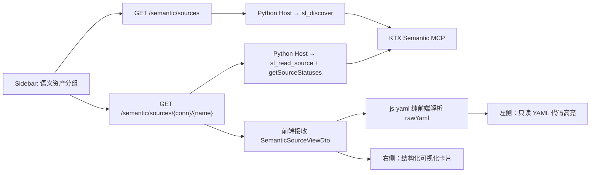

# 语义资产查看器 — 最终方案与开发计划

## 1. 文档状态

| 字段 | 值 |
| :--- | :--- |
| 状态 | V2.3（已重构为可复用业务语义模型，真实运行验收中） |
| 版本 | V2.3（查询条件由 KTX filters 传入） |
| 日期 | 2026-08-16 |
| 范围 | **只读查看器**（Read-Only Semantic Asset Viewer） |
| 前置文档 | [`docs/yaml_review_component_design.md`](file:///d:/data_agent/docs/yaml_review_component_design.md)（含 V1 原始方案 + §8-§10 第一轮审阅 + §11 第二轮对抗性审阅） |
| 明确排除 | 编辑/保存、乐观锁、审核状态机（approve/reject）、CodeMirror 编辑器 |

---

## 2. 范围裁决

前置文档经两轮审阅后暴露出核心矛盾：V1 方案同时包含"查看"和"审核/编辑/保存"，但项目当前不具备支撑完整审核流的基础设施：

- **无角色/权限模型**：[`src/api/auth.py`](file:///d:/data_agent/src/api/auth.py) 只有 `username`/`display_name`，无 role。`approve/reject` 无法回答"谁有权批准"。
- **保存会重写 YAML 原文**（N-1）：KTX 的写入链 `parse → normalize → dedupe → stringify` 会丢弃注释、重排键序与引号，直接破坏"左侧展示你写的代码"这一核心承诺。在未裁决该问题前，任何可编辑实现都会主动摧毁信任。
- **前端无测试基建**：[`frontend/package.json`](file:///d:/data_agent/frontend/package.json) 中无 vitest/jest/playwright，并发/事务类验收用例无法自动化验证。

**因此，V2 收敛为只读的「语义资产查看器」**。编辑、乐观锁、审核状态机在出现具名审核角色需求后再独立立项，届时以 N-1（回写破坏原文）作为首个待解问题。

---

## 3. 总体架构



### 3.1 关键架构约束

1. **不复用 Knowledge API**：[`knowledge_api.py`](file:///d:/data_agent/src/api/knowledge_api.py#L19-L37) 的 `KNOWLEDGE_ROOT` 指向 `<project>/knowledge/`，而语义项目目录位于 [`config_manager.py:L64-66`](file:///d:/data_agent/src/config_manager.py#L64-L66) 的 `.data_agent/semantic-context/`（或 Electron `userData/semantic-context`），两者无交集。[`_safe_resolve_path`](file:///d:/data_agent/src/api/knowledge_api.py#L110-L120) 的 `relative_to` 校验会对任何逃逸路径返回 403。**必须建立独立的 Semantic API。**
2. **Host 复用既有 KTX 工具**：[`mcp/manager.py:L195`](file:///d:/data_agent/src/mcp/manager.py#L195) 的 `call_tool` **没有白名单校验**。白名单仅在 `bridge_tools`（Agent 可见工具列举）阶段生效。Host 侧今天就可以直接 `call_tool("sl_discover", ...)`、`call_tool("sl_read_source", ...)`，无需修改 KTX。
3. **前端不接触绝对路径**：API 只返回 `connectionId`、`sourceName`、YAML 内容和结构化视图，不返回文件系统路径。
4. **展示层严禁调用 LLM**：KTX 生成的 YAML 已自带完备的 `descriptions`（`user/ai/dbt/db/ktx`），前端纯确定性解析渲染。

---

## 4. 后端 API 设计

### 4.1 新增路由

```text
GET  /semantic/sources                            → 列举全部语义资产
GET  /semantic/sources/{connectionId}/{sourceName} → 查看单个语义资产详情
```

新增文件：[`src/api/semantic_api.py`]

### 4.2 列表接口 `GET /semantic/sources`

调用 Host 侧已有的 `call_tool("sl_discover", {})` 获取连接与 source 清单。

**响应结构**：

```json
{
  "connections": [
    {
      "connectionId": "qianhai_monthly",
      "sources": [
        {
          "sourceName": "industry_sales_detail",
          "sourceKind": "standalone",
          "isQueryable": true,
          "hasOverlay": false,
          "description": "批发业、零售业、餐饮业企业级累计销售额明细..."
        }
      ]
    }
  ]
}
```

### 4.3 详情接口 `GET /semantic/sources/{connectionId}/{sourceName}`

调用 `call_tool("sl_read_source", { connectionId, sourceName })` 获取原始 YAML 与结构化视图。

**响应 DTO（`SemanticSourceViewDto`）**：

```python
class SemanticSourceViewDto(BaseModel):
    connectionId: str
    sourceName: str
    sourceKind: Literal[
        "standalone",             # 独立 YAML 文件
        "manifest_only",          # 仅存在于 _schema manifest 中，无独立文件
        "manifest_with_overlay",  # manifest + overlay 文件
        "standalone_shadows_manifest",  # standalone 遮蔽了同名 manifest 条目
        "orphan_overlay",         # overlay 文件但 manifest 中无对应条目
    ]
    rawYaml: str                  # 原始 YAML 文本（manifest_only 时为空字符串）
    table: str | None
    sql: str | None
    descriptions: dict[str, str]  # {user: "...", ai: "...", dbt: "...", ktx: "..."}
    grain: list[str]
    columns: list[ColumnView]
    measures: list[MeasureView]
    segments: list[SegmentView]
    joins: list[JoinView]
    tags: list[str]
    defaultTimeDimension: str | None
```

> [!IMPORTANT]
> - `sourceKind` 的 5 种状态由 KTX 已有的 `getSourceStatuses()` 派生（[`semantic-layer.service.ts:L333-392`](file:///d:/data_agent/ktx/packages/cli/src/context/sl/semantic-layer.service.ts#L333-L392)），基于 `{inManifest, overlayExists, standalone}` 三个布尔值组合。
> - `manifest_only` 属于系统元数据，不进入前端业务语义模型目录；它只作为 KTX overlay/resolved model 的内部基础。
> - 列举 source 时必须排除 `_schema/` 前缀路径（[`semantic-layer.service.ts:L337,345`](file:///d:/data_agent/ktx/packages/cli/src/context/sl/semantic-layer.service.ts#L337)）。

### 4.4 子结构视图

```python
class ColumnView(BaseModel):
    name: str
    type: str | None             # 可能因 inherits_columns_from 而缺省
    role: str | None             # "time" | "default"（注意：不是 "dimension"/"measure"）
    descriptions: dict[str, str] # 多来源描述 map
    primaryDescription: str | None  # 按 user > ai > dbt > db > ktx 优先级取首个非空
    descriptionProvenance: str | None  # "user" / "ai" / "dbt" / "db" / "ktx"
    isGrain: bool
    inherited: bool              # 是否由 manifest 填充，而非文件中显式定义

class MeasureView(BaseModel):
    name: str
    expr: str                    # 必填，原样展示
    description: str | None      # measure 使用单数 description（这是 canonical）
    filter: str | None
    segments: list[str] | None

class SegmentView(BaseModel):
    name: str
    expr: str
    description: str | None      # segment 也使用单数 description

class JoinView(BaseModel):
    to: str
    on: str                      # 原样展示，不做自然语言改写
    relationship: str            # 必填：many_to_one / one_to_many / one_to_one
    alias: str | None
```

---

## 5. 前端组件设计

### 5.1 新增依赖

```json
// frontend/package.json → dependencies
"js-yaml": "^4.1.0"

// frontend/package.json → devDependencies
"@types/js-yaml": "^4.0.9",
"vitest": "^3.2.1",
"@testing-library/react": "^16.3.0"
```

同时在 `scripts` 中增加 `"test": "vitest run"`。

### 5.2 目录结构

```text
frontend/src/components/semantic-viewer/
├── SemanticAssetViewer.tsx      # 双栏容器主入口
├── SemanticVisualPane.tsx       # 右侧可视化渲染面板
├── SemanticCodePane.tsx         # 左侧只读代码面板
├── components/
│   ├── DescriptionSummary.tsx   # 业务速览条（含 provenance 标识）
│   ├── MeasureCardList.tsx      # 指标卡片列表
│   ├── ColumnFieldGroup.tsx     # 字段分组（Grain / Time / Default，非统称"维度"）
│   ├── JoinRelationList.tsx     # 关联关系列表
│   ├── SegmentChipList.tsx      # 分群/过滤规则标签
│   └── SourceKindBadge.tsx      # sourceKind 类型徽章
├── types.ts                     # 前端 DTO 类型（镜像后端 SemanticSourceViewDto）
└── __tests__/
    └── SemanticAssetViewer.test.tsx
```

### 5.3 核心组件设计

#### SemanticAssetViewer（双栏容器）

```tsx
type ViewMode = 'split' | 'code' | 'visual';

interface Props {
  dto: SemanticSourceViewDto;   // 后端返回的完整 DTO
  onClose: () => void;
}
```

- **视图模式切换**：`双栏对照 | 仅代码 | 仅可视化`，通过 `aria-pressed` 实现无障碍。
- **左侧 `SemanticCodePane`**：使用 `<pre>` 只读展示 `dto.rawYaml`。
  - `manifest_only` 时展示引导占位：「此模型由系统 manifest 定义，暂无独立 YAML 文件。如需自定义，请通过 ktx 创建 Overlay。」
- **右侧 `SemanticVisualPane`**：直接从 `dto` 的结构化字段渲染，**不依赖前端 YAML 解析**（因为是只读，后端已解析好）。
- **窄屏降级**：`< 768px` 时自动切换为标签页模式（上下布局），不强制双栏。

#### Description Provenance 展示规则

| `descriptionProvenance` | UI 表现 |
| :--- | :--- |
| `user` | 正常展示，无特殊标识 |
| `ai` | 展示 `🤖 AI 生成` 淡色标注 |
| `dbt` / `db` | 展示 `📦 dbt` 或 `🗄️ 数据库` 来源标注 |
| `ktx` | **弱化显示**（灰色斜体 + `⚙️ 系统兜底`），因为这是模板化机器文案 |

### 5.4 Sidebar 集成

在 [`Sidebar.tsx`](file:///d:/data_agent/frontend/src/components/Sidebar.tsx) 的知识库分组下方，新增一个「语义资产」折叠分组：

```text
侧边栏:
├── 📋 任务
├── 📚 知识库 (现有，保持不变)
├── 🧊 语义资产 (新增)
│   ├── 📁 qianhai_monthly
│   │   ├── industry_sales_detail   [standalone]
│   │   ├── industry_sales_summary  [业务模型]
│   │   └── social_retail_detail    [standalone]
│   └── 📁 另一个连接
│       └── ...
└── 📦 插件
```

点击任一 source 条目 → 打开弹窗 → 渲染 `<SemanticAssetViewer />`。

### 5.5 弹窗布局

```text
┌─────────────────────────────────────────────────────────────────────────────┐
│ 🧊 industry_sales_detail  [standalone]  [ 🔀 对照 | 📝 代码 | 👁️ 可视化 ]  [✖]│
├───────────────────────────────────┬─────────────────────────────────────────┤
│ 左栏：只读 YAML 原文              │ 右栏：结构化可视化面板                    │
│ (等宽字体 pre 渲染)               │                                         │
│                                   │ 💡 业务速览                              │
│ name: industry_sales_detail       │ "批发业、零售业...金额单位为亿元。"       │
│ table: mart_industry_sales_detail │ 来源: 👤 人工                            │
│ descriptions:                     │ ─────────────────────────────────────── │
│   user: 批发业、零售业...         │ 🎯 核心指标 (5)                          │
│ grain:                            │ ┌─────────────────────────────────────┐ │
│   - snapshot_month                │ │ sales_ytd_total                     │ │
│   - unified_social_credit_code    │ │ SUM(sales_ytd)                      │ │
│ columns:                          │ │ 累计销售额合计，亿元。              │ │
│   - name: company_name            │ └─────────────────────────────────────┘ │
│     type: string                  │ ─────────────────────────────────────── │
│     description: 企业名称。       │ 📋 字段 (25)                             │
│ measures:                         │ 🔑 Grain: [snapshot_month] [code]       │
│   - name: sales_ytd_total         │ ⏰ Time:  [snapshot_month]              │
│     expr: sum(sales_ytd)          │ 📊 Default: [company_name] [district]...│
│     description: 累计销售额合计   │ ─────────────────────────────────────── │
│ segments:                         │ 🔗 关联关系 (0)                          │
│   - name: positive_growth         │ (无关联定义)                             │
│     expr: sales_ytd > ...         │                                         │
│                                   │ 🏷️ 标签: [mart] [industry_sales]        │
└───────────────────────────────────┴─────────────────────────────────────────┘
```

- 弹窗宽度：`width: min(1150px, 95vw)`，使用 `grid-template-columns: minmax(0, 1fr) minmax(0, 1fr)` 实现弹性分屏。
- Header 由弹窗统一管理（文件名 + sourceKind Badge + 模式切换 + 关闭），Viewer 内部不重复承载文件级操作。

---

## 6. 开发计划

### 阶段 M0：契约冻结与基建准备（~1 天）

| 编号 | 任务 | 验证 |
| :--- | :--- | :--- |
| M0-1 | 在 `frontend/package.json` 中声明 `js-yaml`、`@types/js-yaml` 为依赖 | `npm install` 成功，`import yaml from 'js-yaml'` 编译通过 |
| M0-2 | 引入 `vitest` + `@testing-library/react`，增加 `npm test` script | `npm test` 可执行（空测试通过） |
| M0-3 | 冻结 `SemanticSourceViewDto` Python Pydantic 模型 | 类型定义文件落盘 |
| M0-4 | 冻结前端 `types.ts` 镜像 DTO 定义 | 类型与后端 1:1 对应 |
| M0-5 | 新增断言测试：Agent 可见的语义工具白名单不含写工具 | `assert "sl_edit_source" not in VISIBLE_SEMANTIC_TOOLS` 通过 |

### 阶段 M1：后端 Semantic API（~1.5 天）

| 编号 | 任务 | 验证 |
| :--- | :--- | :--- |
| M1-1 | 新建 [`src/api/semantic_api.py`]，注册 `/semantic/sources` 路由 | Host 调用 `sl_discover` 返回连接与 source 清单 |
| M1-2 | 实现 `/semantic/sources/{conn}/{name}` 详情接口 | Host 调用 `sl_read_source` + 解析结构化视图 |
| M1-3 | 实现 `sourceKind` 推导：基于 `sl_discover` 返回的 source 状态信息派生 5 种 Kind | 各种 Kind 正确标识 |
| M1-4 | Description provenance 处理：按 `user > ai > dbt > db > ktx` 优先级提取 `primaryDescription` 与 `descriptionProvenance` | `ktx` 来源的系统兜底文案被正确标识 |
| M1-5 | 排除 `manifest_only` 系统元数据；保留 overlay/standalone 业务模型 | 前端列表不出现系统 manifest 条目 |
| M1-6 | 后端单元测试 | 各 sourceKind 的 fixture 全部通过 |

### 阶段 M2：前端组件实现（~2 天）

| 编号 | 任务 | 验证 |
| :--- | :--- | :--- |
| M2-1 | 实现 `SemanticCodePane`：只读 `<pre>` 渲染可查询业务语义模型 YAML 与业务规则 YAML | YAML 内容正确展示，系统元数据不进入前端 |
| M2-2 | 实现 `DescriptionSummary`：业务速览 + provenance 标识（user/ai/dbt/db/ktx） | 系统兜底文案灰色弱化展示 |
| M2-3 | 实现 `MeasureCardList`：指标名、`expr` 原样展示、`description`、`filter` | measure 的 expr/filter 原样代码展示，不做自然语言改写 |
| M2-4 | 实现 `ColumnFieldGroup`：按 Grain / Time / Default 分组展示，非统称"维度" | Grain 字段带 🔑 标识，继承字段带"继承自 manifest"标注 |
| M2-5 | 实现 `JoinRelationList`：`to`/`on`/`relationship` 原样展示 | `on` 表达式原样代码展示，不推断自然语言 Join Key |
| M2-6 | 实现 `SegmentChipList` 与 `SourceKindBadge` | 各类 sourceKind 正确着色标识 |
| M2-7 | 实现 `SemanticAssetViewer` 双栏容器 + 三种视图模式切换 | 双栏/仅代码/仅可视化切换流畅 |
| M2-8 | 组件测试 | `SemanticAssetViewer.test.tsx` 覆盖可查询 SQL 业务模型、业务规则及各 sourceKind 边界场景 |

### 阶段 M3：Sidebar 集成与体验打磨（~1 天）

| 编号 | 任务 | 验证 |
| :--- | :--- | :--- |
| M3-1 | Sidebar 新增「语义资产」折叠分组，调用 `GET /semantic/sources` 渲染 source 树 | 点击展开显示连接与 source 列表 |
| M3-2 | 点击 source 条目打开弹窗，加载详情并渲染 `SemanticAssetViewer` | 弹窗正确展示双栏视图 |
| M3-3 | 弹窗宽度响应式：`min(1150px, 95vw)`，`< 768px` 时切为标签页模式 | 窄屏可读，不出现双栏过窄 |
| M3-4 | sourceKind Badge 视觉区分 | standalone/manifest_only/orphan_overlay 等一目了然 |
| M3-5 | 暗色主题兼容 + `prefers-reduced-motion` | 无不必要动画，暗色可读 |

---

## 7. 验收标准

| 序号 | 场景 | 预期结果 |
| :--- | :--- | :--- |
| **V-01** | 点击侧边栏「语义资产」分组 | 通过 Semantic API 加载 source 清单，不依赖 Knowledge API |
| **V-02** | 查看 standalone source | 左栏显示完整 YAML，右栏显示结构化卡片 |
| **V-03** | 加载语义资产列表 | `manifest_only` 系统元数据不出现在前端；业务模型与业务知识 YAML 正常出现 |
| **V-04** | 查看 orphan_overlay source | sourceKind Badge 显示告警态 |
| **V-05** | measures 展示 | `expr` 和 `filter` 原样代码展示，不做自然语言改写 |
| **V-06** | joins 展示 | `on` 表达式原样展示，`relationship` 显示实际值 |
| **V-07** | description 为 `ktx`（系统兜底）来源 | 灰色弱化展示 + `⚙️ 系统兜底` 标注 |
| **V-08** | columns 中存在 `inherited` 字段 | 展示"继承自 manifest（未在本文件中定义）"标注 |
| **V-09** | 切换视图模式（对照/仅代码/仅可视化） | 布局自适应，无双层工具栏 |
| **V-10** | 窄屏 (< 768px) | 自动切为单栏标签页模式 |
| **V-11** | 无任何 API 调用包含绝对文件路径 | 请求/响应中无 `D:\` 或 `/home/` 路径 |
| **V-12** | Agent 可见工具白名单 | 断言测试确认 `sl_edit_source`/`sl_write_source` 不在白名单中 |

---

## 8. 明确不做（Deferred）

以下能力在本版本中**明确不实现**，以避免前置文档两轮审阅中反复争议的问题：

| 能力 | 推迟原因 | 启动条件 |
| :--- | :--- | :--- |
| YAML 编辑与保存 | N-1：KTX 写入链会重写 YAML 原文（丢注释、重排键序），破坏核心信任承诺 | 裁决 N-1 回写策略后立项 |
| 审核状态机 (approve/reject) | 无角色/权限模型，任意用户都能点"批准"，伪造合规感比无审核更危险 | 产品增加角色模型后立项 |
| 乐观锁 (revision/If-Match) | KTX Git 层仅支持进程内串行化，跨进程 TOCTOU 无法做强一致 | 与编辑能力一起评估 |
| CodeMirror 6 编辑器 | 只读场景 `<pre>` 即可满足，CodeMirror 引入成本不合理 | 编辑需求确认后引入 |
| 本地实时 YAML 解析 + debounce | 只读模式无编辑，无需本地解析 | 编辑模式立项后实现 |

## 9. V2.1 需求调整：只展示业务语义模型

根据实际 KTX 产物和业务审核对象，V2.1 对 V2.0 做以下调整：

1. **系统元数据不进入前端目录**
   - `_schema/*.yaml` 中的 manifest 是数据库结构/字段元数据和自动关系目录，不作为用户业务语义模型展示。
   - `manifest_only` source 从 `/semantic/sources` 列表和详情接口中排除。
   - Manifest 仍可作为 KTX overlay/resolved model 的内部基础，但不参与前端审核展示。

2. **业务语义模型进入前端目录**
   - 当前知识库中的 `knowledge/doc/query_patterns.md` 和 `knowledge/doc/business.md`（用户所称 `business.ma`，项目中实际文件名为 `business.md`）作为人工整理来源。
   - 已验证查询口径转换为独立 KTX 业务语义模型，放入 `semantic-layer/<connectionId>/`；模型的业务条件由 KTX filters 传入，不将示例企业、行业或月份写死在模型中。
   - 汇总同比增速、正增长企业数、行业层级、金额单位和四上企业变动口径进入 columns/measures/segments；KTX `sl_validate` 与 MySQL 原始 SQL 均需通过验证。
   - `business.md` 中不能独立执行的规则保留为 Host-owned `business-semantic/<connectionId>/qianhai_business_rules.yaml`，不把已验证 SQL 模板标记为 advisory。

3. **DTO 增补业务资产字段**
   - 增加 `assetType: semantic_model | business_knowledge` 和 `isQueryable`。
   - `business_knowledge` 继续支持 `sourceDocuments`、`businessRules`；`queryTemplates` 仅作为旧格式兼容，不再承载当前 13 条查询模板。
   - 前端分组名称调整为“业务语义模型”，不再显示“系统 manifest”；可执行 SQL source 显示“可查询”标识。

## 10. V2.2 需求调整：已验证 SQL 模板直接进入可查询语义层（历史实现）

用户确认 `knowledge/doc/query_patterns.md` 中的 SQL 是已经验证过的查询口径，不应作为仅供参考的业务知识文本展示。V2.2 先将 13 条口径转换为独立 KTX source，并完成了 SQL/schema/KTX 执行验证。

> V2.2 的“保留模板默认参数”决策已被 V2.3 取代；当前模型已改为可复用语义模型。

1. 13 条模板各自转换为独立 KTX SQL source：
   - `query_industry_sales_monthly`
   - `query_industry_sales_trend`
   - `query_industry_sales_ranking`
   - `query_company_sales_monthly`
   - `query_industry_positive_growth_summary`
   - `query_industry_positive_growth_monthly`
   - `query_new_four_above_summary`
   - `query_new_four_above_detail`
   - `query_new_four_above_companies`
   - `query_new_four_above_by_industry`
   - `query_lost_four_above_by_industry`
   - `query_new_four_above_batch`
   - `query_lost_four_above_batch`
2. 每个 source 具备 `sql`、`grain`、输出 columns、可查询 measures；该阶段仍保留了模板默认参数，已由 V2.3 重构。
3. 为适配 KTX/Python 双端契约，SQL 输出别名统一为稳定 ASCII 字段名；中文业务标签保留在 descriptions 和 SQL 注释中。`source_type` 不写入 source 文件，避免 TypeScript schema 与 Python `SourceDefinition(extra=forbid)` 不一致。
4. `qianhai_business_rules.yaml` 仅承载 `business.md` 中不能独立执行的规则。前端标准语义模型面板展示 13 个 SQL source 的 YAML、SQL、字段和 measures；列表/详情通过 `isQueryable` 显示“可查询”。
5. Windows Host 启动 KTX Python daemon 时设置 `PYTHONUTF8=1`，避免中文 SQL/描述经 stdin/stdout 编解码后导致 `sl_query` 失败。

## 11. V2.3 需求调整：重构为可复用业务语义模型

1. 13 个业务模型位于 `semantic-layer/default-mysql/`，名称统一为 `business_*`：
   - `business_industry_sales_monthly`
   - `business_industry_sales_trend`
   - `business_industry_sales_ranking`
   - `business_company_sales_monthly`
   - `business_industry_growth_summary`
   - `business_industry_growth_monthly`
   - `business_new_four_above_summary`
   - `business_new_four_above_growth`
   - `business_new_four_above_companies`
   - `business_new_four_above_by_industry`
   - `business_lost_four_above_by_industry`
   - `business_new_four_above_batch`
   - `business_lost_four_above_batch`
2. 所有模型删除企业、行业、月份等示例字面量。查询条件改由 KTX `sl_query.filters` 传入，排序由 `order_by` 传入。
3. 行业销售、企业销售和正增长模型按可复用粒度输出；同比、正增长占比等指标进入 measures，必要时提供“先汇总再计算”的派生 measure。
4. 新增/减少四上模型通过 `month_pairs` 生成可选的 `base_month`/`target_month`，支持基准月份和目标月份动态筛选，并覆盖基准月没有企业记录的情况。
5. 列表模型移除展示用 `ROW_NUMBER()`，增加 `company_id`、行业代码和比较月份等真正可筛选的业务维度；前端展示的是业务模型，而不是固定 SQL 模板。
6. `sql:` 仍可能存在，但它只定义多表关联、行级计算或跨月比较的可复用底层关系；它不再承载某一次查询的参数。KTX 仍负责外层 measures、dimensions、filters 的编译与执行。
7. `qianhai_business_rules.yaml` 继续只承载不能独立执行的业务规则；前端通过 `isQueryable` 区分可查询业务模型和业务知识。
