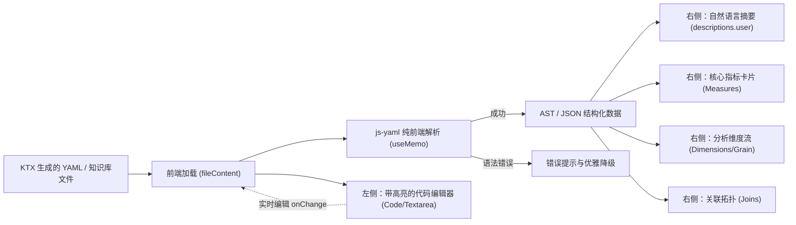
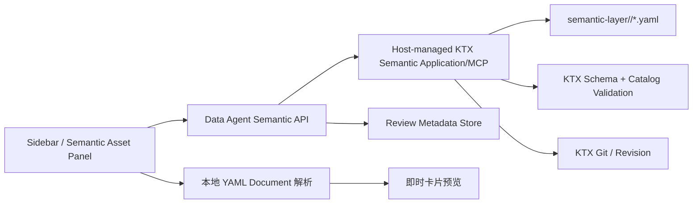

# Data Agent 语义层 YAML 双栏审核组件设计方案

## 1. 文档概述

- **文档状态**：已就绪（Ready for Implementation）
- **版本**：V1.0
- **创建日期**：2026-08-16
- **归属模块**：前端知识库与语义资产管理 (`frontend/src/components/`, `knowledge/`)
- **关联组件**：KTX Semantic MCP (`@kaelio/ktx`)、Sidebar 知识库弹窗 (`Sidebar.tsx`)

---

## 2. 背景与目标

### 2.1 业务背景
在 Data Agent 中，KTX 负责执行数据库和元数据源的自动化摄入（Ingest & Scan），生成标准的语义层定义文件（`semantic-layer/**/*.yaml`）。在投入 Agent 查询使用前，往往需要经过业务人员或数据工程师的审查确认（Review & Approval）。

### 2.2 核心痛点
1. **纯代码门槛高**：原生 YAML 对业务人员和非技术分析师不够友好，阅读颗粒度、聚合函数、过滤逻辑时容易产生疲劳与误判。
2. **纯自然语言存在二义性**：如果仅靠 LLM 翻译成纯自然语言，可能产生幻觉（如曲解聚合方式或操作符），无法保证口径的绝对精确。
3. **黑盒缺乏信任**：单纯的可视化界面如果脱离了底层真实执行代码，技术人员无法校验其底层一致性。

### 2.3 设计目标
在前端知识库模块（或独立审核弹窗）中，构建一套 **“左侧原生 YAML + 右侧自然语言业务摘要与结构化可视化卡片”** 的双栏分屏对照组件（Split-View Semantic Reviewer）：
- **0 额外 LLM 负担**：展示阶段纯前端解析已生成的 YAML 语义，0 额外网络延迟、0 Token 消耗；
- **双向互信**：左侧提供 100% 精确的执行代码，右侧提供 0 门槛的直观可视化；
- **毫秒级同步**：左侧编辑或切换时，右侧卡片毫秒级响应重绘。

---

## 3. 总体架构与设计原则



### 3.1 核心设计原则

1. **确定性优先（Deterministic-First）**：
   - KTX 在生成 YAML 时已由模型完成了字段与指标说明（`descriptions`、`columns[].description`、`measures[].description`）。
   - 前端展示层 **严禁再次调用 LLM 进行二次翻译**，直接通过纯 JavaScript 解析已有字段进行渲染，确保口径 100% 忠实于底层。
2. **渐进式呈现（Progressive Disclosure）**：
   - 顶部：1 秒即可看懂的自然语言业务速览；
   - 中部：结构化的核心指标卡片流与分析维度流；
   - 底部/左侧：完整的代码对照，满足各级角色的查看需求。
3. **防御性容错**：
   - 用户在左侧编辑产生 YAML 缩进错误时，右侧展示轻量告警横条，不白屏、不阻塞用户继续输入。

---

## 4. UI 布局与交互规范

### 4.1 双栏视图布局 (Split-View Layout)

```text
┌────────────────────────────────────────────────────────────────────────────────────────────────────────┐
│ 📄 industry_sales_detail.yaml                  [ 🔀 双栏对照  |  📝 仅YAML  |  👁️ 仅卡片 ]   [💾 保存] [✖ 关闭]│
├────────────────────────────────────────────────────┬───────────────────────────────────────────────────┤
│ 👈 左侧：原始 YAML (技术精确视图)                    │ 👉 右侧：业务语义可视化 (0门槛理解视图)              │
├────────────────────────────────────────────────────┼───────────────────────────────────────────────────┤
│  1  name: industry_sales_detail                    │ 💡 业务自然语言速览                               │
│  2  table: mart_industry_sales_detail               │ 批发业、零售业、餐饮业企业级累计销售额明细，金额单位为亿元。│
│  3  descriptions:                                  │ ───────────────────────────────────────────────── │
│  4    user: 批发业、零售业...                         │ 🎯 核心指标 (Measures - 2)                         │
│  5  grain: [snapshot_month, code]                  │ ┌───────────────────────────────────────────────┐ │
│  6  columns:                                       │ │ 💰 累计销售额合计 (sales_ytd_total)             │ │
│  7    - {name: company_name, type: string}         │ │    聚合口径: SUM(sales_ytd)                   │ │
│  8    - {name: sales_ytd, type: number}            │ │    业务说明: 统计周期内累计销售总额（亿元）       │ │
│  9  measures:                                      │ ├───────────────────────────────────────────────┤ │
│ 10    - name: sales_ytd_total                      │ │ 🏢 企业数量 (company_count)                    │ │
│ 11      expr: sum(sales_ytd)                       │ │    聚合口径: COUNT(DISTINCT code)             │ │
│ 12      description: 累计销售额合计，亿元。           │ └───────────────────────────────────────────────┘ │
│ 13  joins:                                         │ ───────────────────────────────────────────────── │
│ 14    - to: companies                              │ 📐 分析维度 (Dimensions) & 统计颗粒度              │
│ 15      on: unified_social_credit_code             │ [ 🔑 统计月份 (Grain) ] [ 🏢 企业名称 ] [ 🏷️ 行业大类 ]│
│                                                    │ ───────────────────────────────────────────────── │
│                                                    │ 🔗 关联关系 (Joins)                               │
│                                                    │ ➔ 关联 companies 模型 (多对一，按统一社会信用代码)  │
└────────────────────────────────────────────────────┴───────────────────────────────────────────────────┘
```

### 4.2 结构化可视化卡片详细映射规范

| YAML 字段 | UI 映射组件 | 视觉表现与样式 |
| :--- | :--- | :--- |
| `descriptions.user` / `descriptions.ai` | **业务速览通知条** (`NlSummaryBox`) | 浅蓝背景容器 (`#f0f9ff`)，带 `💡` 图标，加粗业务核心说明 |
| `measures[]` | **度量卡片流** (`MeasureCard`) | 包含指标显示名、公式代码块（如 `sum(sales_ytd)`）、业务口径描述、过滤条件 Tag |
| `columns[]` | **维度气泡流** (`DimensionTag`) | 灰色圆角 Badge (`#f1f5f9`)，颗粒度主键带 `🔑` 标识，悬浮 Tooltip 展示字段类型与详细备注 |
| `joins[]` | **关联拓扑列表** (`JoinRelationBar`) | 包含来源模型、目标模型、Join On 键、关联基数标识 |
| `segments[]` | **分群/过滤规则** (`SegmentChip`) | 绿色圆角标签，展示业务筛选表达式及描述 |

---

## 5. 前端模块与组件设计

### 5.1 组件目录规划

```text
frontend/src/components/semantic-review/
├── SemanticSplitViewer.tsx        # 双栏容器主入口，负责分屏布局与模式切换
├── SemanticVisualPane.tsx          # 右侧可视化渲染面板
├── components/
│   ├── NlSummaryBox.tsx           # 自然语言业务速览卡片
│   ├── MeasureCardList.tsx        # 指标列表卡片
│   ├── DimensionBadgeGroup.tsx    # 维度与 Grain 标签组
│   └── JoinRelationList.tsx       # 关联拓扑关系流
└── types.ts                       # KTX YAML AST 接口定义
```

### 5.2 核心数据结构接口 (`types.ts`)

```typescript
export interface KtxSemanticColumn {
  name: string;
  type?: string;
  role?: 'time' | 'dimension' | 'measure';
  description?: string;
}

export interface KtxSemanticMeasure {
  name: string;
  expr?: string;
  agg?: string;
  description?: string;
  filter?: string;
}

export interface KtxSemanticJoin {
  to: string;
  on: string;
  relationship?: 'many_to_one' | 'one_to_many' | 'one_to_one';
}

export interface KtxSemanticModel {
  name?: string;
  table?: string;
  descriptions?: {
    user?: string;
    ai?: string;
    dbt?: string;
  };
  grain?: string[];
  columns?: KtxSemanticColumn[];
  measures?: KtxSemanticMeasure[];
  segments?: Array<{ name: string; expr: string; description?: string }>;
  joins?: KtxSemanticJoin[];
}
```

### 5.3 核心容器实现 (`SemanticSplitViewer.tsx`)

```tsx
import React, { useState, useMemo } from 'react';
import yaml from 'js-yaml';
import { Columns, Code2, Eye, AlertTriangle } from 'lucide-react';
import { SemanticVisualPane } from './SemanticVisualPane';
import { KtxSemanticModel } from './types';

type ViewMode = 'split' | 'code' | 'visual';

interface Props {
  yamlContent: string;
  onChange?: (val: string) => void;
  isEditing?: boolean;
  modelName?: string;
}

export const SemanticSplitViewer: React.FC<Props> = ({
  yamlContent,
  onChange,
  isEditing = false,
  modelName,
}) => {
  const [viewMode, setViewMode] = useState<ViewMode>('split');

  // 纯前端 AST 解析，0 额外延迟
  const { data, error } = useMemo(() => {
    if (!yamlContent?.trim()) {
      return { data: null, error: null };
    }
    try {
      const parsed = yaml.load(yamlContent) as KtxSemanticModel;
      return { data: parsed, error: null };
    } catch (err: any) {
      return { data: null, error: err.message || 'YAML 格式解析失败' };
    }
  }, [yamlContent]);

  return (
    <div className="semantic-split-viewer">
      {/* 顶部视图模式切换 */}
      <div className="viewer-toolbar">
        <span className="model-tag">{modelName || data?.name || '语义模型预览'}</span>
        <div className="mode-toggle-group">
          <button
            className={`mode-btn ${viewMode === 'split' ? 'active' : ''}`}
            onClick={() => setViewMode('split')}
            title="双栏分屏对照"
          >
            <Columns size={14} /> 对照
          </button>
          <button
            className={`mode-btn ${viewMode === 'code' ? 'active' : ''}`}
            onClick={() => setViewMode('code')}
            title="仅查看代码"
          >
            <Code2 size={14} /> 代码
          </button>
          <button
            className={`mode-btn ${viewMode === 'visual' ? 'active' : ''}`}
            onClick={() => setViewMode('visual')}
            title="仅查看可视化卡片"
          >
            <Eye size={14} /> 可视化
          </button>
        </div>
      </div>

      {/* 主体渲染区 */}
      <div className={`viewer-body mode-${viewMode}`}>
        {/* 左侧代码区 */}
        {(viewMode === 'split' || viewMode === 'code') && (
          <div className="pane-code">
            {isEditing ? (
              <textarea
                className="yaml-editor-textarea"
                value={yamlContent}
                onChange={(e) => onChange?.(e.target.value)}
                placeholder="请输入 YAML 定义..."
                spellCheck={false}
              />
            ) : (
              <pre className="yaml-code-block">{yamlContent}</pre>
            )}
          </div>
        )}

        {/* 右侧可视化区 */}
        {(viewMode === 'split' || viewMode === 'visual') && (
          <div className="pane-visual">
            {error ? (
              <div className="yaml-error-banner">
                <AlertTriangle size={16} />
                <span>YAML 格式存在异常：{error}</span>
              </div>
            ) : data ? (
              <SemanticVisualPane data={data} />
            ) : (
              <div className="empty-hint">暂无有效语义定义</div>
            )}
          </div>
        )}
      </div>
    </div>
  );
};
```

---

## 6. 与现有项目的集成路径

### 6.1 侧边栏知识库弹窗改造 (`Sidebar.tsx`)
1. **自动格式识别**：
   - 当用户在侧边栏点开 `.yaml` / `.yml` 文件时，`editor-modal` 内部直接渲染 `<SemanticSplitViewer />`；
   - 当点开 `.md` 文件时，保持现有的 `<ReactMarkdown>` 预览；
   - 点开其他文本文件时，保持纯文本预览。
2. **弹窗宽度响应式调整**：
   - 在 [`frontend/src/index.css`](file:///d:/data_agent/frontend/src/index.css#L4265) 中增加 `.editor-modal.is-split` 样式，在分屏模式下宽度由 `800px` 自动拓展为 `1150px`（最大 `95vw`），保证两侧均有充足的阅读宽度。

### 6.2 样式规范 (`index.css` 拓展)

```css
.editor-modal.is-split {
  width: 1150px;
  max-width: 95vw;
  height: 85vh;
}

.semantic-split-viewer {
  display: flex;
  flex-direction: column;
  height: 100%;
  overflow: hidden;
}

.viewer-toolbar {
  display: flex;
  justify-content: space-between;
  align-items: center;
  padding: 8px 16px;
  background: var(--bg-subtle, #f8fafc);
  border-bottom: 1px solid var(--border-light, #e2e8f0);
}

.viewer-body {
  display: flex;
  flex: 1;
  overflow: hidden;
}

.pane-code, .pane-visual {
  flex: 1;
  height: 100%;
  overflow-y: auto;
  padding: 16px;
}

.pane-code {
  background: #1e1e1e;
  color: #d4d4d4;
  border-right: 1px solid var(--border-light, #e2e8f0);
}

.yaml-code-block {
  margin: 0;
  font-family: 'JetBrains Mono', 'Fira Code', Consolas, monospace;
  font-size: 13px;
  line-height: 1.5;
}
```

---

## 7. 验收标准与测试清单

| 序号 | 验收场景 | 预期结果 |
| :--- | :--- | :--- |
| **TC-01** | 点击 `.yaml` 知识库文件 | 弹窗以双栏形式展开，左侧展示高亮 YAML 代码，右侧展示业务速览与卡片 |
| **TC-02** | 包含 `descriptions.user` 的 YAML | 右侧顶部高亮显示自然语言业务速览条 |
| **TC-03** | 包含 `measures` 指标列表 | 右侧清晰展示每个度量的计算口径 (`expr`)、名称和中文业务解释 |
| **TC-04** | 包含 `grain` 和 `columns` | 颗粒度字段带有主键标识，维度字段带有类型标签和悬浮说明 |
| **TC-05** | 在编辑模式下修改 YAML | 左侧文字变动时，右侧卡片实时同步重绘（延迟 < 5ms） |
| **TC-06** | 故意输入错误缩进的 YAML | 右侧优雅展示错误提示横幅，界面不崩溃，修正后自动恢复 |
| **TC-07** | 切换视图模式（仅代码/仅卡片） | 界面自适应单栏全宽展示，切换流畅无卡顿 |

---

## 8. 审阅意见

> 本节为对 V1.0 方案的补充审阅。前文的双栏呈现、确定性渲染和无二次 LLM 原则可以保留，但当前方案尚不宜直接进入实现，建议先完成本节列出的契约和安全性修订。

### 8.1 审阅结论

- **建议状态**：`Needs Revision`，完成 P0 阻塞项后再恢复为 `Ready for Implementation`。
- **可保留内容**：双栏对照、视图模式切换、结构化卡片、编辑时容错、无二次 LLM。
- **主要阻塞项**：语义文件访问链路不成立、前端类型与 KTX Schema 不一致、生成型 Source 存在误覆盖风险、缺少真正的审核状态机和安全保存事务。

### 8.2 主要问题与审阅建议

| 级别 | 当前方案 | 问题 | 审阅建议 |
| :--- | :--- | :--- | :--- |
| **P0** | 通过 `Sidebar.tsx` 的 Knowledge API 打开语义 YAML | Knowledge API 被限制在 `KNOWLEDGE_ROOT`，而真实语义目录位于独立的 Semantic Project（安装态通常为 Electron `userData/semantic-context`），当前接口无法访问 `semantic-layer/` | 建立独立 Semantic API，由后端通过 Host-managed KTX Application/MCP 访问语义资产，不复用 `/knowledge/*` 文件接口 |
| **P0** | 通过扩展名识别全部 `.yaml/.yml` | `ktx.yaml`、`_schema` manifest、普通配置 YAML 与 Semantic Source 的结构不同，不能统一按模型 YAML 渲染或编辑 | 只对 Semantic API 返回的 Source 启用审核器；普通 YAML 继续使用文本预览 |
| **P0** | 手写 `KtxSemanticModel` 并通过类型断言接收 `yaml.load` 结果 | 类型定义与当前 KTX canonical schema 存在漂移：Column `role` 应为 `time/default`；Measure 的 `expr` 必填且支持 `segments`；Join 的 `relationship` 必填并支持 `alias`；描述字段主要为开放的 `descriptions` Map | 从 KTX Schema 生成共享契约，或由后端输出稳定的 `SemanticSourceView` DTO；前端不得把 TypeScript 类型断言当成运行时校验 |
| **P0** | 所有 Source 均可直接修改并保存 | `sl_read_source` 可能返回由 `_schema` manifest 投影出来的 resolved YAML。若把它保存为 `<sourceName>.yaml`，可能创建 standalone source 并遮蔽 manifest | API 必须返回 `sourceKind` 和 `editable`；`manifest_projected` 默认只读，只允许通过明确的“创建 Overlay”流程修改 |
| **P0** | “审核”仅包含查看、编辑和保存 | 缺少待审核、通过、驳回、审核人、审核时间、意见和内容版本，无法实现文档背景中声明的 Review & Approval | 若 V1 只做查看，应改名为“双栏语义查看器”；若保留“审核”定位，必须增加独立审核状态机 |
| **P0** | 使用 `saveKnowledgeContent` 直接覆盖文本 | 绕过 KTX Source 校验、Git 写入、并发控制和 Catalog reload，可能写入语法正确但不可执行的语义定义 | 保存必须经过 KTX canonical 写入链，并具备 draft 校验、revision 检查、原子提交和失败回滚 |
| **P1** | YAML 解析成功即认为模型有效 | YAML 标量、数组、未知字段、非法 Grain、失效 Join 等都可能通过语法解析 | 将状态拆分为 `syntaxValid`、`sourceSchemaValid`、`catalogValid`；只有三者都满足才允许提交或批准 |
| **P1** | `useMemo` 在每次按键时同步解析，验收目标为 `< 5ms` | 该目标没有文件大小和硬件基线，大文件同步解析还可能阻塞输入 | 使用 150～250ms debounce 或 deferred value；目标改为“输入处理不阻塞一帧，100KB 内视觉更新 p95 < 250ms” |
| **P1** | 解析失败后右侧仅显示错误横条 | 当前代码会把 `data` 置空，编辑时短暂缩进错误将导致整个右栏消失 | 保留最后一次有效预览，并显示“预览基于上一有效版本”的 stale 标识及错误行列号 |
| **P1** | 左侧声明高亮和行号，实际实现为 `<pre>/<textarea>` | 实现与 TC-01 不一致，且 `.yaml-editor-textarea` 缺少完整尺寸、焦点和滚动样式 | 若高亮和诊断是验收项，使用 CodeMirror 6；否则删除“高亮/行号”承诺 |
| **P1** | 组件内部 Toolbar 与现有 Modal Header 并存 | 文件名、保存和关闭动作可能出现双层工具栏，保存状态也分散在两个组件中 | Modal 负责文件级动作，Viewer 只负责模式切换和内容展示；保存、dirty、revision 状态由一个上层容器统一管理 |
| **P2** | 固定 `1150px` 双栏 | 小窗口下两栏仍可能过窄，固定宽度不等于响应式 | 使用 `grid-template-columns: minmax(0, 1fr) minmax(0, 1fr)`；窄屏自动切换单栏标签页或上下布局 |
| **P2** | 所有 `columns[]` 都标记为“分析维度” | KTX Column 还包含时间、计算字段以及 `internal/hidden` 字段，直接称为维度会误导业务用户 | 改称“字段”，分别展示 Grain、Time、Computed 和 Visibility；非 public 字段默认折叠或明确标识 |
| **P2** | `JoinRelationList` 称为关联拓扑 | 当前组件只是关系列表，不是真正的拓扑图，且不能从 `on` 表达式安全推断自然语言 Join Key | 改称“关联关系”，原样展示 `on` 和 `relationship`；只有引入图布局后再使用“拓扑”称谓 |

### 8.3 Schema 对齐要点

前端展示模型至少需要覆盖以下当前 KTX 能力，不能只支持示例中的最小字段集：

1. Source：`table` 与 `sql` 二选一，以及 `standalone`、`overlay`、`resolved/manifest_projected` 三类来源；
2. Descriptions：开放的 `Record<string, string>`，默认优先级为 `user > ai > dbt > db > 其他首个非空值`；
3. Column：`type`、`role`、`visibility`、`descriptions`、`expr`、`natural_granularity`、约束、枚举值和测试信息；
4. Measure：必填 `name/expr`，可选 `filter/segments/description`；
5. Join：必填 `to/on/relationship`，可选 `alias`；
6. Source 附加信息：`column_overrides`、`exclude_columns`、`disable_joins`、`default_time_dimension`、`tags`、`freshness`；
7. 对遗留 YAML 中可能存在的单数 `description` 做只读兼容，但保存时统一使用当前 canonical 表达。

前端不应直接复制完整 KTX 执行 Schema。建议增加一个纯展示 DTO，把执行契约和 UI 契约解耦：

```typescript
export interface SemanticSourceReviewDto {
  connectionId: string;
  sourceName: string;
  yaml: string;
  revision: string;
  contentHash: string;
  sourceKind: 'standalone' | 'overlay' | 'manifest_projected';
  editable: boolean;
  resolvedView: SemanticSourceView;
  validation: {
    syntaxValid: boolean;
    sourceSchemaValid: boolean;
    catalogValid: boolean;
    errors: SemanticValidationIssue[];
    warnings: SemanticValidationIssue[];
  };
  review?: {
    status: 'pending' | 'approved' | 'rejected';
    reviewer?: string;
    reviewedAt?: string;
    comment?: string;
    approvedContentHash?: string;
  };
}
```

---

## 9. 修改思路

### 9.1 修订后的总体架构



关键边界：

- 前端不接触绝对路径，也不直接访问 Semantic Project 文件系统；
- 后端不复用 Knowledge API，而是通过唯一的 KTX 语义运行时读取和修改 Source；
- 现有 Semantic MCP 只有 `sl_discover/sl_read_source/sl_validate` 等读操作。若需要编辑，应新增 **Host-only** 的 draft validate/write 能力，且不得加入 Agent 工具白名单；
- Review Metadata 独立于 Semantic YAML 保存。KTX Source 使用严格字段约束，不能直接向 YAML 注入 `reviewStatus` 等产品字段。

### 9.2 建议 API

```text
GET  /semantic/sources
GET  /semantic/sources/{connectionId}/{sourceName}
POST /semantic/sources/{connectionId}/{sourceName}/validate
PUT  /semantic/sources/{connectionId}/{sourceName}
POST /semantic/sources/{connectionId}/{sourceName}/approve
POST /semantic/sources/{connectionId}/{sourceName}/reject
```

约束：

- `GET` 返回 `sourceKind/editable/revision/contentHash`，不返回绝对文件路径；
- `validate` 接收尚未落盘的 YAML，执行语法、Source Schema 和全 Catalog 校验；
- `PUT` 必须携带 `expectedRevision` 或 `If-Match`，版本冲突返回 `409`；
- `manifest_projected` 的 `PUT` 默认返回 `409/422`，前端应引导用户创建 Overlay；
- `approve` 只允许针对当前 `contentHash` 执行，内容变化后自动回到 `pending`；
- 保存或批准失败不得破坏 last-known-good Catalog。

### 9.3 前端解析与预览流程

1. 首次加载使用后端返回的 `resolvedView` 渲染，保证与 KTX 当前执行视图一致；
2. 用户编辑时使用与 KTX 一致的 `yaml` 包及 `parseDocument` 做本地语法解析，避免把普通对象误称为 AST；
3. 本地解析采用 debounce，不在每次击键时同步执行重型校验；
4. 本地解析成功后通过轻量 projection adapter 更新卡片；
5. 本地解析失败时保留 `lastValidView`，右侧增加 stale 遮罩和行列错误；
6. 用户点击保存时再调用后端 draft validation，不在每次击键时产生网络请求；
7. 服务端验证通过后执行受版本保护的提交，并返回新的 revision、content hash 和 validation 状态。

建议状态模型：

```typescript
interface SemanticEditorState {
  originalYaml: string;
  draftYaml: string;
  lastValidView: SemanticSourceView | null;
  parseIssues: SemanticValidationIssue[];
  serverValidation: SemanticSourceReviewDto['validation'] | null;
  dirty: boolean;
  saving: boolean;
  sourceRevision: string;
}
```

### 9.4 安全保存与审核流程

```text
打开 Source
-> 获取 revision/contentHash/sourceKind
-> 本地编辑与预览
-> 服务端校验 Draft
-> 在临时工作区执行全 Catalog 校验
-> revision 未冲突且校验通过
-> KTX 原子写入并提交 Git
-> reload/validate Catalog
-> 返回新 revision/contentHash
-> Review 状态重置为 pending
-> 审核人显式 approve/reject
```

交互要求：

- 有未保存修改时，关闭弹窗、切换文件或点击遮罩必须二次确认；
- 保存按钮在 YAML 语法无效、Source 不可编辑或请求进行中时禁用；
- Schema Warning 可以允许保存，但必须显式展示；Catalog Error 默认禁止保存；
- “保存”与“批准”必须是两个独立动作，保存成功不能自动代表审核通过；
- 驳回需要填写意见，批准记录审核人、时间和批准内容哈希；
- 发生并发冲突时提供“重新加载”和“复制我的草稿”，不得静默覆盖。

### 9.5 UI 修改建议

1. 将入口从“知识库文件”调整为“语义资产”分组，按 Connection 和 Source 展示；
2. Modal Header 统一承载文件名、来源类型、审核状态、保存/批准/关闭；
3. Viewer Toolbar 只保留双栏、代码、可视化模式切换；
4. manifest projection 显示“系统投影 · 只读”，Overlay 显示“业务覆盖层”，Standalone 显示“独立模型”；
5. 右侧标题采用真实字段，不凭 snake_case 自动生成中文业务名；描述来源增加 `人工/AI/dbt/db` provenance 标识；
6. Measure 的 `expr/filter/segments` 和 Join 的 `on/relationship` 必须原样展示，禁止自然语言改写替代精确表达式；
7. 模式切换按钮增加 `aria-pressed`、键盘焦点样式和可访问名称；
8. 为 `prefers-reduced-motion`、暗色主题和窄屏布局增加测试；高频模式切换不增加冗长动画。

### 9.6 分阶段实施建议

| 阶段 | 范围 | 退出条件 |
| :--- | :--- | :--- |
| **M0 契约冻结** | Semantic API、Source Kind、Review DTO、Schema 版本 | standalone/overlay/manifest projection fixture 全部通过契约测试 |
| **M1 只读查看器** | Source 列表、读取、双栏、卡片、错误降级 | 不通过 Knowledge API；各类 Source 均能正确展示且不能误编辑 |
| **M2 安全编辑** | 本地预览、draft validate、revision、KTX 写入、回滚 | 非法 YAML、无效 Catalog、并发冲突和 manifest 覆盖均被阻止 |
| **M3 审核闭环** | pending/approve/reject、审核意见、内容哈希 | 内容变更自动失效，审核记录可追溯且不污染 KTX YAML |
| **M4 体验与门禁** | CodeMirror、响应式、无障碍、性能与 E2E | 完整自动化测试和安装态真实 Semantic Project 验证通过 |

---

## 10. 修订后的补充验收清单

以下验收项应覆盖或替代前文中与实际架构冲突的要求：

| 序号 | 验收场景 | 预期结果 |
| :--- | :--- | :--- |
| **RTC-01** | 打开语义资产列表 | 数据来自 Semantic API/KTX，不依赖 Knowledge API，不暴露绝对路径 |
| **RTC-02** | 查看 standalone、SQL Source、Overlay、manifest projection | 四类内容均能正确归一化展示，并明确标识来源类型 |
| **RTC-03** | 查看 manifest projection | 默认只读；编辑时必须进入“创建 Overlay”流程，不生成遮蔽 manifest 的 standalone 文件 |
| **RTC-04** | 编辑过程中产生 YAML 错误 | 输入保持流畅，展示错误行列号，右侧保留最后有效预览并标记为 stale |
| **RTC-05** | YAML 语法合法但 KTX Schema 非法 | 本地可继续编辑，服务端校验给出字段路径，禁止提交或批准 |
| **RTC-06** | Join 指向不存在的 Source 或 Grain 不合法 | 全 Catalog 校验失败，不写入 active Catalog，last-known-good 继续可用 |
| **RTC-07** | 两个窗口同时修改同一 Source | 后提交者收到 `409 revision conflict`，不会覆盖先提交内容 |
| **RTC-08** | 保存合法修改 | 通过 KTX canonical 写入和 Git 提交，返回新 revision/contentHash，并完成 Catalog reload |
| **RTC-09** | 保存后立即查看 Review 状态 | 状态为 `pending`，不会因保存自动变为 `approved` |
| **RTC-10** | 批准后再次修改内容 | 原批准状态因 content hash 变化自动失效，重新进入 `pending` |
| **RTC-11** | 关闭存在未保存修改的弹窗 | 显示确认提示，可取消关闭并保留草稿 |
| **RTC-12** | 窄屏、暗色主题、键盘导航和 reduced motion | 布局可读、焦点可见、模式切换可操作、无不必要动画 |
| **RTC-13** | 100KB 以内 YAML 连续输入 | 输入处理不阻塞一帧，视觉预览更新 p95 小于 250ms；不要求不可稳定复现的 `<5ms` 指标 |
| **RTC-14** | 运行前端与安装态 E2E | 增加明确测试脚本和组件测试框架，并在真实 Electron Semantic Project 中完成读取、校验、保存和审核闭环 |

---

## 11. 对抗性审阅（第二轮 / 针对 §8-§10）

> 本节对 V1.0 方案与 §8/§9/§10 的第一轮审阅意见同时做代码级证伪。所有结论均给出 `文件:行号` 证据。
> 总体判断：第一轮审阅方向正确但**关键事实有误**，并且**遗漏了两个真正的 P0**。按第一轮意见直接开工，会为一个不存在的问题（manifest projection 读取路径）建设施，同时放过一个必然发生的信任崩塌（保存时 YAML 被重写）。

### 11.1 结论摘要

| 判定 | 数量 | 说明 |
| :--- | :--- | :--- |
| 维持第一轮意见 | 4 项 | P0#1 语义目录不可达、P0#3 Schema 漂移、`.strict()` 禁止注入产品字段、无测试基建 |
| **推翻或降级** | 4 项 | P0#4 机制错误、9.1「需新增 write 能力」错误、9.4「last-known-good Catalog」为虚构物、P0#2 在当前代码库中为假设性问题 |
| **新增（双方均遗漏）** | 4 项 | 保存回写破坏原文、文档示例本身不合法、`inherits_columns_from` 击穿「纯前端解析」前提、依赖未声明 |
| 范围质疑 | 1 项 | 第一轮把一个展示组件升级为 5 阶段平台工程，且未解决自己提出的「只读 or 审核」分叉 |

---

### 11.2 推翻：第一轮审阅的事实性错误

#### R-1（推翻 §9.1）「现有 Semantic MCP 只有读操作，需新增 Host-only draft validate/write 能力」——错误

写能力**早已存在**，无需新增任何 KTX 能力：

- `ktx/packages/cli/src/context/sl/tools/` 下已有 `sl-write-source.tool.ts`(445 行)、`sl-edit-source.tool.ts`(238 行)、`sl-rollback.tool.ts`(88 行)、`sl-validate.tool.ts`。
- 被限制的只是**暴露给 read 的白名单**：`src/mcp/manager.py:36`、`src/mcp/registry.py:27`、`src/semantic_startup.py:15` 均为 `{"sl_discover", "sl_read_source", "sl_query"}`。
- 过滤发生在 **tool 列举**阶段（`src/mcp/manager.py:484`、`src/mcp/registry.py:246`），而 `call_tool`（`src/mcp/manager.py:195`）**没有白名单校验**。

**结论**：Host 侧今天就可以直接 `call_tool("sl_edit_source", ...)`，read 依然看不到该工具。§9.1 中「应新增 Host-only 的 draft validate/write 能力」应改为「Host 侧复用已有 `sl_edit_source`/`sl_write_source`/`sl_validate`，并**新增一条断言测试**锁定白名单不含写工具」。M2 的工作量因此从「KTX 改造」降为「Python 侧 API 封装」。

#### R-2（推翻 P0#4）「`sl_read_source` 可能返回 manifest 投影出的 resolved YAML」——机制错误

`sl_read_source` **只读原始文件**，从不投影：

- `tools/sl-read-source.tool.ts` → `readSourceYaml()` → `base-semantic-layer.tool.ts:93-106` → `readSourceFile()` → `semantic-layer.service.ts:199-203`，直接读 `semantic-layer/<conn>/<name>.yaml`。
- manifest-backed 且无 overlay 文件时，返回的是 `yaml: ''` + "Source not found"。

因此：

1. DTO 中的 `sourceKind: 'manifest_projected'` **在该读取路径上永远不会出现**，按第一轮方案实现会得到一个恒为 false 的分支；
2. **真正的问题更严重且未被提出**：ingest 产出的大部分表存在于 `_schema/*.yaml` 的 `tables` map 中（`semantic-layer.service.ts:243`、`358-370`），**没有 per-source YAML 文件**。也就是说，双栏审核器对绝大多数语义资产会呈现**左栏空白**。方案 §4.1 里「点开 industry_sales_detail.yaml」这一入口假设，对 manifest-backed source 根本不成立；
3. 遮蔽风险的**防护已存在**，不需要设计：`writeSource` 在 standalone 遮蔽 manifest 时给出明确告警（`semantic-layer.service.ts:164-171`），`sl_edit_source` 更是直接返回「exists in the schema manifest but has no overlay file yet」并附上 overlay 模板（`sl-edit-source.tool.ts:140-152`）。要做的是**把这段既有引导透传到 UI**，而不是自研 409 语义。

**修正后的 sourceKind 来源**：应基于 `getSourceStatuses()`（`semantic-layer.service.ts:333-343`）返回的 `{inManifest, overlayExists, standalone}`，其真实状态空间是 **5 种**（manifest-only / manifest+overlay / standalone / standalone 遮蔽 manifest / **orphan overlay**），而非第一轮的 3 种枚举。orphan overlay 被 KTX 明确列为需要 UI 呈现的告警态（`semantic-layer.service.ts:328-331`），第一轮 DTO 完全没有它的位置。

#### R-3（部分推翻 §9.4 / RTC-06）「Catalog Error 默认禁止保存」「不写入 active Catalog，last-known-good 继续可用」

- KTX 的写入是**有意宽容**的，且有代码注释明确声明设计意图：`semantic-layer.service.ts:143-150`——"Writes are intentionally permissive — the agent must be able to save broken files so it can iterate on them... invalid sources should be skipped rather than poisoning the whole connection's catalog"。schema 问题一律降级为 `warnings`（`:175-180`）。
- 与此同时，`sl_edit_source` **已经硬阻断**校验失败：`sl-edit-source.tool.ts:190-198`，"Validation failed — edits were NOT saved"。第一轮「写入链缺少校验」对 edit 路径不成立，对 write 路径成立。
- **「last-known-good Catalog」在 KTX 中不存在**这个对象。回滚机制是 `sl_rollback` + git（`git.service.ts`）。RTC-06 的预期结果不可验证，应改写为：「`sl_validate` 返回 errors 时不产生 git commit；同连接其它 source 的可查询性不受影响」。
- **`expectedRevision`/If-Match 无法由 KTX 提供**：`git.service.ts:144` 的 `withMutationQueue` 只是**进程内**串行化，返回 `commitHash` 但**没有 compare-and-swap**。第一轮写了「`PUT` 必须携带 `expectedRevision`」却未指出执行者——必须由 Python Host 层在调用 `sl_edit_source` 前后自行比对 `contentHash`，且该比对在「Electron 与外部 ktx CLI 双进程写同一仓库」时仍会有 TOCTOU 窗口。这一点必须在 M0 契约里写明是**尽力而为的乐观锁**，不能承诺强一致。

#### R-4（降级 P0#2 → P2）「按扩展名识别会把 `ktx.yaml`/`_schema` manifest 误当模型 YAML」

在当前代码库中这是**假设性问题**：

- `knowledge/` 下**只有 Markdown**：`knowledge/agent.md`、`knowledge/doc/*.md`（5 个 .md），**零个 YAML**；
- Sidebar 的编辑能力**本就只对 .md 开放**：`frontend/src/components/Sidebar.tsx:221` `isMarkdown = ...endsWith('.md')`，编辑按钮受 `:408` 门控，其它文件走 `:417` 的只读 `<pre>`。

所以「误按模型 YAML 渲染或编辑」今天不可能发生。该条应降级为 P2，并**重述为对新 Semantic API 的约束**——这一部分是真实的：列举 source 时必须排除 `_schema/` 前缀文件（`semantic-layer.service.ts:337`、`:345` 的 `schemaFiles`/`nonSchemaFiles` 划分），否则 manifest 分片会被当成 source 列出。

---

### 11.3 新增 P0：双方均遗漏

#### N-1（P0）保存会重写用户的 YAML 原文，直接摧毁本方案的核心承诺

保存链路是 **parse → normalize → dedupe → stringify**：

- `sl-edit-source.tool.ts:170-188`：`YAML.parse(yaml)` → `normalizeSemanticLayerDescriptions` → `deduplicateSemanticLayerSource` → `YAML.stringify(source, { indent: 2, lineWidth: 0, version: '1.1' })`
- `semantic-layer.service.ts:190-192`：`writeSource` 同样 `YAML.stringify` 后落盘

后果：**注释全部丢失、键顺序被规范化、引号与换行被重排**（`lineWidth: 0` 会把长表达式拉成单行）。

方案 §2.3 承诺「左侧提供 100% 精确的执行代码」，§3.1 承诺「口径 100% 忠实于底层」。而实际行为是：用户点保存后，左栏内容会在他眼前被静默改写成另一份文本。这对一个以「建立技术人员信任」为唯一卖点的组件是**致命的**，且第一轮审阅 14 条问题、14 条 RTC 中**一条都没提到**。

必须处理（三选一，M0 决策）：
1. 保存后强制 reload，并展示「格式已规范化」的前后 diff，让改写显式化；
2. 新增 raw-write 路径（绕过 stringify，仅做 parse 校验后写原文）——需评估是否与 KTX 上游发散；
3. 明确降级承诺：左栏定位为「KTX canonical 视图」而非「你写的代码」，并在 UI 文案中说明。

#### N-2（P0-文档）方案自身的示范 YAML 不合法，且示范图恰好演示了它声称要消灭的幻觉

§4.1 的核心示例：

```yaml
joins:
  - to: companies
    on: unified_social_credit_code
```

- `on` 必须匹配 `/^(\w+)\.(\w+)\s*=\s*(\w+)\.(\w+)$/`（`semantic-layer.service.ts:1562-1584` `parseJoinOn`），裸列名会返回 `null` → 校验失败；
- `relationship` 是**必填**（`schemas.ts:74-79` `joinDeclarationSchema`），示例缺失。

更严重的是右栏渲染：

- 右栏写「关联 companies 模型（**多对一**，按统一社会信用代码）」——`many_to_one` 在左栏 YAML 中**根本不存在**，是凭空补的；
- 右栏写「企业数量 (company_count) 聚合口径: `COUNT(DISTINCT code)`」——左栏 YAML 里**没有这个 measure**；
- 右栏写「累计销售额合计」「统计月份」「行业大类」等中文名——左栏只有 snake_case，无 `descriptions`。

第一轮审阅在 §9.5.5 提了「不凭 snake_case 自动生成中文业务名」，但没有指出**文档的验收示范图本身就是反例**。任何按 §4.1 图做像素级实现的人，都会实现出一个幻觉生成器。**M0 出口条件应增加：所有文档示例替换为从真实 `userData/semantic-context/semantic-layer/**` 导出的、能通过 `sl_validate` 的 fixture。**

#### N-3（P1）`inherits_columns_from` 与 compose-time enrichment 击穿「纯前端解析」前提

- `schemas.ts:141` 允许 `inherits_columns_from`；`sourceColumnSchema` 中 `type`/`descriptions` **可缺省**（`schemas.ts:84-97`，注释明确说明由 compose-time enrichment 从 manifest 填充）；
- 填充逻辑在 `semantic-layer.service.ts:1591` `enrichColumnsFromManifest`，纯前端**无法复现**（需要读 manifest 分片）。

因此对一个完全合法的 source，本地解析会渲染出无类型、无说明的维度气泡。第一轮的 `resolvedView` 只解决**首次加载**；其 §9.3 第 4 步「本地解析成功后通过 projection adapter 更新卡片」会在**每次击键后**把卡片退化回未解析状态——业务用户看到的是错的那一份。

修正：本地 projection 必须能区分「文件中缺省」与「已解析值」，缺省字段显示为「继承自 manifest（未解析）」而非空白；`type`/`descriptions`/`role` 三个字段在 draft 态一律不得以本地值覆盖 `resolvedView` 的值。

#### N-4（P1）依赖与测试基建：方案的第一行 import 就跑不通

- `frontend/package.json` 的 `dependencies` **没有 `js-yaml` 也没有 `yaml`**，也没有 `@types/js-yaml`。`node_modules/js-yaml` 仅为 eslint 的传递依赖——§5.3 的 `import yaml from 'js-yaml'` 今天靠 hoisting 侥幸能编译，任何 lockfile 变动即失效。第一轮建议改用 `yaml` 包的 `parseDocument`，但同样**没有指出这是一个未声明依赖**。
- `frontend/package.json` 中**没有任何测试框架**（无 vitest / jest / @testing-library / playwright），scripts 只有 `dev/build/lint/preview/electron:dev`。因此 TC-01~07 与 RTC-01~14 **全部没有执行器**；TC-05 的「< 5ms」和 RTC-13 的「p95 < 250ms」在当前工程中**无法测量**。
- 第一轮把这件事塞进 RTC-14（M4），但它实际上是 **M1 的前置条件**——否则 M1「不通过 Knowledge API」这条出口条件也无法自动化验证。

---

### 11.4 维持并加强的第一轮意见

| 原条目 | 判定 | 加强证据 |
| :--- | :--- | :--- |
| P0#1 语义目录不可达 | **完全成立** | `KNOWLEDGE_ROOT` 解析见 `src/api/knowledge_api.py:19-37`，`_safe_resolve_path` 在 `:110-121` 强制 `relative_to` 校验并对逃逸返回 403；语义项目目录是 `userData/semantic-context`（`src/config_manager.py:65`、`frontend/electron/main.js:151`），两者无交集。Knowledge API 物理上不可能读到 `semantic-layer/`。 |
| P0#3 Schema 漂移 | **完全成立**，且比第一轮描述的更严 | `columnRoleValues = ['time','default']`（`schemas.ts:10`，方案写的 `'dimension'|'measure'` 不存在）；`expr` 必填（`:16`）；`relationship` 必填（`:77`）；`descriptions` 为 `z.record(string, string)`（`:27`）。此外三个 schema 全部 `.strict()`（`:127`、`:178`、`:198`），方案 `types.ts` 里的乐观断言与运行时零关系。 |
| 不得向 YAML 注入 `reviewStatus` | **成立，且理由要更强** | `.strict()` 会拒绝未知键，但 `writeSource` 只把它降级为 warning 并「Saving anyway」（`semantic-layer.service.ts:175-180`）。也就是说注入**不会报错、会静默污染**，Python 侧加载时（`python/ktx-sl/semantic_layer/models.py`，见 `schemas.ts:5-7` 注释所述锁步关系）才可能爆。审核元数据必须独立存储——这一条比第一轮说得更硬。 |
| Modal/Toolbar 双层工具栏 | **成立** | `Sidebar.tsx:405-412` 已有 header（文件名 + 编辑/保存/关闭），`:138` 调 `saveKnowledgeContent`。`.editor-modal` 固定 `width: 800px`（`frontend/src/index.css:4264-4266`），确认第一轮 P2 的固定宽度问题。 |
| 遮罩点击需二次确认 | **成立** | `Sidebar.tsx:403` `<div className="editor-modal-overlay" onClick={closeEditor}>`，当前无 dirty 检查，直接丢弃编辑内容。 |

---

### 11.5 第一轮的两处技术性误导

1. **§8.3 第 7 条「对单数 `description` 做只读兼容，保存时统一使用 canonical」——会造成数据丢失。**
   `description`（单数）对 **measure 与 segment 就是 canonical**：`schemas.ts:13-19`（measure）、`:21-25`（segment）均为 `description: z.string().optional()`。而 `normalizeSemanticLayerDescriptions` **只改写 source 级与 columns[]**（`description-normalization.ts:106-131`），从不触碰 measures。若按第一轮字面实现「统一转为 descriptions map」，measure/segment 说明会被 `.strict()` 拒收或被规范化丢弃。该条必须限定为「仅 source 级与 column 级」。

2. **§8.3 第 2 条描述的 description 优先级需补一个真实来源。**
   `DEFAULT_PRIORITY = ['user','ai','dbt','db']`（`descriptions.ts:1-10`），fallback 为首个非空（`:32`）——第一轮描述正确。但遗漏了：KTX 在 ingest 时会自动注入 `ktx` 这个来源键作为兜底（`description-normalization.ts:29-33` 的 `descriptions.ktx = fallback`），且其内容是**模板化机器文案**（`sourceFallback`/`columnFallback`，`:60-105`，例如 "Column sales ytd from industry_sales_detail."）。UI 的 provenance 标识必须包含 `ktx = 系统兜底`，否则会把机器占位文案当成业务口径展示给业务人员——这正是本方案要防的事。

---

### 11.6 范围质疑：第一轮未解决自己提出的分叉

第一轮在 P0#5 提出「若 V1 只做查看，应改名为双栏语义查看器」，但随后 §9.4 与 RTC-03/05/06/07/08/09/10/11 又把**编辑 + 乐观锁 + 审核状态机**全部保留为 P0，并列出 M0~M4 五个阶段。两者互斥，文档未裁决。

支持「V1 只做只读」的客观事实：

- read 侧语义工具白名单已是只读（`src/mcp/manager.py:36`），当前不存在 read 误写语义层的风险；
- `knowledge/` 中零 YAML，Sidebar 编辑能力仅对 `.md` 开放——「审核」目前没有任何真实入口在流失；
- 产品**没有角色/权限模型**：`src/api/auth.py` 只有 `username`/`display_name`，无 role。M3 的 `approve/reject` 因此无法回答「谁有权批准」，实现出来只是任意登录用户都能点的按钮，比没有审核更危险（伪造合规感）；
- 前端无测试基建（见 11.3 N-4），M2/M3 的 8 条并发/事务类 RTC 无法自动验证，只能靠手工回归。

**建议裁决**：V1 收敛为**只读「语义资产查看器」**，交付面只有：
`GET /semantic/sources` + `GET /semantic/sources/{conn}/{name}`（Host 侧封装既有 `sl_discover` / `sl_read_source` / `getSourceStatuses`）+ 双栏展示 + 5 种 sourceKind 标识 + manifest-only 时的「暂无 overlay」引导。
编辑、乐观锁、审核状态机全部**推迟到出现具名审核角色需求之后**再立项，立项时把 N-1（回写破坏原文）作为第一个待解问题。这样可砍掉 M2/M3，且不需要 CodeMirror（只读高亮用轻量 highlighter 即可），M4 缩为「响应式 + 无障碍 + 测试基建」。

---

### 11.7 建议的 M0 契约冻结清单（替代 §9.6 的 M0）

| 编号 | 待冻结事项 | 依据 |
| :--- | :--- | :--- |
| M0-1 | `sourceKind` 枚举扩为 5 态，含 `orphan_overlay`；由 `getSourceStatuses()` 派生，不由文件名/扩展名推断 | `semantic-layer.service.ts:328-343` |
| M0-2 | manifest-only source 的读取契约：`rawYaml` 为空 + `resolvedView` 非空 + `editableVia: 'overlay_bootstrap'`；UI 左栏显示「此模型由系统 manifest 定义，无独立 YAML」 | `sl-read-source.tool.ts`、`sl-edit-source.tool.ts:140-152` |
| M0-3 | 列举 source 时排除 `_schema/` 前缀路径 | `semantic-layer.service.ts:337,345` |
| M0-4 | 明确 Host 复用既有 `sl_*` 写工具，并新增断言测试锁定 read 白名单不含写工具 | `src/mcp/manager.py:36,484`、`registry.py:27,246` |
| M0-5 | 明确「乐观锁为尽力而为」，跨进程 TOCTOU 不做强一致承诺 | `git.service.ts:144` 仅进程内 `withMutationQueue` |
| M0-6 | 裁决 N-1 回写策略（reload+diff / raw-write / 降级承诺），并同步修改 §2.3、§3.1 的「100%」措辞 | `sl-edit-source.tool.ts:170-188`、`semantic-layer.service.ts:190-192` |
| M0-7 | 全部文档示例替换为可通过 `sl_validate` 的真实 fixture；删除右栏中无左栏依据的字段 | `schemas.ts:74-79`、`semantic-layer.service.ts:1562-1584` |
| M0-8 | 声明 `yaml`（或 `js-yaml` + `@types/js-yaml`）为 `dependencies`；引入 vitest + @testing-library 并接入 `npm test` | `frontend/package.json` |
| M0-9 | description provenance 枚举含 `ktx = 系统兜底`，且系统兜底文案在 UI 中弱化显示 | `description-normalization.ts:29-33,60-105` |
| M0-10 | `description`（单数）在 measure/segment 上为 canonical，规范化仅作用于 source 级与 column 级 | `schemas.ts:13-25`、`description-normalization.ts:106-131` |

---

### 11.8 对抗性审阅结论

- **文档状态建议**：维持 `Needs Revision`，但阻塞项清单需按本节替换——第一轮的 P0#2/P0#4 与 §9.1 的部分前提不成立，照其实施会产生无效代码；N-1/N-2 才是真正的阻塞项。
- **不同意第一轮的地方**：写能力无需新增（R-1）；manifest projection 读取路径不存在（R-2）；「禁止保存 + last-known-good Catalog」与 KTX 既有设计冲突且概念虚构（R-3）；扩展名误识别在当前代码库中为假设性问题（R-4）。
- **同意并加强的地方**：语义目录不可达、Schema 漂移、审核元数据必须外置、无测试基建。
- **最小可信路径**：先做 M0 契约冻结（本节 10 项）→ 只读查看器 → 再依据真实审核角色需求决定是否进入编辑与审批。在 N-1 未裁决前，任何「可编辑并保存」的实现都会主动破坏本方案唯一的价值主张。
